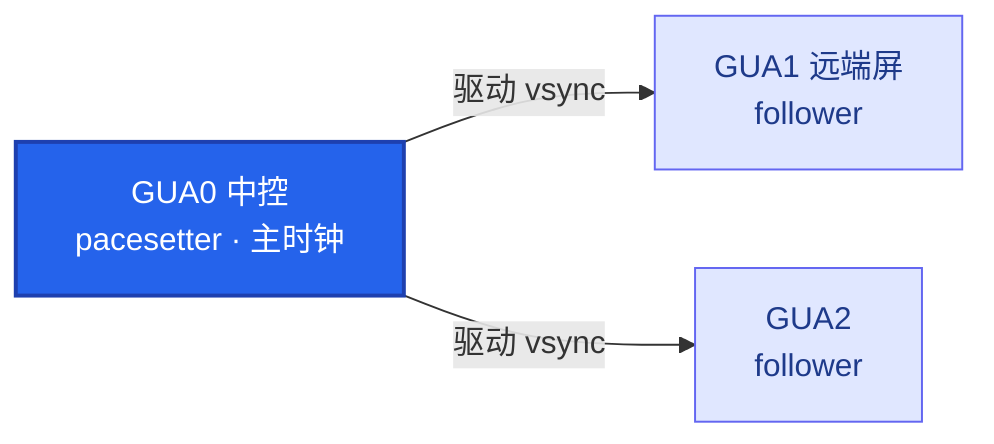
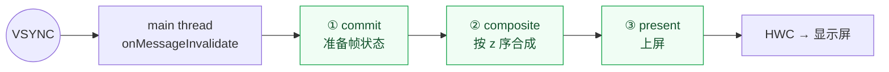

# 🖥️ SurfaceFlinger 主线程与三阶段

> [!abstract] 一句话记住
> **中控是时钟源，远端屏是从属，SF 每帧只有 `15.67ms`。**

> 关联：[[SurfaceFlinger]] · [[VSync]] · [[Fence]] · [[HWC]]

```bash
# 抓取命令：看 layer 列表、display、fence
adb shell dumpsys SurfaceFlinger | head -200
```

---

## 1. 🧭 Display 拓扑



| HWC display | SF displayId          | 名称       | 角色                  |
| :---------: | --------------------- | -------- | ------------------- |
|     `0`     | `4634679611807204096` | GUA0 中控  | **pacesetter（主时钟）** |
|     `1`     | `4634679327297303554` | GUA2     | follower            |
|    `100`    | `4634679587309427457` | GUA1 远端屏 | follower            |

> [!warning] 为什么远端屏最先「看起来」死
> bug 里的 `FENCE GAP display=100 gap=16.9s` 就是最后这块屏。
> - 它是 **follower**，`hwVsyncState=Disallowed`，自身没有硬件 vsync，跟着中控走。
> - 中控合成一卡 → 它的 `present` 整个停摆 → 因此远端屏最先表现出「死屏」。

---

## 2. ⏱️ SF 主循环的节拍

| 参数               | 值        | 说明                  |
| ------------------ | :-------: | --------------------- |
| VSYNC period       | `16.67ms` | 一帧总时长            |
| `sf: workDuration` | `15.67ms` | SF 自己实际可用的时间 |

> [!note] 阈值来源
> 方案里「commit / composite 阈值 `16ms`」即源于此：一帧 `16.67ms`，SF 只能用 `15.67ms`。

---

## 3. ✅ 健康态基线

> 加心跳后，以下数值即为「正常」参照。

| 指标         | pacesetter | follower ×2 |
| ------------ | :--------: | :---------: |
| Total missed | `6`        | `0`         |
| HWC missed   | `4`        | `0`         |
| GPU missed   | `4`        | `0`         |

---

## 4. 🔎 Fence 观测点

> [!tip] `Has 1 unfired fences`（pacesetter 的 VsyncController）
> - **正常态**：偶尔 `1` 个未 signal 的 present fence 属正常。
> - **bug 发生时**：此处会**积压** —— 这是方案 `FENCE_STALL` 路径盯的数据。

---

## 5. 🧩 VsyncGuaDispatch（厂商私有）

- AOSP **没有**此机制，是厂商追加的第二套 vsync 分发（`Gua` 前缀）。
- 读 `Scheduler` 代码时需留意它。
- 当前**空闲**：`mIntendedWakeupTime` 为极大值 = 没有排任务。

---

## 6. 🎞️ 主线程与三阶段（核心）

SF 合成全跑在**单一主线程**，vsync 驱动，每帧顺序推进 `commit → composite → present`。



> 代码位置根目录：`frameworks/native/services/surfaceflinger/`（下表 AAOS 代码列均相对此目录）

| 概念              | 是什么                                                                   | 干什么                                                          | AAOS 代码位置                                                                                                                                                                                               |
| --------------- | --------------------------------------------------------------------- | ------------------------------------------------------------ | ------------------------------------------------------------------------------------------------------------------------------------------------------------------------------------------------------- |
| **main thread** | SF 的单线程事件循环（`MessageQueue`/`onMessageReceived`），vsync 一到就醒来跑一帧        | 唯一操作图层树的线程；它一卡 → 全屏卡/黑。抓它的栈是定位掉帧/黑屏的起点                       | `Scheduler/MessageQueue.cpp` → `MessageQueue::Handler::dispatchFrame`；`Scheduler/Scheduler.cpp` → `Scheduler::onFrameSignal`                                                                            |
| **① commit**    | 帧的准备阶段：把 App 提交的事务（transaction）和新 buffer 锁进这一帧的状态                     | 处理 [[SurfaceControl]] 事务、latch 最新 buffer、算可见区域/几何；决定"这帧长什么样" | `SurfaceFlinger.cpp` → `SurfaceFlinger::commit()`                                                                                                                                                       |
| **② composite** | 合成阶段：把各 layer 按 z 序合成                                                 | 决定每层走 [[HWC]] overlay（硬件叠加省电）还是 GPU/RenderEngine 客户端合成       | `SurfaceFlinger.cpp` → `SurfaceFlinger::composite()` → `mCompositionEngine->present()`；`CompositionEngine/src/Output.cpp` → `Output::present()` / `prepareFrame()`(选 HWC/GPU) / `finishFrame()`(GPU 合成) |
| **③ present**   | 上屏阶段：把合成结果交给 [[HWC]] 送显示屏；实为 `composite()` 内部收尾子步骤（`postFramebuffer`） | 提交 present fence，等待上屏；`--timestats` 的 present time 即此步       | `CompositionEngine/src/Output.cpp` → `Output::postFramebuffer()` → `presentAndGetFrameFences()`；`DisplayHardware/HWComposer.cpp` → `HWComposer::presentAndGetReleaseFences()`                           |

> [!example] 调用链与复现原理
> **调用链（Android 13+）**：`Scheduler → MessageQueue frame callback → commit() → composite() → (内部) postFramebuffer/present`
> 给 `composite()` 加 `sleep(3s)` → 主线程被拖住 → 下游 `dequeueBuffer failed -110` + `Skipped N frames`（Day 4 复现原理）。

> [!info] `onMessageReceived` 取的是什么 message
> 取的是 SF **内部** `MessageQueue`（`Looper` based）的**事件码 `what`**（`INVALIDATE`→commit / `REFRESH`→composite），由 **vsync** 经 `DispSyncSource` → `dispatchInvalidate` 投递。它只是「该跑哪一步」的节拍信号，**不是** App 的 IPC 消息或事务数据。
> 真正的数据（`SurfaceControl` 事务、新 buffer）走另一条路：`setTransactionState()` 存入 `mTransactionQueue`，等 `INVALIDATE` 唤醒后在 **commit 阶段**才 latch 进来。

> [!important] present 的真实位置
> `present` **不是**与 `composite` 并列的第三步，而是 `composite()` 内部的收尾子步骤（`postFramebuffer`）。概念上仍是「三阶段」，调用栈上 present 嵌在 composite 里。

> [!note] 版本差异
> 早期（Android ≤12）主线程入口是 `SurfaceFlinger::onMessageReceived` / `onMessageInvalidate`；
> Android 13+ 拆成 `commit()` + `composite()` 两个独立回调，由 `Scheduler` 驱动。

---

## 📚 延伸阅读

- [SurfaceFlinger & WindowManager — source.android.com](https://source.android.com/docs/core/graphics/surfaceflinger-windowmanager) — SF 在图形栈中的定位：作为消费者从各 BufferQueue latch buffer，按 z 序合成后送显示屏。对应本页 §6 `commit/composite` 的图层树与事务模型。
- [Implement VSYNC — source.android.com](https://source.android.com/docs/core/graphics/implement-vsync) — vsync 如何驱动 App / SF 唤醒，`app phase` 与 `sf phase` 偏移、`workDuration` 的来源。解释本页 §2 的 `16.67ms / 15.67ms` 节拍与 pacesetter/follower 机制。
- [Sync framework / Fence — source.android.com](https://source.android.com/docs/core/graphics/sync) — acquire/release/present fence 的语义与生命周期，跨硬件的 buffer 同步原语。对应本页 §4 `unfired fences` 观测点与 `FENCE GAP` 死屏根因。
- [SurfaceFlinger 源码（AOSP）— cs.android.com](https://cs.android.com/android/platform/superproject/main/+/main:frameworks/native/services/surfaceflinger/) — §6 代码位置表所有函数（`commit()` / `composite()` / `Output::postFramebuffer()` 等）的在线源码，可直接对照调用链。

