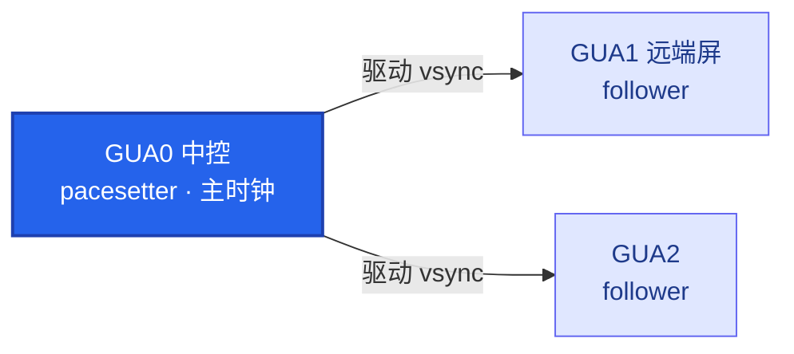
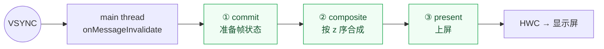

# 🖥️ SurfaceFlinger 主线程与三阶段

> [!abstract] 一句话记住
> **中控是时钟源，远端屏是从属，SF 每帧只有 `15.67ms`。**

> 关联：[[SurfaceFlinger]] · [[VSync]] · [[Fence]] · [[HWC]]

```bash
# 抓取命令：看 layer 列表、display、fence
adb shell dumpsys SurfaceFlinger | head -200
```

---

## 1. 🧭 Display 拓扑（谁是时钟源）



| HWC display | SF displayId          | 名称       | 角色                  |
| :---------: | --------------------- | -------- | ------------------- |
|     `0`     | `4634679611807204096` | GUA0 中控  | **pacesetter（主时钟）** |
|     `1`     | `4634679327297303554` | GUA2     | follower            |
|    `100`    | `4634679587309427457` | GUA1 远端屏 | follower            |

> [!warning] 为什么远端屏最先「看起来」死
> bug 里的 `FENCE GAP display=100 gap=16.9s` 就是最后这块屏。
> - 它是 **follower**，`hwVsyncState=Disallowed`，自身没有硬件 vsync，跟着中控走。
> - 中控合成一卡 → 它的 `present` 整个停摆 → 因此远端屏最先表现出「死屏」。

---

## 2. ⏱️ SF 主循环的节拍

| 参数               | 值        | 说明                  |
| ------------------ | :-------: | --------------------- |
| VSYNC period       | `16.67ms` | 一帧总时长            |
| `sf: workDuration` | `15.67ms` | SF 自己实际可用的时间 |

> [!note] 阈值来源
> 方案里「commit / composite 阈值 `16ms`」即源于此：一帧 `16.67ms`，SF 只能用 `15.67ms`。

---

## 3. ✅ 健康态基线

> 加心跳后，以下数值即为「正常」参照。

| 指标         | pacesetter | follower ×2 |
| ------------ | :--------: | :---------: |
| Total missed | `6`        | `0`         |
| HWC missed   | `4`        | `0`         |
| GPU missed   | `4`        | `0`         |

---

## 4. 🔎 Fence 观测点

> [!tip] `Has 1 unfired fences`（pacesetter 的 VsyncController）
> - **正常态**：偶尔 `1` 个未 signal 的 present fence 属正常。
> - **bug 发生时**：此处会**积压** —— 这是方案 `FENCE_STALL` 路径盯的数据。

---

## 5. 🧩 VsyncGuaDispatch（厂商私有）

- AOSP **没有**此机制，是厂商追加的第二套 vsync 分发（`Gua` 前缀）。
- 读 `Scheduler` 代码时需留意它。
- 当前**空闲**：`mIntendedWakeupTime` 为极大值 = 没有排任务。

---

## 6. 🎞️ 主线程与三阶段（核心）

SF 合成全跑在**单一主线程**，vsync 驱动，每帧顺序推进 `commit → composite → present`。



| 概念              | 是什么                                                            | 干什么                                                          |
| --------------- | -------------------------------------------------------------- | ------------------------------------------------------------ |
| **main thread** | SF 的单线程事件循环（`MessageQueue`/`onMessageReceived`），vsync 一到就醒来跑一帧 | 唯一操作图层树的线程；它一卡 → 全屏卡/黑。抓它的栈是定位掉帧/黑屏的起点                       |
| **① commit**      | 帧的准备阶段：把 App 提交的事务（transaction）和新 buffer 锁进这一帧的状态              | 处理 [[SurfaceControl]] 事务、latch 最新 buffer、算可见区域/几何；决定"这帧长什么样" |
| **② composite**   | 合成阶段：把各 layer 按 z 序合成                                          | 决定每层走 [[HWC]] overlay（硬件叠加省电）还是 GPU/RenderEngine 客户端合成       |
| **③ present**     | 上屏阶段：把合成结果交给 [[HWC]] 送显示屏                                      | 提交 present fence，等待上屏；`--timestats` 的 present time 即此步       |

> [!example] 调用链与复现原理
> **调用链（Android 13+）**：`Scheduler → MessageQueue frame callback → commit() → composite() → (内部) postFramebuffer/present`
> 给 `composite()` 加 `sleep(3s)` → 主线程被拖住 → 下游 `dequeueBuffer failed -110` + `Skipped N frames`（Day 4 复现原理）。

> [!important] present 的真实位置
> `present` **不是**与 `composite` 并列的第三步，而是 `composite()` 内部的收尾子步骤（`postFramebuffer`）。概念上仍是「三阶段」，调用栈上 present 嵌在 composite 里。

### 🗂️ AAOS / AOSP 代码位置

根目录：`frameworks/native/services/surfaceflinger/`

| 阶段 | 函数 | 文件 |
| --- | --- | --- |
| **主线程循环** | `MessageQueue::Handler::dispatchFrame` → frame callback | `Scheduler/MessageQueue.cpp` |
| 帧调度 | `Scheduler::onFrameSignal` | `Scheduler/Scheduler.cpp` |
| **① commit** | `SurfaceFlinger::commit()` | `SurfaceFlinger.cpp` |
| **② composite** | `SurfaceFlinger::composite()` → `mCompositionEngine->present()` | `SurfaceFlinger.cpp` |
| 合成主流程 | `Output::present()`（prepare/finish/post 依次跑） | `CompositionEngine/src/Output.cpp` |
| 合成策略（HWC vs GPU） | `Output::prepareFrame()` | `CompositionEngine/src/Output.cpp` |
| GPU 合成 | `Output::finishFrame()` | `CompositionEngine/src/Output.cpp` |
| **③ present（上屏）** | `Output::postFramebuffer()` → `presentAndGetFrameFences()` | `CompositionEngine/src/Output.cpp` |
| present fence / 送 HWC | `HWComposer::presentAndGetReleaseFences()` | `DisplayHardware/HWComposer.cpp` |

> [!note] 版本差异
> 早期（Android ≤12）主线程入口是 `SurfaceFlinger::onMessageReceived` / `onMessageInvalidate`；Android 13+ 拆成 `commit()` + `composite()` 两个独立回调，由 `Scheduler` 驱动。

---

## 📚 延伸阅读

- [SurfaceFlinger — source.android.com](https://source.android.com/docs/core/graphics/surfaceflinger-windowmanager)
- [VSYNC — source.android.com](https://source.android.com/docs/core/graphics/implement-vsync)
- [Sync framework / Fence — source.android.com](https://source.android.com/docs/core/graphics/sync)

## log
