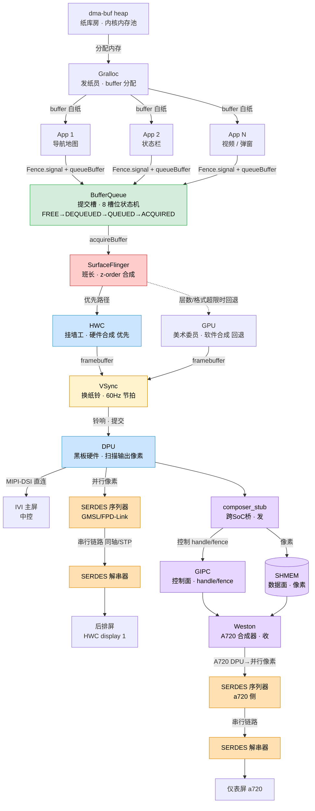
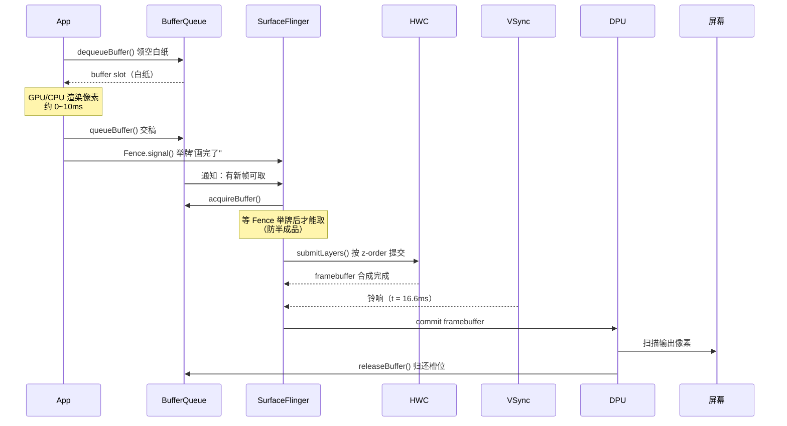
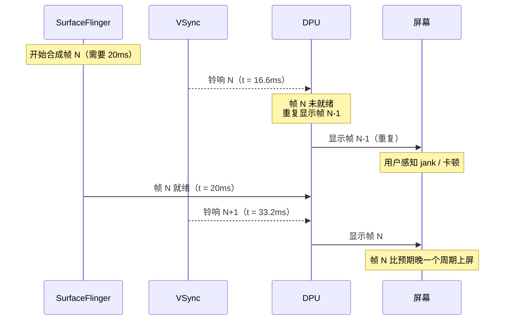
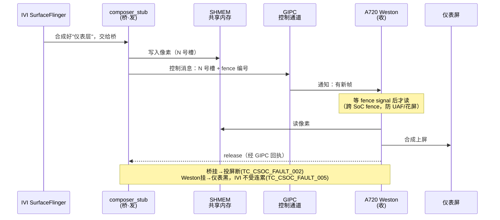
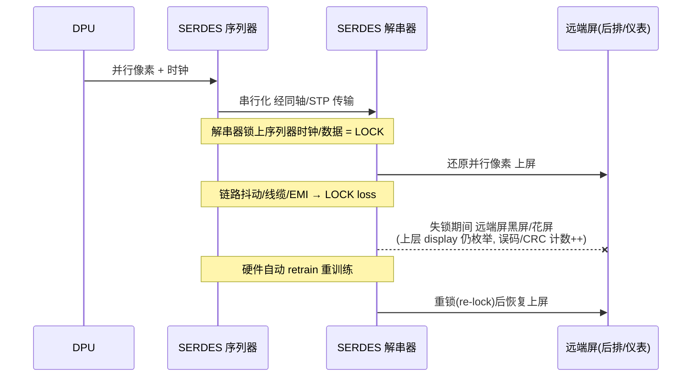

# GFWK 图形框架总览

> GFWK = Graphics Framework，AAOS 座舱里把一帧画面画出来并送上屏的整套软件栈。
> 本笔记是地图（MOC），用**教室黑板报**比喻把所有子系统串起来。

---

## 角色对照表

| 教室角色    | 技术名                | 职责                                     | 常见故障现象                                         |
| ------- | ------------------ | -------------------------------------- | ---------------------------------------------- |
| 纸库房     | [[dma-buf heap]]   | 内核内存池，所有白纸的真实存储                        | 库存耗尽 → 领不到大纸，跨屏投屏失败                            |
| 发纸员     | [[Gralloc]]        | 按格式/尺寸发空白纸（buffer 分配）                  | 挂了 → **冻屏**（旧帧还在，新帧无法分配）                       |
| 白纸      | 图形 buffer          | 装像素的内存块                                | —                                              |
| 同学（画画）  | App / [[生产者]]      | 在白纸上渲染自己的内容                            | —                                              |
| "画完了"举牌 | [[Fence]]          | 举牌前班长不许取，防拿到半成品                        | 未举牌就取 → 花屏 / kernel panic（UAF）                 |
| 提交槽     | [[Buffer Queue]]   | 同学交纸 / 班长取纸的中间缓冲，8 个槽位状态机管理            | 槽满 → 反压阻塞；状态机防止两人同时领一槽                         |
| 班长      | [[SurfaceFlinger]] | 从各提交槽取纸，按 z-order 合成完整一帧               | **黑屏**：班长倒了，无人向 DPU 提交帧                        |
| 挂墙工     | [[HWC]]            | 硬件 overlay 合成（省 GPU，优先路径）              | 层数/格式超限 → 回退 GPU；坏参数 → 拒绝不崩                    |
| 美术委员    | GPU                | 软件合成（HWC 回退路径，费电）                      | HWC/GPU 不一致 → 切换时颜色/透明度跳变                      |
| 换纸铃     | [[VSync]]          | 60Hz 节拍，铃响才换黑板内容，防撕裂                   | 铃响时帧没好 → DPU 重复上一帧 = jank                      |
| 黑板硬件    | **DPU**            | 把 framebuffer 扫描输出到物理像素                | underflow → 红屏；flip_done timeout → 黑屏          |
| 送线到远端   | [[SERDES链路]]       | DPU→远端屏(后排/仪表)/相机 的串行链路(GMSL/FPD-Link) | **失锁/误码 → 远端屏黑屏/花屏**（但上层 display 仍枚举，需链路层监控兜底） |
| 隔壁班黑板   | [[composer_stub]]  | 跨 SoC 把帧送到仪表屏（a720）                    | fence 跨核丢失 → 冻屏 / double-free                  |

---

## 流程图（一帧的完整旅程）



---

## 时序图 — 正常一帧（16.6ms 内完成）



---

## 时序图 — 异常：SF 合成超时（Jank）



---

## 时序图 — 跨 SoC 投屏（IVI → A720 仪表）

控制面（[[GIPC]]）与数据面（[[SHMEM]]）分离：像素走共享内存，只把 handle+fence 经 GIPC 通知。



> 像素**不经 GIPC**（那是控制面）；A720 侧 [[Weston]] 直接从 [[SHMEM]] 取像素。这与芯片内 [[Binder IPC|Binder]](控制)+[[dma-buf heap|dma-buf]](数据) 是同一套路，只是跨了两颗芯片。

---

## 时序图 — 远端屏经 [[SERDES链路]]（失锁 → 重训练）

DPU 之后到**远端屏（后排/仪表）**要过 SERDES 串行链路（GMSL/FPD-Link，走同轴/STP）。链路失锁时远端屏黑屏/花屏，但上层 display 常**仍枚举**——故链路层监控比上层"屏检测"更根因。



> 监控点：LOCK/LOSS、误码/CRC 计数、line-fault、retrain 次数（读法：I2C 读 SER/DES 寄存器 / sysfs / dmesg）。可做旁路探针嵌进 [[TC_HWC_FAULT_004]]、[[TC_GFWK_STRESS_007]]（显示开关恢复）等；用例矩阵见 [[SERDES链路]]。

---

## 通用验证手段：多屏抓图判黑

座舱是**多屏系统**（中控主屏 + 副屏/仪表），验证"画面正常/不黑"时——单屏不黑不代表全屏不黑，必须**逐块物理屏**抓图。这是 GFWK 所有稳定性用例通用的显示层验证方法。

```bash
# 不带 -d：只抓默认主屏
adb shell screencap -p /data/local/tmp/main.png

# -d <display-id>：指定抓哪块物理屏（多屏必用）
adb shell "screencap -d 4634679611807204096 -p /data/local/tmp/gua0.png && stat -c%s /data/local/tmp/gua0.png"  # GUA0 主屏

adb shell "screencap -d 4634679327297303554 -p /data/local/tmp/gua2.png && stat -c%s /data/local/tmp/gua2.png"  # GUA2 副屏
```

| 参数 / 值 | 含义 |
|---|---|
| `-d <id>` | 物理 display id，指定抓哪块屏；省略则只抓默认主屏 |
| `GUA0 = 4634679611807204096` | 主显示（中控 IVI 主屏） |
| `GUA2 = 4634679327297303554` | 第二显示（副屏 / 乘客屏） |
| `stat -c%s` | 取 PNG 字节数；纯黑帧压缩后仅几 KB，**> 30KB 视为有内容（非黑）** |

> display id 查询：`adb shell dumpsys SurfaceFlinger --display-id` 或 `adb shell dumpsys display`。
> 应用示例见 [[TC_SF_FAULT_002]] ④ 断言逻辑（施压后逐屏验证不黑）。

---

## 五大子系统

1. [[SurfaceFlinger]] / [[Buffer Queue]] — 班长 + 提交槽
2. [[Gralloc]] / [[dma-buf heap]] — 发纸员 + 纸库房
3. [[HWC]] — 挂墙工（overlay / GPU 合成切换、Alpha blending）
4. [[Fence]]（dma-buf/sync_file）— 举牌同步，跨进程 / 跨 SoC
5. [[composer_stub]] — 跨 SoC 显示（IVI ↔ 仪表 a720），GIPC/SHMEM
6. **DPU**（Display Processing Unit）— 扫描输出到物理屏幕
7. [[SERDES链路]] — DPU→远端屏(后排/仪表)/相机的串行链路(GMSL/FPD-Link)，GFWK 最后一公里

---

## 课程目录

- [[07-Android架构分层]] — Android 五层架构总览（Kernel/HAL/ART/Framework/App）
- [[01-一帧画面是怎么上屏的]] — 大图景
- [[02-SurfaceFlinger与BufferQueue]]
- [[03-Gralloc与dma-buf]]
- [[HWC]]
- [[05-Fence与跨SoC同步]]
- [[06-GFWK如何映射到测试用例]]
- [[TC_SF_FAULT_001]] — 实战起点
- [[重点用例-高亮]] — SF/HWC/GFWK 高亮用例集

## 关联

- 重启/休眠视角见 [[座舱]]（socreboot/mainreboot/STR/RAMdump）
- 稳定性测试整体见 `005-稳定性/`

### 跨 SoC 显示链路（IVI ↔ A720 仪表）
IVI 合成的帧跨芯片送到 A720 仪表屏，控制面/数据面分离：
- 发送桥 [[composer_stub]]（本平台 `vendor.gua.hardware.cluster-service`）
- 控制面 [[GIPC]]（传 handle/fence，进程 `gipc_sdd`）｜数据面 [[SHMEM]]（传像素）
- 接收合成 [[Weston]]（A720 Wayland 合成器，= 仪表的 SF）

### kill-恢复类测试（故障注入）
- 总览 [[GFWK kill-恢复类测试]]｜模板 [[TC_SF_FAULT_001]]
- [[TC_HWC_FAULT_004]]（kill HWC，连坐 SF）· [[TC_CSOC_FAULT_002]]（kill 跨SoC桥）· [[TC_CSOC_FAULT_005]]（kill weston）
