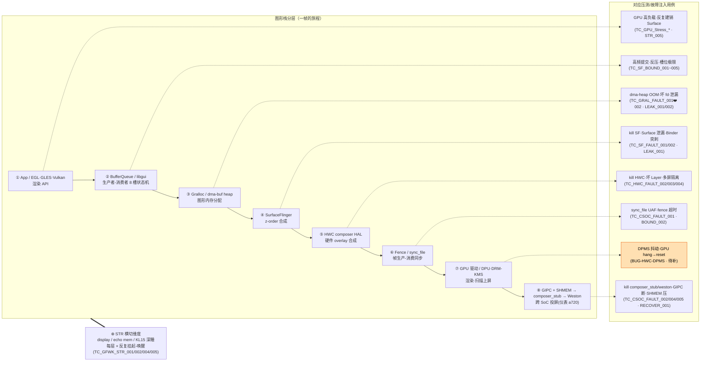

# 06 - GFWK 如何映射到测试用例

> 上级：[[000-GFWK图形框架总览]]

一句话：管线每个环节的故障 → 对应一个测试维度/用例。代码在 `D:\Dev_Code\autocase`（本地）与 Ubuntu `~/Documents/autocase`（真机权威副本）。

| 环节 | 维度 | 用例前缀 |
|---|---|---|
| [[SurfaceFlinger]]/[[Buffer Queue]] | FAULT/BOUND/LEAK | TC_SF_* |
| [[Gralloc]]/[[dma-buf heap]] | CONF/FAULT/LEAK | TC_GRAL_* |
| [[HWC]] | CONF/FAULT | TC_HWC_* |
| [[Fence]]/[[composer_stub]] | FAULT/SM/RECOVER | TC_CSOC_* |

- 实战起点：[[TC_SF_FAULT_001]]

---

## 图形栈分层 → 压测用例映射（mermaid）

> 一帧从 App 到像素，纵向穿过每一层；每层的故障模式对应一类注入用例。右列括号为 `autocase` 前缀。STR（挂起-唤醒）是**横切**维度，与每层相乘。

| 栈层 | 故障模式 | 用例 | 状态 |
|---|---|---|---|
| ① API/GPU | 驱动泄漏·hang | `TC_GPU_Stress_*` / [[TC_GFWK_STR_005]] | ✅ / 🟠 hang→reset 待补 |
| ② BufferQueue | 反压·槽位·突刺 | `TC_SF_BOUND_001~005` | 部分需 native |
| ③ Gralloc/dma-buf | **OOM**·坏 fd·泄漏 | **[[TC_GRAL_FAULT_001]]**（新，写完待验）· `002` · `LEAK_001/002` | 🟠 gap 最多 |
| ④ SurfaceFlinger | 崩溃·泄漏·死锁 | [[TC_SF_FAULT_001]] / [[TC_SF_FAULT_002]] | ✅ |
| ⑤ HWC | 崩溃·坏 Layer·多屏 | [[TC_HWC_FAULT_004]] / `002` / `003` | ✅ |
| ⑥ Fence | UAF·超时 | `TC_CSOC_FAULT_001`（P0） | 写完待验 |
| ⑦ GPU驱动/DPU | **DPMS 抖动·hang→reset** | [[BUG-HWC-DPMS-SetPowerMode崩溃循环]] | 🟠 待立用例 |
| ⑧ 跨 SoC | kill 桥·断链·压带宽 | [[TC_CSOC_FAULT_002]] / `004` / [[TC_CSOC_FAULT_005]] / [[TC_CSOC_RECOVER_001]] | ✅ |
| ⊗ STR 横切 | 挂起-唤醒累积 | [[TC_GFWK_STR_001]]/`002`/`004`/`005` | ✅ smoke 通过 |

> 🟠 = 高价值待补：③ dma-heap OOM 已落 [[TC_GRAL_FAULT_001]]；⑦ GPU hang→reset 与 DPMS 压测为下一批（见 [[BUG-HWC-DPMS-SetPowerMode崩溃循环]]）。

## 📚 延伸阅读
- Android Graphics 架构总览：https://source.android.com/docs/core/graphics
- BufferQueue 与 Gralloc：https://source.android.com/docs/core/graphics/arch-bq-gralloc
- SurfaceFlinger 与 HWC：https://source.android.com/docs/core/graphics/arch-sf-hwc
- Fence / 同步框架：https://source.android.com/docs/core/graphics/sync
- Kernel DMA-BUF：https://docs.kernel.org/driver-api/dma-buf.html
