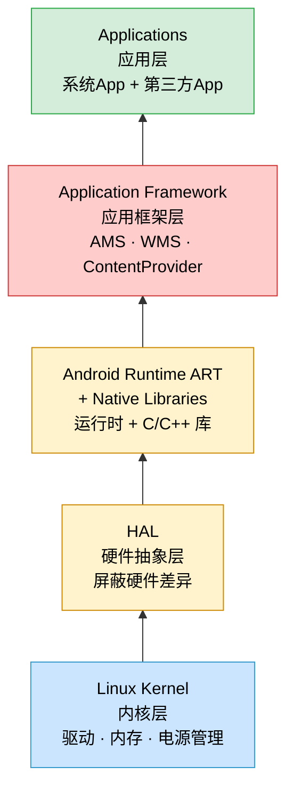
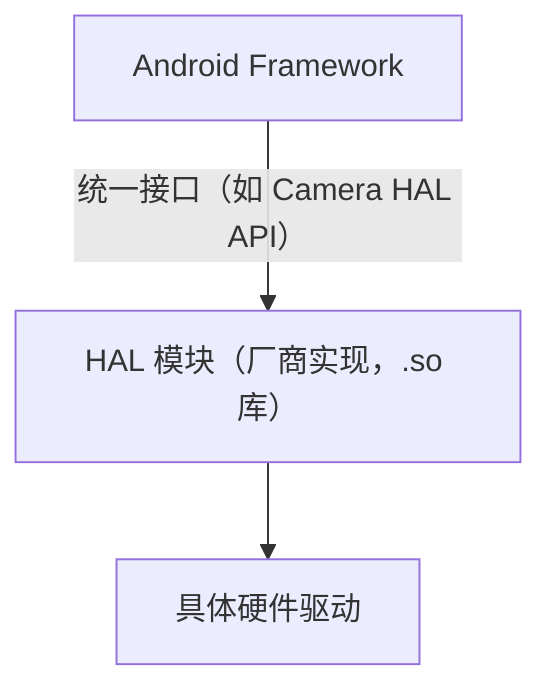
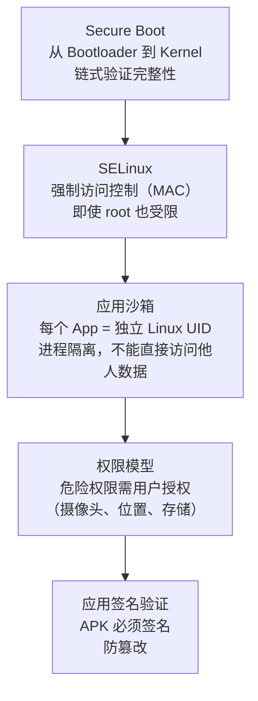
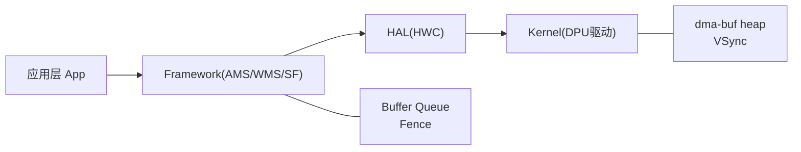

# 07 - Android 架构分层总览

> 来源：Android Architecture Explained: Layers, Components & Security for Beginners!
> 上级：[[000-GFWK图形框架总览]]

**一句话**：Android 是五层堆叠的软件栈，从底部硬件到顶部 App，每层只和相邻层通信。

---

## 架构分层图

---

## 各层详解

### 第一层：Linux Kernel（内核层）

Android 的地基。运行在最底层，直接控制硬件。

| 职责 | 说明 |
|---|---|
| 设备驱动 | 相机、Wi-Fi、蓝牙、Display、传感器驱动 |
| 内存管理 | 分配/回收物理内存，管理 OOM |
| 进程调度 | 决定哪个进程占用 CPU |
| 电源管理 | 休眠、唤醒（关联 [[STR]]、[[KL15]]） |
| 安全隔离 | 每个 App 是独立 Linux 用户，天然沙箱 |

> GFWK 关联：[[dma-buf heap]] 是内核的内存池；[[Fence]] 是内核的 `sync_file` 机制；DPU 驱动也在这一层。

---

### 第二层：HAL（Hardware Abstraction Layer，硬件抽象层）

**作用**：让 Android 框架不用关心具体硬件型号。不同厂商的摄像头硬件不同，但 HAL 对上提供统一接口。

> GFWK 关联：[[HWC]]（Hardware Composer）就是 Display HAL 的一部分，厂商实现 HWC HAL 对接自家 DPU。

---

### 第三层：Android Runtime（ART）+ Native Libraries

**ART（Android Runtime）**：
- 把 App 的 Java/Kotlin 字节码编译成机器码运行
- **AOT**（Ahead-of-Time）：安装时编译，启动快，占空间
- **JIT**（Just-in-Time）：运行时编译热路径，节省空间
- Android 5.0 起 ART 取代 Dalvik

**Native Libraries（C/C++ 库）**：

| 库 | 用途 | GFWK 关联 |
|---|---|---|
| `libc (Bionic)` | Android 定制版 C 标准库 | 所有进程的基础 |
| `OpenGL ES / Vulkan` | GPU 图形渲染 API | [[HWC]] GPU 合成路径 |
| `libstagefright` | 媒体解码（视频/音频） | 解码帧送入 [[Buffer Queue]] |
| `SQLite` | 嵌入式数据库 | — |
| `WebKit` | 浏览器渲染引擎 | — |
| `OpenSSL` | 加密库 | — |

---

### 第四层：Application Framework（应用框架层）

App 开发者直接使用的 Java API 层。住在这一层的核心服务都跑在 [[system_server]] 进程里。

| 服务 | 技术名 | 职责 |
|---|---|---|
| Activity 管理 | [[AMS]] | App 生命周期、任务栈 |
| 窗口管理 | [[WMS]] | 窗口 z-order、焦点、输入分发 |
| 显示合成 | [[SurfaceFlinger]] | 收图层、合成、送 DPU |
| 内容共享 | ContentProvider | App 间数据共享（联系人、媒体库） |
| 通知广播 | BroadcastReceiver | 系统事件通知（锁屏、网络变化） |
| 包管理 | PackageManager | App 安装、权限管理 |

---

### 第五层：Applications（应用层）

系统 App（设置、电话、相机）和第三方 App，都运行在这一层。

**四大组件**：

| 组件 | 作用 | 类比 |
|---|---|---|
| **Activity** | 一个可见的交互界面 | 教室里的一块黑板 |
| **Service** | 后台长期运行（音乐播放、导航） | 教室里静默工作的空调 |
| **ContentProvider** | 向其他 App 暴露数据 | 图书馆借阅台 |
| **BroadcastReceiver** | 监听系统广播事件 | 广播喇叭的收听者 |

---

## Android 安全模型

| 安全机制 | 作用 |
|---|---|
| 应用沙箱 | 每个 App 有独立 Linux 用户 ID，进程间内存隔离 |
| 权限模型 | 敏感能力（摄像头/麦克风/位置）需用户显式授权 |
| SELinux | 强制访问控制，限制进程能访问的文件和系统调用 |
| 应用签名 | APK 必须用开发者私钥签名，防止中间篡改 |
| Secure Boot | Bootloader → Kernel → System 链式签名验证 |

---

## 与 GFWK 的关联

GFWK（图形框架）横跨 **第三层到第一层**：
- SF / BufferQueue 在 Framework 层
- HWC 在 HAL 层  
- DPU 驱动、dma-buf、Fence、VSync 在 Kernel 层

---

## 关联

- 分层地图 → [[000-GFWK图形框架总览]]
- Framework 核心进程 → [[system_server]] · [[AMS]] · [[WMS]]
- HAL 图形实现 → [[HWC]] · [[Gralloc]]
- Kernel 内存/同步 → [[dma-buf heap]] · [[Fence]] · [[VSync]]
- 安全相关重启 → [[座舱]] · [[STR]] · [[KL15]]
