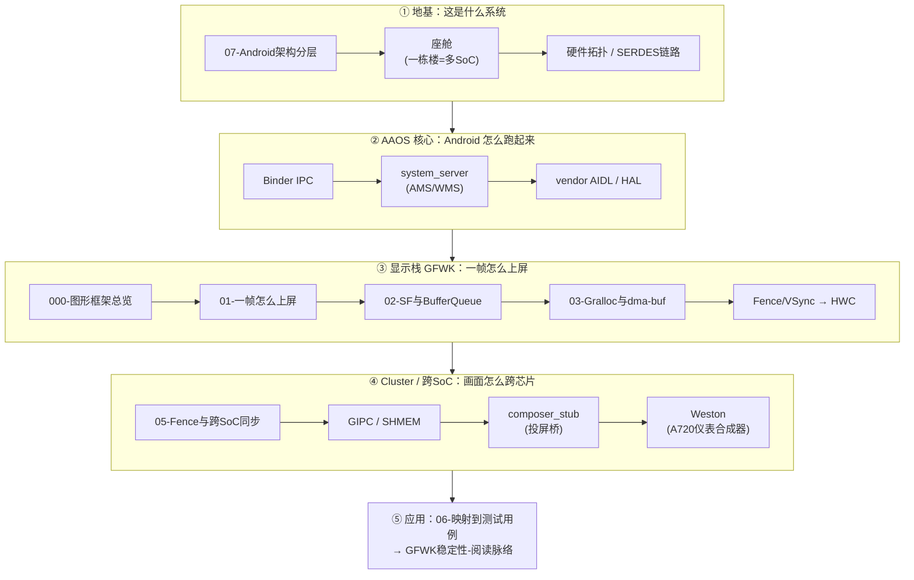

# AAOS + Cluster 学习地图（从哪入手）

> `004-AAOS/` 有 40+ 篇，编号教程(000/01/02/03/05/06/07) + 组件词条 + 座舱/跨SoC 混在一起，缺清晰入口。
> 本笔记是**总地图**：按目标给你一条读法。不移动任何原文件（避免断链），用链接把顺序串起来。
> 姊妹图：测试侧看 [[GFWK稳定性-阅读脉络]]。

## 一张图看懂 AAOS + Cluster

## 按目标选起点

### 🅰 我完全新手，想懂"座舱是什么"
1. [[07-Android架构分层]] —— Android 五层栈（地基）
2. [[座舱]] —— 「一栋楼住四户」：[[中控 Android（IVI）]] / [[仪表]] / [[智驾（ADAS）]] / [[安全核]]
3. [[硬件拓扑]] · [[SERDES链路]] —— 几颗 SoC、怎么连、屏怎么挂

### 🅱 我要懂"一帧画面怎么出来"（AAOS 显示栈 = GFWK）
1. [[000-GFWK图形框架总览]] —— 黑板报比喻，全栈地图
2. [[01-一帧画面是怎么上屏的]]
3. [[02-SurfaceFlinger与BufferQueue]] —— [[SurfaceFlinger|SF]] · [[Buffer Queue]] · [[生产者]]/[[Consumer]]
4. [[03-Gralloc与dma-buf]] —— [[Gralloc]] · [[dma-buf heap]] · [[GraphicBuffer]]
5. [[Fence]] · [[VSync]] → [[HWC]] —— 时序同步 + 上屏

### 🅲 我要懂"Cluster / 跨 SoC 投屏"（你现在的重点）
1. [[05-Fence与跨SoC同步]] —— 跨芯片怎么对齐时序
2. [[GIPC]] · [[SHMEM]] —— 跨 SoC 的管道和共享内存
3. [[composer_stub]] —— IVI→A720 投屏桥（[[退出码101 vs SIGSEGV（composer_stub 崩溃判定）]]）
4. [[Weston]] · [[仪表]] —— A720(Linux) 侧的合成器与显示

### 🅳 我要懂"AAOS 系统服务/进程"
- [[Binder IPC]]（一切 IPC 的底座）→ [[zygote]]（Java 进程母体）→ [[system_server]] → [[AMS]] / [[WMS]] / [[CPMS]] → [[SurfaceControl]] · [[vendor AIDL]]
- [[zygote]] 还是「SF 崩溃恢复」的关键（`onrestart restart zygote`）

### 🅴 我要把知识用到测试
- [[06-GFWK如何映射到测试用例]] → 转到测试 MOC [[GFWK稳定性-阅读脉络]]

## 关键词条速查（读到不懂时点）
- 图形：[[SurfaceFlinger]] [[HWC]] [[Gralloc]] [[dma-buf heap]] [[GraphicBuffer]] [[Buffer Queue]] [[Fence]] [[VSync]] [[SurfaceControl]]
- 系统：[[Binder IPC]] [[system_server]] [[AMS]] [[WMS]] [[CPMS]] [[vendor AIDL]] [[SELinux]]
- 跨SoC/Cluster：[[GIPC]] [[SHMEM]] [[SERDES链路]] [[composer_stub]] [[Weston]] [[仪表]]
- 座舱域：[[座舱]] [[中控 Android（IVI）]] [[智驾（ADAS）]] [[安全核]] [[KL15]]
- 故障态：[[STR]] [[SIGSEGV]]（+ 测试侧 [[SIGKILL （kill -9）]] [[tombstone（墓碑 验尸报告）]] [[RAMdump]] [[ANR]]）

---

## 📁 文件夹重整建议（可选，不影响学习地图）
现状问题 → 建议（**先备份 vault 再动**）：

1. **顶层散文件归位**：`AI赋能/` 直下的 [[显示链路]]、[[硬件拓扑]]、[[GraphicBuffer]]、[[后排屏]] 属 AAOS → 移入 `004-AAOS/`；[[黑屏检测算法说明]]、[[屏幕异常检测算法总览]]、[[DL模型训练]]、[[屏幕异常模型训练方案]] 属算法 → 新建 `006-屏幕异常算法/`。
2. **去重**：`Gralloc.md` 顶层与 `004-AAOS/` 各一份 → 保留 004 版，顶层删或改为跳转。
3. **补缺 04**：编号教程缺 `04`（03 之后直接 05）→ 建议 `04-HWC与上屏` 或把 `05-Fence与跨SoC同步` 补齐前置。
4. **004-AAOS 内分层**（40+篇偏多）：可拆 `004-AAOS/概念词条/`（SF/HWC/Binder… 词条）与保留编号教程在根，教程做主线、词条做词典。
5. **空目录**：`000-GenerativeAI` 空 → 填充或删。
6. **cheatsheet 归拢**：[[常用adb指令速查]] [[常用linux 指令速查]] → 新建 `007-速查/`。

> 我可以按上面 1-6 帮你实际执行（移动+批量修 `[[链接]]`），或只保留这张地图不动文件。你定。
