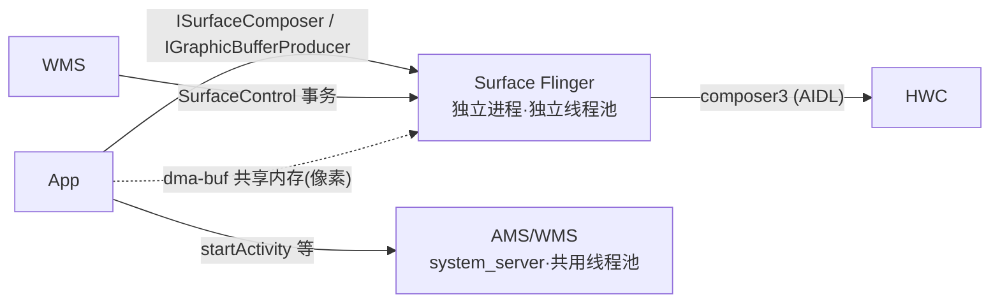

# Binder IPC

Android 的**进程间通信**机制。各进程内存独立，无法直接调用对方函数，必须通过 Binder 内核驱动"传纸条"。

> HAL/服务接口用 [[vendor AIDL]] 定义并经 Binder 暴露；`service call <svc> <code>` 即手动发一次 Binder 事务（见 [[TC_GFWK_STRESS_008]] 后排屏电机 AIDL 压测）。

## 核心概念

| 术语 | 含义 |
|---|---|
| Binder 线程池 | 每个进程默认 15 条线程，同时最多处理 15 个请求，超出的等待 |
| Transaction | 一次 Binder 调用（同步阻塞，默认 5s 超时） |
| ServiceManager | Binder 的"电话本"，服务注册/查找都靠它 |
| IBinder / AIDL | 定义 Binder 接口的语言，编译生成 proxy/stub 代码 |

## 与图形框架的关系

- [[SurfaceFlinger|SF]] **本身是 Binder 服务**（ServiceManager 里注册名 `SurfaceFlinger`）；[[WMS]] 是它的头号客户，用 `SurfaceControl` 事务建/摆窗口层
- **控制面走 Binder，数据面走共享内存**：Binder 只传 buffer 的 **fd 句柄**，几 MB 的像素走 [[dma-buf heap|dma-buf]]，不占 Binder 带宽
- SF 和 [[AMS]]/[[WMS]] 的 Binder 线程池**完全独立**——system_server 被打满不影响 SF 的 IPC 通道（[[TC_SF_FAULT_002]] 验证的正是这点）
- `service call` 命令可直接从 shell 发 Binder transaction（[[TC_HWC_FAULT_002]] 的注入方式）

## 📚 延伸阅读
- [Binder IPC（官方）](https://source.android.com/docs/core/architecture/hidl/binder-ipc)
- [Graphics architecture（官方）](https://source.android.com/docs/core/graphics/architecture)

## 相关
上级 [[000-GFWK图形框架总览]]｜使用者 [[SurfaceFlinger]]｜[[AMS]]｜[[WMS]]｜[[system_server]]｜验证隔离 [[TC_SF_FAULT_002]]
