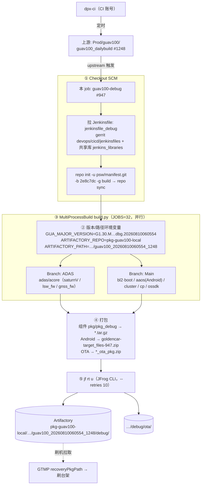

# CI 构建与产物流程（Jenkins → JFrog Artifactory）

> 来源：guav100-debug #947 完整 console 分析（版本 `G1.30.M.H2.1.7.6.0.01.14.01-2e8c7dc.dbg.20260810060554`）。
> 上级：[[000-GFWK图形框架总览]]｜关联：[[代码编译]]（源码下载/本地编译）

## 一句话
`dpx-ci` 定时跑上游 `guav100_dailybuild` → 触发 `guav100-debug` job → checkout(Jenkinsfile + manifest) → `build.py` 并行编各子域 → 打包 → **`jf rt u` 上传到 JFrog Artifactory**。刷机（GTMP）从 Artifactory 拉包。

## 产物存放位置（image 存哪里）
```
https://jf.guasemi.com/ui/repos/tree/General/
  pkg-guav100-local/guav100/gua-master/dailybuild/guav100_<时间戳>_<buildNo>/debug/
```
- **repo**：`pkg-guav100-local`（`ARTIFACTORY_REPO`）
- **每次构建一个文件夹**：`guav100_<yyyymmddHHMMSS>_<buildNo>`（#947 → `guav100_20260810060554_1248`）
- `/debug/`：`*.tar.gz`（各子域镜像 + build_info）、`goldencar-target_files-947.zip`（Android target_files）、版本 `.json`、`*.txt`
- `/debug/ota/`：`*_empty_incremental` / `*_ota_pkg` / `*_mcu_ota_pkg`（`.zip`+`.json`）
- **build_info（manifest）**：`MANIFEST_JFROG_URL` = `…/debug/guav100_…_build_info.tar.gz`
- **上传命令**：`jf rt u --retries 10 --retry-wait-time 60s --flat=false <file> pkg-guav100-local/…/debug/`

## 流程图



## 关键坐标（速查）
| 项 | 值 |
|---|---|
| 触发者 | `dpx-ci`（上游 `guav100_dailybuild #1248` upstream 触发） |
| Jenkinsfile | `jenkinsfiles/guav100/dailybuild/guav100/jenkinsfile_debug`（gerrit `devops/cicd/jenkinsfiles`） |
| 源码 | `repo init -u ssh://gerrit.guasemi.com:29418/psw/manifest.git -b 2e8c7dc -g build` |
| 编译 | `build.py`（MultiProcessBuild，JOBS=32，并行 ADAS + Main 两分支） |
| 上传 | `jf rt u`（JFrog CLI） |
| 仓库 | `pkg-guav100-local` @ `jf.guasemi.com` |

## 关联
- 源码下载与本地编译 → [[代码编译]]
- 座舱各域（谁被编出来） → [[座舱]] · [[中控 Android（IVI）]] · [[智驾（ADAS）]] · [[仪表]]
- 刷机消费此产物 → GTMP `recoveryPkgPath`（见 [[GFWK 稳定性测试用例全量清单]] 回归记录）
