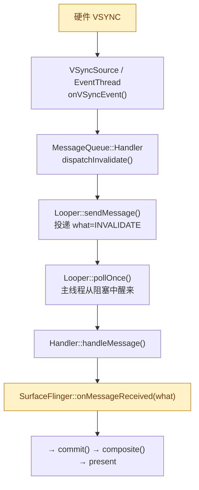

# 📮 MessageQueue（SF 主线程事件循环）

> [!abstract] 一句话
> SF 主线程那颗**心脏**：一个基于 **`Looper`** 的原生 C++ 事件循环，平时阻塞睡眠，**vsync/任务一到就醒来跑一帧**。它把「异步事件」串行化到**单一主线程**，这就是 SF「单线程合成模型」的根。

> 关联：[[SurfaceFlinger]] · [[SurfaceFlinger 主线程与三阶段]] · [[VSync]] · [[Scheduler]] · [[HWC]]

---

## 1. 🧭 它是什么 / 不是什么

| | 说明 |
|---|---|
| **是** | SF **内部私有**的 C++ 类，`frameworks/native/services/surfaceflinger/Scheduler/MessageQueue.{h,cpp}`；封装一个 `android::Looper` |
| **不是** | ❌ Java 层 `android.os.MessageQueue`/`Handler`（App 主线程那套）——同名不同物，语言/进程都不同 |
| **不是** | ❌ Binder 消息队列、❌ App 的 IPC 消息——它收的是**帧节拍信号**，不是内容数据 |

> [!info] 与 `Looper` 的关系
> `Looper` = Android 原生的 **epoll 封装**，提供「阻塞等待 fd 事件 / 定时器 / 唤醒」的底层能力。
> `MessageQueue` = 在 `Looper` 之上加了 **vsync 驱动**和 SF 语义的一层壳：把 `VSyncSource` 的回调转成主线程要跑的 `what` 事件。

---

## 2. 🔄 一次唤醒的完整链路

---

## 3. 🏷️ message 到底是什么

主线程收到的 `message` 是一个**事件枚举 `what`**，不是数据：

| `what` | 触发时机 | 派发到 | 对应阶段 |
| --- | --- | --- | --- |
| `INVALIDATE` | vsync 到来 | `onMessageInvalidate()` | **① commit**（latch 事务/buffer） |
| `REFRESH` | commit 判定需重绘 | `onMessageRefresh()` | **② composite → ③ present** |

> [!important] 数据走的是另一条路
> App 的 `SurfaceControl` 事务、新 buffer **不经过** message：`setTransactionState()` 把它们存进 `mTransactionQueue`，等 `INVALIDATE` 唤醒后在 **commit 阶段**才被 latch 进来。
> **message = 「该干活了」的节拍；事务/buffer = 「要画什么」的内容**，两者解耦。

---

## 4. 🧵 为什么用「单线程事件循环」

- **无锁化图层树**：所有对 layer tree 的操作都排到同一线程串行执行 → 免去大量锁竞争。
- **代价**：主线程是**唯一瓶颈**——任一阶段卡住（如 `composite()` 阻塞）→ 整条 `pollOnce` 排队积压 → 全屏掉帧/黑屏。这正是稳定性排障要抓主线程栈的原因。
- **投递入口**：除 vsync 外，其它模块用 `postMessage()` / `post()` 把一次性任务丢进队列，同样串行执行。

---

## 5. 🧬 版本演进

| Android 版本 | 主线程入口 | 说明 |
| --- | --- | --- |
| ≤ 12 | `onMessageReceived(what)` + `onMessageInvalidate/Refresh` | 经典 `what` 枚举分发 |
| 13+ | `Scheduler` 直接回调 `commit()` / `composite()` | 去掉 `what` 分发层，语义等价；`MessageQueue` 仍在，改喂 frame callback |

> [!note] 排障提示
> 看栈时若出现 `Looper::pollOnce` / `MessageQueue::Handler::handleMessage`，说明落在主线程事件循环里；再往上一帧就是 `commit`/`composite`，可据此判断卡在准备帧还是合成。详见 [[SurfaceFlinger 主线程与三阶段]] §6。

---

## 📚 延伸阅读

- [SurfaceFlinger 源码 · Scheduler/MessageQueue.cpp — cs.android.com](https://cs.android.com/android/platform/superproject/main/+/main:frameworks/native/services/surfaceflinger/Scheduler/MessageQueue.cpp) — `MessageQueue` 与其 `Handler` 的实现：`dispatchInvalidate/Refresh`、`postMessage`、`initVsync`，可直接对照本页 §2 链路。
- [Looper.h — cs.android.com](https://cs.android.com/android/platform/superproject/main/+/main:system/core/libutils/include/utils/Looper.h) — 底层 `Looper`（epoll 封装）的 `pollOnce` / `sendMessage` / `addFd` 接口，理解 §1「阻塞等待—唤醒」机制的出处。
- [Implement VSYNC — source.android.com](https://source.android.com/docs/core/graphics/implement-vsync) — vsync 如何经 EventThread/VSyncSource 喂进主线程，解释 §2 起点与 SF 唤醒时机。

## log
