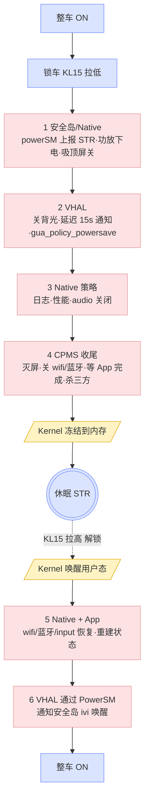
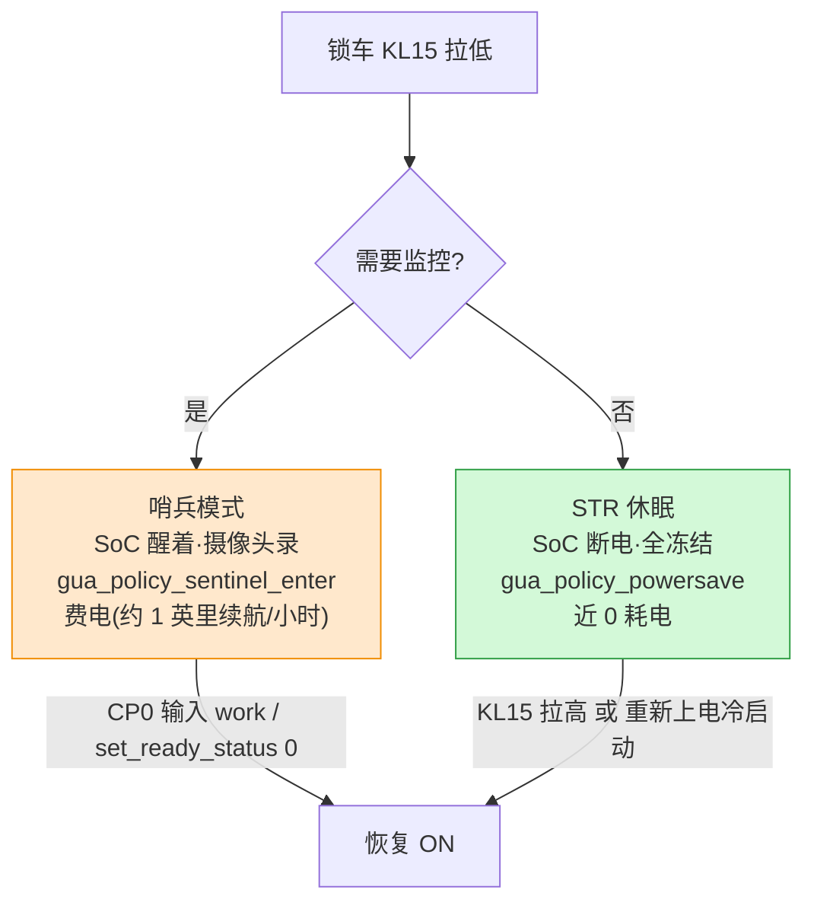

# STR（Suspend-to-RAM，整车休眠）

**一句话**：把整个系统"现场"冻结在 [[RAM]] 里，主 SoC 断电，只留 [[安全核]] + [[KL15]] 检测电路靠常电（KL30）盯着唤醒源；解锁后从内存秒速恢复，不用冷启动。

> STR 不是"一个动作"，而是一条跨 **安全岛(CP0/CP1) → Android 用户态(CPMS/App) → Kernel** 的**流水线**。

## 流程图
🔴Android · 🟡Kernel · 🔵整车状态



**下电 1→6 从用户态往下压到 Kernel 冻结；唤醒反向从 Kernel 往上恢复，对称。**

## 关键区分（最容易踩坑的三点）

### 1. 电源状态 vs 电源策略
| | 电源状态 (Power State) | 电源策略 (Power Policy) |
|---|---|---|
| 含义 | 系统整体档位：ON / SHUTDOWN / **SUSPEND(STR)** | 哪些组件开/关（display、wifi、audio…）|
| 谁管 | Kernel 真断电/冻内存 | [[CPMS]] 下发，**CPU 活着才能执行** |

### 2. "系统等你" vs "你等系统"（清理为何必须放 SHUTDOWN_PREPARE）
- `SHUTDOWN_PREPARE`：**会主动等你**——`canPostpone=true`，可反复 postpone，等所有 listener `future.complete()`。弹性可达数分钟。
- `SUSPEND_ENTER`：**不等你**——`state(7) doesn't allow listener completion`，不可回头点，清理会被从中间截断 → 唤醒后状态不一致/coredump。
- **口诀**：耗时清理/存数据 **必须放 `STATE_SHUTDOWN_PREPARE`**。

### 3. STR vs [[哨兵模式]]（互斥）
- 哨兵要监控 → **SoC 保持唤醒**，只用 `gua_policy_sentinel_enter` 关屏/音频，留摄像头算力。
- STR → **SoC 真睡全冻结**，任何 process 停摆。
- **要哨兵就不进 STR；进了 STR 哨兵也一起冻。** 锁车瞬间按"要不要监控"**分岔二选一**：



> 物理互斥：**不能既 CPU 断电极省电，又 CPU 跑算法监控**。省电 ↔ 监控，二选一。

## CPMS 状态机主干
```
WAIT_FOR_VHAL → ON → SHUTDOWN_PREPARE → WAIT_FOR_FINISH → SUSPEND(DEEP_SLEEP) → [冻结]
              ON ← WAIT_FOR_VHAL ← Resuming ←──────────────────────────── KL15↑
```

## 逐行日志的时间证据
| 阶段 | 耗时 | 说明 |
|---|---|---|
| VHAL 延迟通知 | 15 s | 给收尾留缓冲 |
| `SHUTDOWN_PREPARE`（含 GarageMode + postpone） | **~218 s** | 系统"等你"，弹性 |
| `SUSPEND_ENTER → Entering Suspend-to-RAM` | **~3 ms** | "你等系统"，不可回头 |

关键行：`Entering Suspend-to-RAM`（冻内存）/ `Resuming after suspending`（唤醒）。

## 台架测试要点
- 必须找到 **绿色 KL15 信号线**（外接继电器模拟点火/熄火）：`KL15 拉低=锁车`、`KL15 拉高=解锁`。
- 触发 STR：`adb shell dumpsys vendor.gua.hardware.power.IPower/default --report 2`（关机用 `--report 1`）。
- ⚠️ 安全岛暂未实现软唤醒 → **进 STR 后只能重新上电冷启动**。
- 模拟策略：`adb shell cmd car_service apply-power-policy gua_policy_powersave`（醒：`gua_policy_on`）。
- reboot 测试可覆盖关机测试：CP0 串口输入 `reboot`。
- 出问题 dump：CP0 `sm_state`；CP1 `sm_state` / `dfx_dump plc|ss|is|ipc`。

## 📚 延伸阅读
- [AAOS Power management](https://source.android.com/docs/automotive/power/power?hl=zh-cn)
- [AAOS Power policy](https://source.android.com/docs/automotive/power/power_policy?hl=zh-cn)

## 相关
[[CPMS]]｜[[哨兵模式]]｜[[KL15]]｜[[安全核]]｜[[中控 Android（IVI）]]｜[[座舱]]
