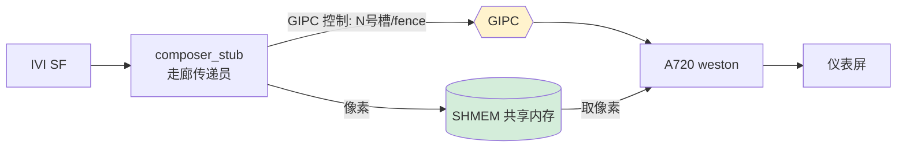

**走廊传递员**：IVI SoC 侧的**跨 SoC 显示桥**。 [[Surface Flinger]] 把要显示到仪表的那一层合成好后交给它，它对 SF **假装自己是一个 display/composer 目标（stub=桩）**，实际把帧转发到隔壁 [[仪表|A720 Cluster]]。

## 拓扑：座舱是多颗 SoC

| 名词               | 是什么                           | 跑什么                                |
| ---------------- | ----------------------------- | ---------------------------------- |
| **IVI SoC**      | 中控 Android(AAOS) 域            | [[Surface Flinger]]/ [[HWC]] / App |
| **A720 Cluster** | 仪表处理器，**独立 SoC**，Linux(Yocto) | weston 合成器，画仪表屏                    |
| **跨 SoC**        | 两颗物理芯片                        | 中控内容显示到仪表屏须跨芯片搬运                   |

## GIPC vs SHMEM = 控制面 vs 数据面（跨 SoC 版）

和芯片内 [[Binder IPC|Binder]]+[[dma-buf heap|dma-buf]] 同一套路，搬到两颗芯片之间：

| 面   | 芯片内     | 跨 SoC                        | 传什么                             |
| --- | ------- | ---------------------------- | ------------------------------- |
| 控制面 | Binder  | **GIPC**（Gua Inter-SoC Comm） | 小消息：有新帧、buffer 在哪、[[Fence]] 举牌没 |
| 数据面 | dma-buf | **SHMEM**（跨 SoC 共享内存）        | 几 MB 像素本体                       |

> 像素放进两颗 SoC 都能访问的 SHMEM，GIPC 只喊"内容在 N 号槽 + fence 编号"，A720 直接从 SHMEM 读像素贴仪表屏。

## 本平台真实进程（两端各一个，别混）
| 侧 | 进程 | 角色 |
|---|---|---|
| **IVI(Android) 发送端** | `vendor.gua.hardware.cluster-service` + `gipc_sdd` | 把 IVI 合成的仪表层经 GIPC/SHMEM 送出 |
| **A720(Linux) 接收端** | **`/bin/composer_stub`** | **Wayland 客户端**：收 IVI 帧交给 [[Weston]] 上仪表屏 |

## 已知风险
- 跨 SoC 单点 + 双所有权：`sp<Surface>` 两端各持 → cleanup **double-free**；A720 重启共享 fence 未 signal → IVI **UAF/冻屏**。
- 🔴 **实测缺陷（2026-07-30）**：**kill IVI 的 HWC → A720 `/bin/composer_stub` SIGSEGV**（`wl_proxy_get_version`，libwayland-client），**1:1 复现**。见 [[BUG-kill-HWC-crashes-A720-composer_stub]]。

## 关联
详见 [[05-Fence与跨SoC同步]]｜上级 [[000-GFWK图形框架总览]]
链路 → 数据面 [[SHMEM]]｜接收侧 [[Weston]]（A720 合成器）
用例 → [[TC_CSOC_FAULT_002]]（kill 桥恢复）· [[TC_CSOC_FAULT_005]]（kill weston）· [[GFWK kill-恢复类测试]]
