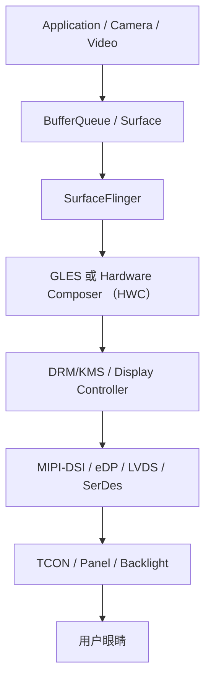

[[SurfaceFlinger|SurfaceFlinger]] 接收各个 Surface 的 buffer，并通过 GPU 或 [[HWC|Hardware Composer]] 完成合成；[[VSync]] 将应用渲染、SurfaceFlinger 合成和物理刷新周期同步起来。虚拟显示则可以把合成输出提供给录屏或网络传输。

|现象|常见根因|
|---|---|
|黑屏|App 没有提交 buffer、SurfaceFlinger/HWC 卡住、DRM commit 失败、显示链路断开、背光关闭、panel reset|
|白屏|framebuffer 未初始化、panel/TCON 异常、显示初始化时序错误、内存数据异常|
|花屏|buffer 越界、stride/format 错误、DMA/IOMMU 错误、DDR 数据损坏、压缩格式错误、SerDes/MIPI 信号问题|
|闪黑/闪白|layer 生命周期错误、HWC plane 切换、modeset、refresh-rate 切换、电源瞬变、ESD/EMI|
|冻屏|App/SurfaceFlinger/GPU hang、fence 不返回、buffer 不再更新、DRM page-flip 卡死|
|撕裂/局部错位|VSync、fence、atomic commit、partial update、panel scan timing|
|间歇色偏|色彩空间、gamma、HDR metadata、pixel format、链路误码、面板温度漂移|
