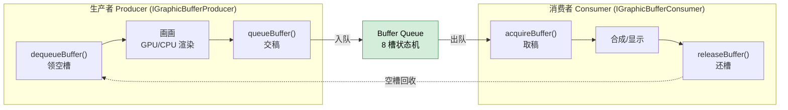

# 生产者 (Producer)

**生产者 = 往图形 buffer 里写像素、画完塞进队列的一方**。
这是经典**生产者-消费者模式**在图形栈的应用，中间隔着有界队列 [[Buffer Queue]]。

## 生产者-消费者一圈流转

- **生产端** `IGraphicBufferProducer`：`dequeueBuffer → 画 → queueBuffer`
- **消费端** `IGraphicBufferConsumer`：`acquireBuffer → 用 → releaseBuffer`

## 角色是相对的

同一个 [[SurfaceFlinger|SF]] 有两副面孔：
- 对 **App**，SF 是**消费者**（取 App 画的帧）
- 对 **[[HWC]]/显示**，SF 又是**生产者**（交出合成好的帧）

> "谁是 producer" 取决于看**哪一段 BufferQueue**，不是固定身份。

## 反压：队列有界，生产者太快就被挡

队列满 → `dequeueBuffer` 阻塞或返回 `WOULD_BLOCK`，生产者**等**，不溢出、不崩溃。这正是 [[TC_SF_BOUND_002]] 验证的机制。

## 📚 延伸阅读
- [BufferQueue and gralloc（官方）](https://source.android.com/docs/core/graphics/arch-bq-gralloc)
- [Graphics architecture（官方）](https://source.android.com/docs/core/graphics/architecture)
- [Producer–consumer problem（Wikipedia）](https://en.wikipedia.org/wiki/Producer%E2%80%93consumer_problem)

## 相关
详见 [[01-一帧画面是怎么上屏的]]｜配对 [[Consumer]]｜机制 [[Buffer Queue]]｜测试 [[TC_SF_BOUND_002]]｜上级 [[000-GFWK图形框架总览]]
