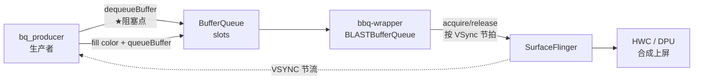

# BufferQueue 反压测试 (bq_producer)

> [!abstract] 一句话概述
> 用一个自写的 native [[生产者]] `bq_producer`，以「超速」方式向 [[SurfaceFlinger]] 的 [[Buffer Queue|BufferQueue]] 投递帧，测量 `dequeueBuffer` 的阻塞时长，从而量化 **[[反压 (back-pressure)]]**；再用 **[[Perfetto]]** 抓 trace，验证这个阻塞的本质是 **被 [[VSync]]/显示刷新节流**，而非卡死。

---

## 1. 如何生成二进制并测试

### 1.1 代码位置
- 源码：`aaos/vendor/gua/tests/bq_producer/bq_producer.cpp`
- 构建脚本：`aaos/vendor/gua/tests/bq_producer/Android.bp`（`cc_binary`，链接 `libgui / libui / libnativewindow / libsync / libutils / libbinder / libcutils / liblog`）

### 1.2 编译（Soong / m）
```bash
cd /home/qi.zhu/code/ws/workspace/aaos
source build/envsetup.sh          # 加载 lunch / m 命令
lunch guav100-userdebug           # 选产品(带参数，勿进交互菜单)
m bq_producer                     # 只编这一个模块，分钟级
# 产物: $OUT/system/bin/bq_producer
#     = out/target/product/guav100/system/bin/bq_producer
```


### 1.3 部署到台架并运行
```bash
# 台架经 ssh 中转主机时：先 scp 到主机，再 adb push 到设备
adb push $OUT/system/bin/bq_producer /data/local/tmp/
adb shell chmod 755 /data/local/tmp/bq_producer
adb shell /data/local/tmp/bq_producer 1000     # 参数 = 生产帧数
```

> [!important] 二进制分发：走 JFrog，不入 git
> autocase 的 native 测试工具**不提交进 git**（旧 `cases/BenchSelfTestCases/bin/gipc-bench-*` 是废弃做法）。当前规范同 `test_028_gipc_bench_pingpong`：**上传 JFrog，用例里 `download_jfrog` 拉取**。
> ```bash
> # 上传（约定路径）
> jfrog rt upload bq_producer autotest-log/resource/tools/bq_producer/
> ```
> 用例 `TC_SF_BOUND_002_producer_rate.py` 已改为 `_download_bin(JFROG_BQ_PRODUCER)` → `adb_push` → 跑；JFrog 缺文件时 `pytest.skip`。

### 1.4 判读输出
- 每帧打印 `dequeue 阻塞 X us`，`X > 2000us` 标 `<== 反压`。
- 结尾汇总：成功帧数 / 最大阻塞 / 平均阻塞 / 阻塞帧数。

---

## 2. 这个测试的目的

> [!note] 核心概念：反压 (back-pressure)
> **类比**：生产者=往传送带放包裹的人，消费者(SurfaceFlinger)=取包裹的人，传送带槽位(BufferQueue slot)有限。放得比取得快 → 槽位占满 → 放包裹的人被迫等。这个「被迫等的时长」就是反压强度。

- **验证生产者-消费者的流控机制**：确认当 app 出帧速度超过显示消费速度时，Android 图形栈会通过 `dequeueBuffer` 阻塞来「顶住」生产者，而不是无限堆积内存。
- **量化背压强度**：用阻塞时长(us)作为客观指标，可对比不同场景(上屏/不上屏、消费快/慢)。
- **车载(AAOS)意义**：仪表/IVI 的 [[HWC]] → [[SurfaceFlinger]] → DPU 合成链路对时延敏感。理解 [[Buffer Queue|BufferQueue]] 背压有助于排查掉帧、卡顿、buffer 饥饿/堆积一类问题，也是复现「消费端卡死(如 SF 被杀见 [[TC_SF_FAULT_001]] / [[TC_SF_FAULT_002|AMS-WMS 死锁]])」类故障的基础工具。

### 本次实测结论
- 独立运行(1000 帧)：平均阻塞 **5.79ms**、最大 **35.5ms**、**998/1000** 帧触发反压。
- 稳态呈 **~4.5ms / ~6.0ms 双值交替**：典型的 triple-buffer 与 VSync 相位拍频。
- `dumpsys SurfaceFlinger` 显示：layer `size=(0,0)`、`VisibleRegion=0`、`composition type=INVALID`（**未真正上屏**），但子层 `bbq-wrapper`(**BLASTBufferQueue**, Android 12+) 持有 320×240 RGBA buffer，`queued-frames=0`（无积压）。
- **结论**：即使 layer 不可见，BLASTBufferQueue 仍按 VSync 节拍 acquire→release buffer（隐形消费者），把生产者限流到显示刷新节奏 = **VSync 节流型背压**，非死等。

---

## 3. Perfetto 的作用

> [!info] Perfetto 是什么
> Android 的系统级 tracing 工具（systrace 的继任者）。把内核调度、SurfaceFlinger、GPU、binder、VSync 等事件按**统一时间线**记录下来，可在 [ui.perfetto.dev](https://ui.perfetto.dev) 可视化，或用 `trace_processor` 跑 SQL 做量化分析。

- **为什么用它**：`bq_producer` 自己的 printf 只能给出「阻塞了多久」，但**无法证明阻塞的原因**。Perfetto 能把 `dequeueBuffer` 阻塞与 `VSYNC-app/VSYNC-sf`、SF 主线程、GPU fence 对齐，直接看出「卡在下一个 VSync 边界」= 被节流。
- **抓取命令**：
```bash
adb shell perfetto -o /data/misc/perfetto-traces/bqp.pftrace -t 8s gfx view sched freq -a '*'
adb pull /data/misc/perfetto-traces/bqp.pftrace
```
- **看什么**：
  - `VSYNC-app` / `VSYNC-sf`：counter 方波，属 `surfaceflinger` 进程（不在 `bq_producer` 下），需展开或搜索 `VSYNC` 并 Pin。
  - `Expected/Actual Timeline`：FrameTimeline，每帧预期/实际时长（绿=按时），**不是** VSYNC。
  - CPU Scheduling 里的 `bq_producer` 黄条 = 线程**在 CPU 上运行**的时间；**阻塞表现为 gap(Sleeping)**，长短不一是因每轮 memset/binder/printf/抢占/相位不同。
  - 语义 slice `dequeueBuffer`/`queueBuffer` 在**进程主线程 slice 轨**（非 CPU Scheduling 轨）。

### 本次 trace 关键读数
- ~354 cycles / 6.08s ≈ **59fps**，cadence 11–13ms → 屏 **60Hz**，生产者被锁到刷新率。
- 最长 `dequeueBuffer` **38.6ms**、`eglSwapBuffers/GPU wait` ~35ms → **冷启动首帧**一次性开销。
- 无 deadlock/ANR/timeout、无多秒 gap → 这是**正常背压的测量快照**，不是崩溃现场。

#### trace_processor 实测结果
| 指标 | 值 | 说明 |
| --- | --- | --- |
| VSYNC-app 周期 | **16666 us** | ≈16.6ms，精确 60Hz |
| dequeueBuffer p50 | **6291 us** | 稳态节流等待，约 0.38×VSync 周期 |
| dequeueBuffer p95 | **9125 us** | 相位靠后的一批，仍 < 1 个 VSync |
| dequeueBuffer max | **38617 us** | 仅冷启动首帧尖峰(1 帧) |

> [!success] 判定
> VSync 精确 16.6ms=60Hz；p50/p95 都 < 一个刷新周期(16.6ms)，说明生产者稳定被**部分周期节流**(triple-buffer 下等最旧 buffer 释放)，只有 warmup 首帧偏大 → **正常 VSync 节流型背压**，无异常卡死。

> [!tip] trace_processor 量化查询
> ```sql
> -- VSync 周期(应≈16.6ms=60Hz)
> select 'vsync-app us' m,
>   cast((max(ts)-min(ts))/(count(*)-1)/1000.0 as int) v
> from counter c join track t on c.track_id=t.id where t.name='VSYNC-app';
>
> -- dequeueBuffer 阻塞分布
> with d as (
>   select s.dur/1000.0 us from slice s
>   join thread_track tt on s.track_id=tt.id
>   join thread th on tt.utid=th.utid
>   join process p on th.upid=p.upid
>   where p.name glob '*bq_producer*' and s.name glob '*dequeueBuffer*')
> select count(*) n, cast(avg(us) as int) avg_us, cast(max(us) as int) max_us,
>   cast((select us from d order by us limit 1 offset (select count(*)/2 from d)) as int) p50,
>   cast((select us from d order by us limit 1 offset (select count(*)*95/100 from d)) as int) p95
> from d;
> ```

---

## 附录 A：数据流示意



## 附录 B：核心循环（bq_producer.cpp）
```cpp
for (int i = 0; i < frames; i++) {
    auto t0 = steady_clock::now();
    int rc = w->dequeueBuffer(w, &buf, &fence);  // ★ 反压阻塞点
    auto t1 = steady_clock::now();               // 阻塞时长 = 反压指标
    if (fence >= 0) { sync_wait(fence, -1); close(fence); }  // 等 fence 再写
    fillColor(buf, argb);                        // 填色(真写像素)
    w->queueBuffer(w, buf, -1);                  // 投回；无真实消费→节流
}
```

## 附录 C：术语
- **BufferQueue**：Android 图形帧的生产者-消费者队列。
- **BLAST / bbq-wrapper**：Android 12+ 的 BufferQueue 新路径，buffer 挂在子 layer 上。
- **VSYNC-app / VSYNC-sf**：应用侧 / SF 侧的垂直同步节拍信号。
- **反压 back-pressure**：消费跟不上时，通过阻塞生产者实现的流控。

---

## 附录 D：bq_consumer（消费者极限，[[TC_SF_BOUND_003]]）

生产者反压的**镜像**：验证"消费者太慢 → 槽位耗尽 → 生产者 dequeueBuffer 被阻塞/超时而非死锁"。

> [!note] 为什么必须自建 BufferQueue
> 无法从外部调慢 SurfaceFlinger 的消费速率，所以工具在**同一进程**里同时跑「快生产者(线程)」+「慢消费者(主线程)」：`BufferQueue::createBufferQueue` → `BufferItemConsumer`(慢 acquire) + `Surface`(快 produce)。

- **源码**：`aaos/vendor/gua/tests/bq_consumer/{bq_consumer.cpp,Android.bp}`
- **关键防护**：`surface->setDequeueTimeout(2×delay)` —— 槽位长时间取不到时 dequeueBuffer 返回 `TIMED_OUT`，保证**永不 hang**（这正是"无死锁"的落地手段）。
- **编译 / 上传**（同 bq_producer）：
```bash
cd /home/qi.zhu/code/ws/workspace/aaos
source build/envsetup.sh && lunch guav100-userdebug
m bq_consumer
jf rt upload $OUT/system/bin/bq_consumer autotest-log/resource/tools/bq_consumer/ --server-id gua-autotest
```
- **参数**：`--delay <秒>`（消费者 hold 时长）`--rounds <次>` `--buffers <槽数>`
- **输出统计**（字段对齐 bq_producer，供 pytest 解析）：`生产帧数 / dequeue 最大·平均阻塞 / 阻塞帧数(>2ms) / dequeue 超时(TIMED_OUT) / 非预期错误 / 死锁`
- **[[TC_SF_BOUND_003]] 断言**：`死锁=否` + (`阻塞帧数>0` 或 `超时>0`，即慢消费确实反压了生产者) + `非预期错误=0` + SF 存活/fd 稳定

---

## 关联
- 服务的用例 → [[TC_SF_BOUND_002]]（生产者反压）· [[TC_SF_BOUND_003]]（消费者极限）
- 机制 → [[Buffer Queue]]｜[[生产者]]｜[[消费者]]｜[[VSync]]｜[[Fence]]
- 故障参照 → [[TC_SF_FAULT_001]]｜[[TC_SF_FAULT_002]]
- 代码树/整版本编译 → [[代码编译]]
- 上级地图 → [[000-GFWK图形框架总览]]｜重点用例集 → [[重点用例-高亮]]
