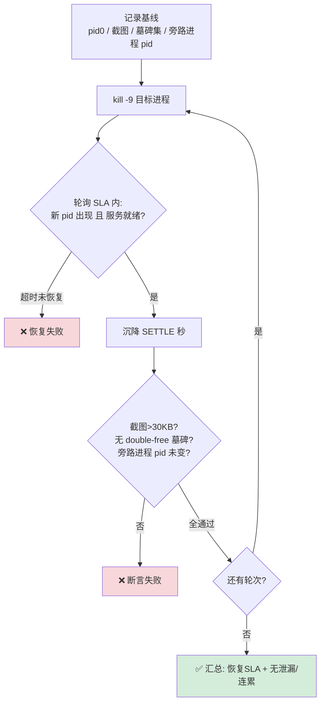

# GFWK kill-恢复类测试（SF / HWC / composer_stub / weston）

> 一类测试，同一套骨架：**打晕关键进程 → 看它多快被拉起、画面是否恢复、有没有 double-free / 连累别人**。度量恢复 SLA + 累积劣化。参照 [[TC_SF_FAULT_001]]。

## 映射：kill 示例 ↔ 需求规格 section

| kill 目标           | 是谁                | 文档 section                        | 用例                    | 代码                                                 |
| ----------------- | ----------------- | --------------------------------- | --------------------- | -------------------------------------------------- |
| **SF**            | 合成引擎(班长)          | §3.1                              | [[TC_SF_FAULT_001]]   | `Fault/TC_SF_FAULT_001.py`                 |
| **HWC**           | composer HAL(挂墙工) | §3.3（新增）                          | [[TC_HWC_FAULT_004]]  | `Hwc/TC_HWC_FAULT_004.py`                 |
| **composer_stub** | 跨 SoC 投屏桥         | §3.4 [[TC_CSOC_FAULT_002]]（文档已定义） | [[TC_CSOC_FAULT_002]] | `CrossSoc/TC_CSOC_FAULT_002.py` |
| **weston**        | A720 Cluster 合成器  | §3.4（新增）                          | [[TC_CSOC_FAULT_005]] | `CrossSoc/TC_CSOC_FAULT_005.py`        |

> `composer_stub` 是文档已有规格；`HWC` / `weston` 是本次新增，需在飞书 §3.3 / §3.4 补编号。

## 工作原理（流程图）



> **恢复判据**：新 pid ≠ 旧 pid（被 init/systemd 拉起）+ 服务就绪。**HWC 特有**：composer 挂常连带 [[SurfaceFlinger|SF]] 一起重启（binder 死 → `LOG_ALWAYS_FATAL`）。**composer_stub/weston 特有**：还要验"旁路的 IVI SF 不被连累"（进程隔离）。

## 各目标的真实进程名（A41AEC42 实测）

| 目标                   | **真实进程名**                                            | 注入通道        | 恢复者              | 覆盖变量             |
| -------------------- | ---------------------------------------------------- | ----------- | ---------------- | ---------------- |
| SF                   | `surfaceflinger`                                     | adb         | init             | —                |
| HWC                  | `android.hardware.composer.hwc3-service.gua`         | adb         | init             | `HWC_PROC`       |
| composer_stub（跨SoC桥） | `vendor.gua.hardware.cluster-service`（兜底 `gipc_sdd`） | adb（IVI 侧）  | init             | `CSOC_STUB_PROC` |
| weston               | `weston`（A720，自研则换名）                                 | **a720 串口** | systemd(Restart) | `WESTON_PROC`    |


## 服务自启动检查（前置，很关键）

kill 前先确认服务**本来就会自启动**，否则"没恢复"是**配置问题**不是缺陷。用例已内置此检查，日志打 `[自启动检查] <proc>: 会自启动=True/False`；False 只告警提示排查，不当缺陷。

**Android init 服务**（SF / HWC / cluster-service / gipc_sdd）——看 init.svc 状态 + `.rc` 有没有 `oneshot`：
```bash
adb -s A41AEC42 shell getprop | grep -i init.svc | grep -iE 'composer|cluster|surfaceflinger'
adb -s A41AEC42 shell "grep -rsA6 hwc3-service /vendor/etc/init /system/etc/init 2>/dev/null | grep -iE 'service|class|oneshot|restart|disabled'"
```
判读：`init.svc.<name>=running` **且无 `oneshot`**（或有 `onrestart`）→ 会自启动✅；标了 `oneshot` 且无 restart → **不自启**。

**A720 weston**（systemd）——a720 串口：
```bash
systemctl is-enabled weston        # enabled = 开机自启
systemctl show weston -p Restart   # Restart=always/on-failure = 崩了自拉起
```

## 恢复后显示内容检查（逐屏，别只看主屏）

服务恢复 ≠ 画面恢复；**多屏系统单主屏不黑 ≠ 全屏都回来**。

```bash
adb -s A41AEC42 shell dumpsys SurfaceFlinger --display-id   # 枚举所有物理屏
adb -s A41AEC42 shell "screencap -d <displayId> -p /data/local/tmp/d.png && stat -c%s /data/local/tmp/d.png"
```

> ⚠️ **实测（A41AEC42, kill HWC）**：composer 挂 → SF 连带重启（pid `502→5674`）→ 主屏恢复，**第三屏不亮**。
>
> **但先别定性为缺陷**：**后排屏(HWC display 1)不会自动亮，必须主动发 VHAL 命令唤醒**（`third_screen_on_without_cann`，见 STR 用例 `check_rear` / `wake_rear_display`）。我的 kill 用例目前只 `screencap` 没唤醒 → "第三屏不亮"可能是**未唤醒**而非不恢复。**待"先唤醒后排屏 → 再截图判黑"复测**才能坐实。
>
> 正确的三屏检查应复用 STR 的 `stability_aw.display.check_status()`（IVI+Cluster+后排，含唤醒/SKU/判黑）——该框架在 `haoying.ren_dev` 分支，合入共用基线后套用。

## 手动 adb 快速验证（不跑 pytest，先确认进程/行为）

> 每条一个**短命令**，别串成一行。第 2 步的 `<pid>` 填第 1 步打印出来的。

### ① kill HWC
```bash
# 1. 打开第三屏
adb -s A41AEC42 shell "dumpsys android.hardware.automotive.vehicle.IVehicle/default --inject-event 560992868 -a 0 -b 0x344c"
# 1. 看 pid
adb -s A41AEC42 shell pidof android.hardware.composer.hwc3-service.gua  
# 2. kill 
adb -s A41AEC42 shell kill -9 <pid>                                      
# wait 15sec

# HWC 换新 pid✅ 主屏+第三屏：屏幕短暂黑→恢复：主屏亮起，第三屏不亮
adb -s A41AEC42 shell pidof android.hardware.composer.hwc3-service.gua   # 3. 再看
adb -s A41AEC42 shell pidof surfaceflinger                               # 4. 看 SF
```
**LOG**：
```
(py312) gua@gua-SG0286:~/Documents/autocase$ adb -s A41AEC42 shell pidof android.hardware.composer.hwc3-service.gua
500
(py312) gua@gua-SG0286:~/Documents/autocase$ adb -s A41AEC42 shell kill -9 500
(py312) gua@gua-SG0286:~/Documents/autocase$ adb -s A41AEC42 shell pidof android.hardware.composer.hwc3-service.gua
5677
(py312) gua@gua-SG0286:~/Documents/autocase$ adb -s A41AEC42 shell pidof surfaceflinger
5674
(py312) gua@gua-SG0286:~/Documents/autocase$ 
```

**第三屏复测（关键）**：kill 后**主动唤醒后排屏再判黑**，区分"真不恢复" vs "没被唤醒"：
```bash
# 5. 唤醒后排屏（VHAL，后排不会自动亮）
adb -s A41AEC42 shell "dumpsys android.hardware.automotive.vehicle.IVehicle/default --inject-event 560992868 -a 0 -b 0x344c"
# 6. 确认后排在位
adb -s A41AEC42 shell dumpsys display | grep mDisplayId          # 应出现 mDisplayId=2
# 7. 找后排物理屏 id 并抓图判黑
adb -s A41AEC42 shell dumpsys SurfaceFlinger --display-id        # 看 (HWC display 1) 对应的大 id
adb -s A41AEC42 shell "screencap -d <rear-id> -p /data/local/tmp/rear.png && stat -c%s /data/local/tmp/rear.png"
```
> **唤醒后仍黑 = 真缺陷；唤醒后亮 = 之前只是没点亮**。用例 [[TC_HWC_FAULT_004]] 已内置此唤醒步骤（MVP）。

---

### ② kill 跨 SoC 桥（composer_stub）
```bash
adb -s A41AEC42 shell pidof vendor.gua.hardware.cluster-service   # 1. 看 pid
adb -s A41AEC42 shell kill -9 <pid>                              # 2. kill
# 桥换新 pid✅（实测 `664→29735`）；**SF pid 不变**✅（`502`，IVI 不被连累）；仪表投屏短暂断→恢复。
adb -s A41AEC42 shell pidof vendor.gua.hardware.cluster-service   # 3. 再看
adb -s A41AEC42 shell pidof surfaceflinger                       # 4. 看 SF
```
**预期**：桥换新 pid✅（实测 `664→29735`）；**SF pid 不变**✅（`502`，IVI 不被连累）；仪表投屏短暂断→恢复。

### ③ kill weston（A720，经 a720 串口，非 adb）
```bash
# check a720/sh terminal via GTMP
picocom -b 921600 /dev/ttyUSB8

# a720 串口终端：
pidof weston        # 1. 看 pid
kill -9 <pid>       # 2. kill
pidof weston        # 3. 再看
```
```bash
# IVI 侧 adb：
adb -s A41AEC42 shell pidof surfaceflinger   # 4. 看 SF
```
**log**：
``` bash

sh-5.2# pidof weston
105 81

sh-5.2# kill -9 105 81                          # 仪表屏短暂黑→恢复 ✅
sh-5.2# [INFO] Channel[composer_server] init success
[INFO] Channel[event_client] init success
[INFO] [IPC][HAL] Poll peerchk wakeup : POLLPRI
main: actual_width: 1920, actual_height: 480
could not load cursor 'dnd-move'
could not load cursor 'dnd-copy'
could not load cursor 'dnd-none'

sh-5.2# pidof weston
4335 4334                                        # weston 换新 pid✅ 
                                                # IVI SF pid 不变✅
```


## 冒烟 / 本地运行

```bash
source ~/.virtualenvs/py312/bin/activate
cd /home/gua/Documents/autocase
adb devices

# kill HWC（连带 SF 恢复）
HWC_FAULT_ROUNDS=3 pytest cases/MultiMedia/GPU/Hwc/TC_HWC_FAULT_004.py --serial A41AEC42 -v

# kill composer_stub（100 轮查 double-free，冒烟设 3）
CSOC_FAULT_ROUNDS=3 pytest cases/MultiMedia/GPU/CrossSoc/TC_CSOC_FAULT_002.py --serial A41AEC42 -v

# kill weston（需台架已接 a720 串口）
WESTON_ROUNDS=3 pytest cases/MultiMedia/GPU/CrossSoc/TC_CSOC_FAULT_005.py --serial A41AEC42 -v
```

| 用例            | 依赖                   | 缺依赖时                                      |
| ------------- | -------------------- | ----------------------------------------- |
| HWC           | adb root             | 发现不到 composer 进程 → `skip`                 |
| composer_stub | adb root（投屏已开）       | 候选进程都不在 → `skip`（可设 `CSOC_STUB_PROC`）     |
| weston        | **a720 串口** + weston | 无串口 / 无 weston → `skip`（可设 `WESTON_PROC`） |
|               |                      |                                           |

## 在 GTMP 上运行

**① gtmp-skill 自然语言**（推荐）——对我说：
```
用 <版本> 在台架 A41AEC42 上跑 TC_HWC_FAULT_004
```
走 `+task create`（版本+台架+用例）建任务、查进度。

**② GTMP Web**：新建任务 → 选版本（避开含 `e0y` 的刷机版本，见 [[GTMP E0y 已废弃]]）→ 绑台架 → 勾用例 → 提交 → 看报告。

> ⚠️ **composer_stub / weston 必须绑一台"串口齐全"的台架**（a720 串口 + 投屏链路），否则 GTMP 上会 `skip`。轮数用任务参数传 `HWC_FAULT_ROUNDS` / `CSOC_FAULT_ROUNDS` / `WESTON_ROUNDS`。

| 维度 | 本地 pytest | GTMP |
|---|---|---|
| 场景 | 开发调试、单台架快验 | 回归、多轮/多台架、留档 |
| 轮数/参数 | 命令行环境变量前缀 | 任务参数表单 |
| 结果 | 终端 + 截图 | 平台报告 + 飞书通知 |
| 串口依赖 | 需本机接线 | 需台架已配串口资源 |

## 断言要点（各目标差异）

| 用例 | 核心断言 |
|---|---|
| HWC | composer+SF 恢复 <10s、**逐屏画面不黑（含第三屏）**、**无 double-free 墓碑**；前置查自启动 |
| composer_stub | 重启 100%、**tombstone 无 double-free**、**IVI SF pid 不变**（不连累）、画面不黑 |
| weston | weston 由 systemd 拉起 <15s、**IVI SF 不 cascade crash**、Cluster 屏恢复（串口目视） |

> Cluster 端画面恢复目前只能**串口/目视**确认，用例里以告警记录，非自动断言。

## 关联
- 模板 → [[TC_SF_FAULT_001]]｜上层压力对照 → [[TC_SF_FAULT_002]]
- 机制 → [[SurfaceFlinger]]｜[[HWC]]｜[[composer_stub]]｜[[Fence]]
- 需求规格 → [[GFWK 稳定性测试 — 需求规格说明书 v2]]｜上级 → [[000-GFWK图形框架总览]]
- 重点用例集 → [[重点用例-高亮]]
