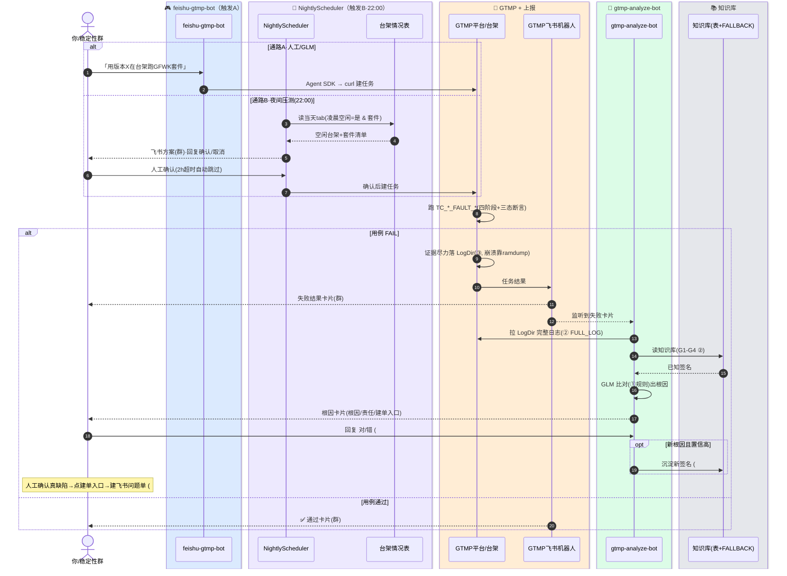

> **两条触发通路** → GTMP 跑用例 → GTMP 机器人上报 → analyze-bot 自动根因 → 人工确认建单。复刻 [[BUG-kill-HWC-crashes-A720-composer_stub|composer_stub 那次]]，把「跑→挖→定位」串成闭环。

## 角色分工

| 组件 | 角色 | 关键能力 |
|---|---|---|
| `feishu-gtmp-bot` | 🎮 触发A·人工/GLM | 飞书长连接 → Claude Agent SDK 加载 ivtest-gtmp → curl 驱动 GTMP |
| `NightlyScheduler`（在 analyze-bot） | 🌙 触发B·夜间定时 | **22:00** 扫描台架表当天 tab，凌晨空闲台架+套件 → **发方案到群等人工回复「确认」** → 建任务 |
| GTMP 平台 / 台架 | 🧪 执行端 | 跑 `TC_*_FAULT_*`（四阶段+三态断言），FAIL 时证据尽力落 `report.LogDir` |
| `GTMP 飞书机器人` | 🤖 上报端 | 把任务结果卡片发到稳定性群（analyze-bot 监听的正是它） |
| `gtmp-analyze-bot` | 🔬 分析端 | 监听失败卡片 → 拉 LogDir → GLM 比对 KB → 根因卡片 + 建单入口 |

## 时序图（一次「触发→FAIL→自动根因→人工建单」）

> 🎨 泳道 box 按机器人分色：蓝=feishu-gtmp-bot · 紫=NightlyScheduler · 橙=GTMP+上报 · 绿=analyze-bot · 灰=知识库。
> （mermaid `sequenceDiagram` 仅支持 box 泳道上色，单条箭头无法分色；如需箭头分色需改用 flowchart。）

## 三个钩子（让分析端认得 GFWK 跨SoC缺陷）

| 钩子 | 位置 | 作用 |
|---|---|---|
| ① 监控规则 | `monitor_rules.py` | critical：`composer_stub segfault`(双向) / `sync_file fence UAF` / `GIPC 断` / `double-free` |
| ② 深挖+KB | `gtmp_analyzer.py` | FULL_LOG_TRIGGER 命中 GFWK 特征→下完整日志；KB **G1-G4** 供 GLM 秒判 |
| ③ 现场落盘 | `TC_CSOC_FAULT_003/004` | 失败时 IVI dmesg/tombstone + A720 串口存 case log dir → 随 LogDir 上传（best-effort，崩溃靠 ramdump 兜底） |

## 实现状态

**#2 夜间压测（✅ 已实现）**
- `gtmp_scheduler.py`：22:00 扫描 → 发方案到**稳定性群** `oc_0e5a…` → **回复「确认」后才建任务**（2h 超时自动跳过），21:00 预览提醒
- 仍用文本方案+回复确认（非交互卡片）；升级交互卡片为后续项
- 弊端：空闲状态靠人工维护表格；并发/资源冲突；次日 tab 复制曾崩

**#7 KB 表重构（✅ 代码 / 🚧 表头待写 / ⏸ 跨表同步暂不做）**

| KB 列 | 语义（新） | 台架表(HEC2nz) 对应 |
|---|---|---|
| A | 编号 | — |
| B | 分类 | — |
| **C** | **根因**（原"内容"，语义已改） | — |
| **D** | 初步定位（推测责任） | AH 初步定位 |
| **E** | 真正根因（拉 log 确认为 bug 后） | AI 确认进展 |
| **F** | 问题单 | AJ 问题单链接 |

- 代码：`gtmp_analyzer.py` 已读 `A:F`，拼 KB 行时若 E(真正根因) 已填则附上供 GLM 秒判；追加新签名仍写 C(根因)，D/E/F 留空待人工填
- 流程：C 初判根因 → D 推测责任/初步定位 → 按 D 拉 log 确认 → E 写真正根因 → 建飞书问题单 → F 回填单号
- ⏸ **跨表同步 D-F↔AH-AJ 暂不做**（用户决定）；日后若做，关联键建议用**问题单号**（KB 一签名对多任务，无主键无法定同步行）

## 关联
- 用例清单 → [[GFWK 稳定性测试用例全量清单]]｜新实现 → [[TC_CSOC_FAULT_003]]｜[[TC_CSOC_FAULT_004]]
- 已知缺陷 → [[BUG-kill-HWC-crashes-A720-composer_stub]]（G1 来源）
- 概念 → [[GIPC]]｜[[SHMEM]]｜[[composer_stub]]｜[[tombstone（墓碑 验尸报告）]]
- 上级 → [[000-GFWK图形框架总览]]

## 📚 延伸阅读
- Claude Agent SDK：https://docs.claude.com/en/api/agent-sdk
- Android tombstone/debuggerd：https://source.android.com/docs/core/tests/debug
