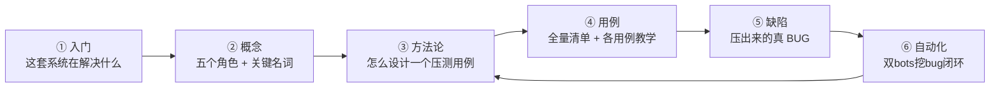

# GFWK 稳定性 — 阅读脉络 (MOC)

> 本笔记是 `005-稳定性/` 的**总入口**：告诉你**按什么顺序读**、每篇解决什么问题。
> 已有多个索引各司其职，这里把它们串成一条线。第一次看从「① 入门」顺着往下。

## 一句话地图

## ① 入门（先建立全局观）
1. [[000-GFWK图形框架总览]] —— 图形栈整体长什么样、分几层
2. [[GFWK 稳定性测试 — 需求规格说明书 v2]] —— 为什么测、测什么（§3.1~3.8 分区）
3. [[重点用例-高亮]] —— 规格作者标注的「最易挖出 bug」用例（❤️❤️）

## ② 概念（读用例前的名词底座）
- 角色链：[[SurfaceFlinger|SF]]（总合成器）→ [[HWC]]（挂墙工）→ [[Gralloc]] / [[dma-buf heap]]（发纸/纸库）→ [[GraphicBuffer]] / [[反压 (back-pressure)]]（白纸流转）
- 故障与取证：[[SIGKILL （kill -9）]] · [[tombstone（墓碑 验尸报告）]] · [[RAMdump]] · [[ANR]] · [[断言（assert）]]
- 跨 SoC：[[GIPC]] · [[composer_stub]]（投屏桥）· [[Weston|weston]]（A720 合成器）

## ③ 方法论（一切用例的骨架）
- [[GFWK kill-恢复类测试]] —— **打晕关键进程→看多快拉起、画面是否恢复、是否连累别人**；四阶段套路（基线→注入→恢复判定→三态断言）
- [[GFWK STR 挂起唤醒稳定性测试]] —— 挂起/唤醒类，resume 最易暴露 bug

## ④ 用例（主索引在这）
- **总表**：[[GFWK 稳定性测试用例全量清单]] —— 55 用例矩阵 + **回归记录**（每次台架跑结果都记这）
- kill-恢复类（本轮重点）：[[TC_SF_FAULT_001]] · [[TC_HWC_FAULT_004]] · [[TC_CSOC_FAULT_002]] · [[TC_CSOC_FAULT_005]] · [[TC_SF_FAULT_002]]
- 边界/反压：[[TC_SF_BOUND_002]] · [[TC_SF_BOUND_003]]
- 压力/显示：[[TC_GFWK_STRESS_004]] · [[TC_GFWK_STRESS_005]] · [[TC_GFWK_STRESS_006]] · [[TC_GFWK_STRESS_008]]
- 跨 SoC 恢复：[[TC_CSOC_FAULT_003]] · [[TC_CSOC_FAULT_004]] · [[TC_CSOC_RECOVER_001]]

## ⑤ 缺陷（压出来的真问题 — 按发现时间）
- [[BUG-SF-ctl-stopstart-显示不重建黑屏]] —— **2026-08-09 新**：优雅重启 SF 后显示永久黑，仅 kill-9 救活
- [[BUG-kill-HWC-crashes-A720-composer_stub]] —— kill IVI HWC 拖崩 A720 composer_stub（疑已修）
- [[BUG-HWC-DPMS-SetPowerMode崩溃循环]] · [[BUG-STRESS006-Cluster撕裂花屏闪屏]]

## ⑥ 自动化
- [[GFWK 双bots自动挖bug闭环]] —— 飞书触发→跑→自动根因卡片

---
## 最近回归（速览，详见全量清单）
- **2026-08-09**：收严 5 个 kill 类用例 + 复用 common，压出 [[BUG-SF-ctl-stopstart-显示不重建黑屏|F3]] / F1(级联) / F4(ctl服务名)。详见 [[2026-08-09-GFWK收严杀进程压测]]。
- 2026-08-04：GFWK 全套 smoke 10/10 PASS（SG0286，任务 95539）
- 2026-08-01：稳定集 7/7 PASS（fw 831）
