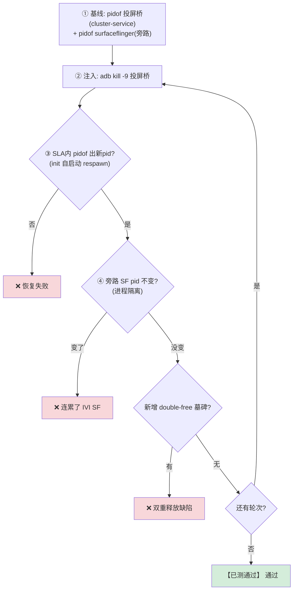
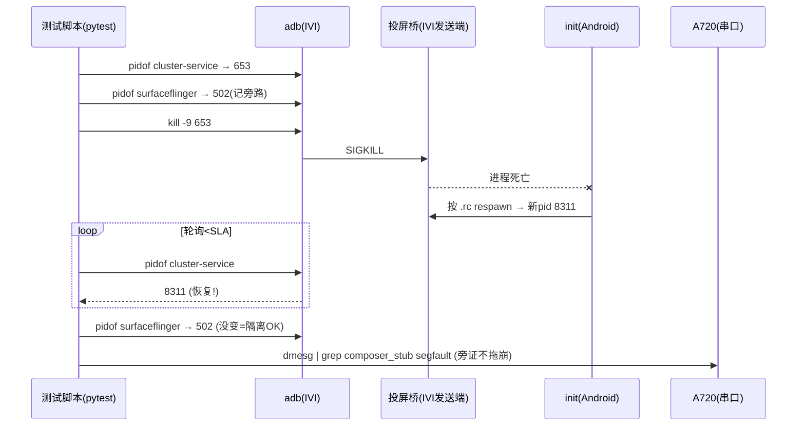

# TC_CSOC_FAULT_002 — kill composer_stub 跨SoC投屏恢复 【已测通过】

> **【已测通过】 实测通过（2026-07-31/08-01, SG0286, fw 831）**：3 轮 kill 投屏桥均 ~0.05s 恢复，无级联/墓碑。

## ① 一句话
**杀掉"把 IVI 画面搬到 A720 仪表屏"的投屏桥进程，看它能不能自己重启、且不连累 IVI 主屏。**

## ② 原理：这颗芯片的画面是怎么跨过去的
座舱是**双 SoC**：IVI（Android）算主画面，A720（Linux）驱动仪表屏。IVI 渲染好的一帧要"跨芯片"送到 A720 显示，靠两条平面：

| 平面 | 作用 | 类比（单芯片内） | 进程 |
|---|---|---|---|
| **控制面 [[GIPC]]** | 传"这帧在哪、什么格式、fence 信号" | 跨芯片版 [[Binder IPC\|Binder]] | `gipc_sdd` / `vendor.gua.hardware.cluster-service`（IVI 侧发送端） |
| **数据面 [[SHMEM]]** | 传像素本身（共享内存） | 跨芯片版 [[dma-buf heap\|dma-buf]] | 同上 |
| **桥接** | A720 侧收帧、当 Wayland 客户端提交给 [[Weston]] | — | `/bin/composer_stub`（**A720 侧**） |

> 关键理解：**IVI 侧的"投屏桥"进程（发送端）** 和 **A720 侧的 `composer_stub`（接收端）** 是两个不同进程。本用例 kill 的是 **IVI 侧发送端**（能经 adb 打到）；A720 侧 `composer_stub` 经 a720 串口观察。

## ③ 测试逻辑（流程图）


## ④ 交互时序（时序图）


## ⑤ 本地复现（台架, 逐条 adb）
```bash
adb -s A41AEC42 root
adb -s A41AEC42 shell pidof vendor.gua.hardware.cluster-service   # 1. 投屏桥 pid
adb -s A41AEC42 shell pidof surfaceflinger                        # 2. 记旁路 SF pid
adb -s A41AEC42 shell kill -9 <投屏桥pid>                          # 3. 杀桥
adb -s A41AEC42 shell pidof vendor.gua.hardware.cluster-service   # 4. 等2秒→应出新pid
adb -s A41AEC42 shell pidof surfaceflinger                        # 5. SF 应不变
```
自动化：`CSOC_FAULT_ROUNDS=3 pytest cases/MultiMedia/GPU/CrossSoc/TC_CSOC_FAULT_002.py --bench=<yaml> -v`

## ⑥ 易出 bug 的环节（重点）
| 环节 | 为什么易出 bug | 判据 |
|---|---|---|
| **接收端清理**（A720 `composer_stub`） | 🔴 **昨天真缺陷所在**：IVI 桥/HWC 重启→Wayland 链路断→A720 持有的 wl_proxy 悬空→下次 `wl_proxy_get_version` 解引用 **SIGSEGV**。kill 发送端时对端不做保护 → 见 [[BUG-kill-HWC-crashes-A720-composer_stub]] | a720 串口 dmesg `composer_stub.*segfault` |
| **进程隔离** | 投屏桥若和 SF 共享状态/锁，kill 桥可能连累 SF | SF pid 不变 |
| **respawn 竞态** | 快速反复 kill，init respawn 与残留 fd/共享内存回收竞态 → double-free | double-free 墓碑 |

> **一句话记住**：本用例本身在 IVI 侧"绿"，但它是**发现对端 A720 崩溃的钩子**——真正的缺陷在跨 SoC 的"接收端没处理上游重启"。

## 关联
- 缺陷 → [[BUG-kill-HWC-crashes-A720-composer_stub]]｜机制 → [[composer_stub]] [[GIPC]] [[SHMEM]] [[Weston]]
- 同簇 → [[TC_CSOC_FAULT_004]] [[TC_CSOC_FAULT_005]] [[TC_HWC_FAULT_004]]｜总览 [[GFWK 稳定性测试用例全量清单]]

## 📚 延伸阅读
- Wayland proxy/生命周期：https://wayland.freedesktop.org/docs/html/
- AAOS 图形栈：https://source.android.com/docs/core/graphics
