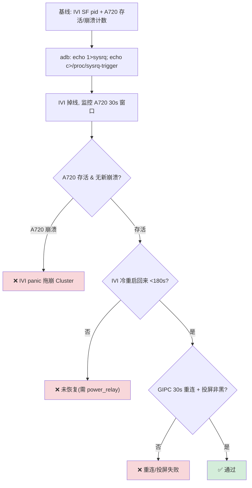

# TC_CSOC_FAULT_003 — IVI panic → Cluster 恢复

> 规格：飞书 §3.4，**P1 ❤️**。代码：`cases/MultiMedia/GPU/CrossSoc/TC_CSOC_FAULT_003.py`（branch `qi.zhu`）。

**一句话**：强制 IVI kernel panic，验证 A720 Cluster 仪表**独立存活（冻屏≤30s 且自恢复）**、IVI 冷重启后 [[GIPC]] 30s 内重连、投屏恢复。

---

## ① 背景（缺陷原理）

IVI 异常重启 → IPC 资源释放 → **share fence 中 used fences NOT signaled** → Cluster 等一个永不 signal 的 [[fence]] → **冻屏**。这是跨 SoC fence 生命周期耦合的经典风险点。

> ⚠️ 每轮**真触发 kernel panic**（进 [[RAMdump]]/冷重启，重且慢）→ 默认低轮次冒烟（`CSOC_P003_ROUNDS=3`；规格 50 轮）。

## ② 注入与断言（四阶段）



| 断言（三态） | 判据 |
|---|---|
| **Cluster 不被拖崩** | 30s 窗口内 a720 串口 dmesg 无新 `composer_stub segfault`/`GIPC panic`（命中=耦合缺陷） |
| IVI 恢复 | `adb wait-for-device` <180s 回来 |
| GIPC 重连 | IVI 回来后 `gipc_sdd`+`cluster-service`+`SF` <30s 起、主屏投屏非黑 |

## ③ 如何运行

**手动**（IVI 侧 adb；⚠️ 会真 panic 重启设备）：
```bash
adb -s A41AEC42 root
adb -s A41AEC42 shell "echo 1 > /proc/sys/kernel/sysrq"
adb -s A41AEC42 shell "echo c > /proc/sysrq-trigger"   # IVI 立即 panic
adb -s A41AEC42 wait-for-device                          # 等冷重启
```
```bash
# a720 串口同时观察 Cluster 是否冻屏/崩溃：
dmesg | grep -iE 'composer_stub.*segfault|GIPC.*panic|fence.*timeout'
```

**本地**（需 a720/cp1 串口）：
```bash
source ~/.virtualenvs/py312/bin/activate
cd /home/gua/Documents/autocase
CSOC_P003_ROUNDS=3 pytest cases/MultiMedia/GPU/CrossSoc/TC_CSOC_FAULT_003.py --bench=<ECU yaml> -v
```

> **限制**：依赖 panic 后自动重启；若不自恢复需 `power_relay` 冷复位（TODO，见 `CSOC_P003_BOOT_TIMEOUT`）。

**GTMP**：绑**含 a720 串口 + 电源继电器**资源的台架（避开 `e0y`）→ 勾用例 → 提交。

## 关联
- 同链路 → [[TC_CSOC_FAULT_004]]（GIPC 断）｜[[TC_CSOC_FAULT_002]]（[[composer_stub]]）｜TC_CSOC_FAULT_001（fence UAF）
- 概念 → [[GIPC]]｜[[SHMEM]]｜[[composer_stub]]｜[[Fence|fence]]｜[[RAMdump]]
- 总览 → [[GFWK 稳定性测试用例全量清单]]｜[[000-GFWK图形框架总览]]

## 📚 延伸阅读
- Linux magic SysRq（`echo c` 触发 panic 原理）：https://docs.kernel.org/admin-guide/sysrq.html
- Android sync/fence（used fence 未 signal 冻屏根因）：https://source.android.com/docs/core/graphics/sync
