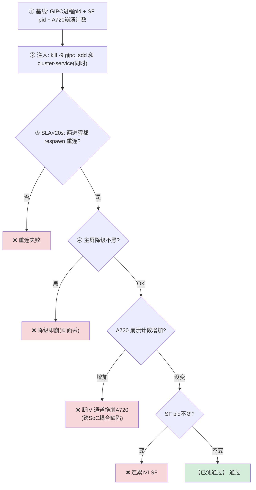
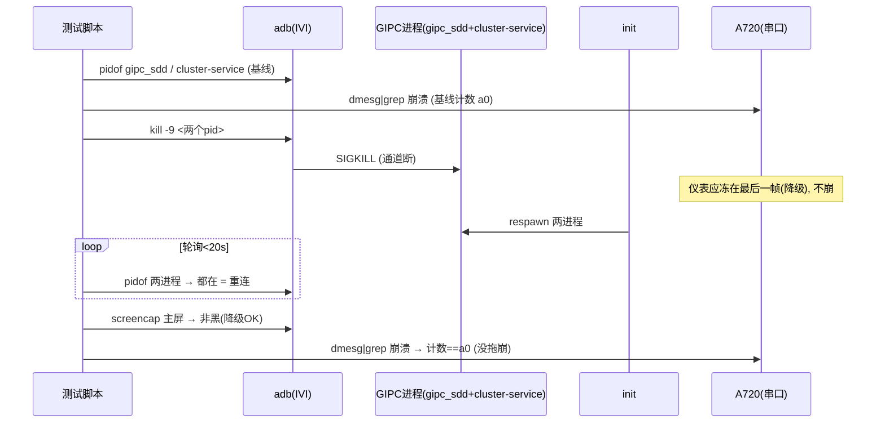

# TC_CSOC_FAULT_004 — GIPC 通道断开 / 禁 SHMEM 降级 【已测通过】

> **【已测通过】 实测通过（2026-08-01, SG0286, fw 831）**：3 轮断 GIPC 均 0.1s 重连，A720 无新崩溃。

## ① 一句话
**把跨芯片的"传输管道"整个掐断，看两颗 SoC 是各自降级（画面停在最后一帧/不更新）还是直接崩，恢复后能否自动重连。**

## ② 原理：断的到底是什么
[[TC_CSOC_FAULT_002|上一个用例]] kill 的是"投屏桥业务进程"，这个用例更狠——断的是**传输通道本身**：

- **[[GIPC]]（控制面）**：跨芯片的信令总线。断了 = 两颗 SoC 之间"失联"，谁也不知道对面帧到没到、fence 有没有 signal。
- **[[SHMEM]]（数据面）**：跨芯片共享内存。断了 = 像素数据传不过去。
- 承载它们的守护进程：`gipc_sdd`（底层传输 daemon）+ `vendor.gua.hardware.cluster-service`（显示 HAL）。**同时 kill 这两个 = 通道断开**。

> **正确行为叫"降级不崩"**：通道断了，仪表屏应"冻在最后一帧"或显示降级画面，**不能整个 crash**；通道恢复后应**自动重连**继续投屏。这才是健壮的跨 SoC 设计。

## ③ 测试逻辑（流程图）


## ④ 交互时序（时序图）


## ⑤ 本地复现（台架, 逐条 adb + 串口）
```bash
adb -s A41AEC42 root
adb -s A41AEC42 shell pidof gipc_sdd
adb -s A41AEC42 shell pidof vendor.gua.hardware.cluster-service
adb -s A41AEC42 shell kill -9 <pid1> <pid2>        # 同时断两个
adb -s A41AEC42 shell pidof gipc_sdd               # 等几秒→应 respawn
```
```bash
# a720 串口另查是否被拖崩：
dmesg | grep -iE 'composer_stub.*segfault|GIPC.*(panic|reset)'
```
自动化：`CSOC_GIPC_ROUNDS=3 pytest cases/MultiMedia/GPU/CrossSoc/TC_CSOC_FAULT_004.py --bench=<yaml> -v`

## ⑥ 易出 bug 的环节（重点）
| 环节 | 为什么易出 bug | 判据 |
|---|---|---|
| **降级 vs 崩溃** | 🎯 核心：通道断了，接收端等一个永远不来的帧/fence → 若无超时保护会**卡死或崩**（正确应降级冻屏） | 主屏非黑 + A720 不崩 |
| **跨 SoC 拖崩** | 断 IVI 侧通道，若 A720 侧对"上游消失"无保护 → segfault（同 composer_stub 那类耦合） | a720 dmesg 无新 segfault |
| **重连幂等** | respawn 后要能干净重建通道；若残留旧共享内存/fd → 重连失败或错帧 | <20s 两进程都回来 |
| **fence 泄漏** | 断链瞬间"已借出未 signal"的 fence 若不回收 → 长跑句柄泄漏 | 长轮次跑 + 查 fd |

> **一句话记住**：健壮的跨 SoC = **"断了要降级不崩、恢复要自动重连、且一侧断不拖崩另一侧"**。这三点任一破 = bug。

## 关联
- 同簇 → [[TC_CSOC_FAULT_002]](投屏桥) [[TC_CSOC_FAULT_003]](IVI panic) [[TC_CSOC_FAULT_005]](weston)
- 机制 → [[GIPC]] [[SHMEM]] [[composer_stub]]｜总览 [[GFWK 稳定性测试用例全量清单]]

## 📚 延伸阅读
- 共享内存 IPC 概念：https://man7.org/linux/man-pages/man7/shm_overview.7.html
- Android sync/fence（断链 fence 未 signal 的根因）：https://source.android.com/docs/core/graphics/sync
