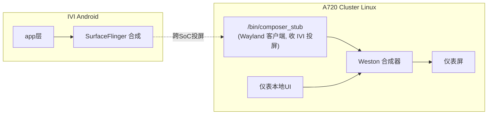
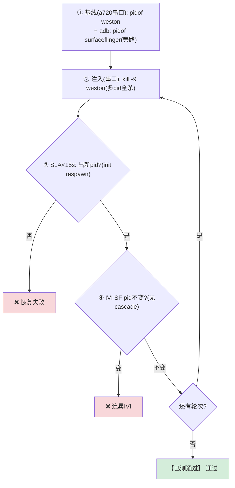
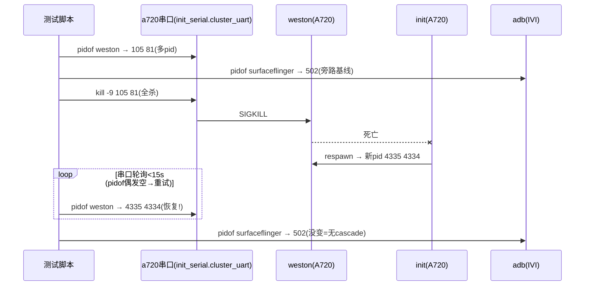

# TC_CSOC_FAULT_005 — kill [[weston]] (A720 Cluster 合成器) 
## ① 一句话
**杀掉 A720 仪表侧的"合成器"weston（相当于仪表屏的 SurfaceFlinger），看它能否被拉起、仪表屏恢复，且不连累 IVI。**

## ② 原理：A720 侧的画面是谁合成的
IVI 侧由 [[SurfaceFlinger|SF]] 把多个 app 的 Surface 合成成一帧。**A720（Linux/Yocto）侧对应的角色是 [[Weston]]**（Wayland 合成器）：


- **weston 挂了** = 仪表屏没人合成 → 黑/冻。健壮设计应由 **init respawn**（A720 非 systemd，靠 init 的 respawn）自动拉起。
- 操作通道：weston 在 A720，**只能经 a720 串口**操作，adb 到不了。

## ③ 测试逻辑（流程图）


## ④ 交互时序（时序图）—— 注意注入走串口不是 adb


## ⑤ 复现指令
```bash
# 在 a720 串口终端(prompt sh-5.2#)，逐条：
pidof weston            # 1. 看 weston pid(可能多个)
kill -9 <pid...>        # 2. 全杀
pidof weston            # 3. 等几秒→应出新pid
```
```bash
# IVI 侧另开 adb 验隔离：
adb -s A41AEC42 shell pidof surfaceflinger   # 应全程不变
```
自动化：`WESTON_ROUNDS=3 pytest cases/MultiMedia/GPU/CrossSoc/TC_CSOC_FAULT_005.py --bench=<yaml> -v`

## ⑥ 易出 bug 的环节（重点）
| 环节 | 为什么易出 bug | 判据 |
|---|---|---|
| **respawn 机制** | A720 非 systemd，靠 init respawn；若配成 `oneshot`/未配 respawn → kill 后不恢复（属**配置**问题，非缺陷，前置要查） | 出新 pid |
| **多 pid 漏杀** | weston 常多线程/多进程，`pidof` 返回多个；只杀一个 = 没真正 kill（no-op）→ 用例假过 | 全杀 + 重试取 pid |
| **cascade** | weston 与 composer_stub/IVI 投屏链耦合，weston 崩是否波及对端 | IVI SF 不变 + composer_stub 不崩 |
| **串口偶发空** | `pidof` 经串口偶发返回空，误判"已恢复/无进程" | 重试机制 |

> **本用例结论：weston 自恢复健康（非缺陷）**——对比 [[TC_CSOC_FAULT_002|composer_stub]] 直接段错误，说明**同是跨 SoC，接收端(composer_stub)有 bug、合成器(weston)健壮**。这种"对照"正是挖 bug 的思路。

## 关联
- 同簇 → [[TC_CSOC_FAULT_002]] [[TC_CSOC_FAULT_004]]｜机制 → [[Weston]] [[composer_stub]]
- 对照 → IVI 侧 [[TC_SF_FAULT_001]](kill SF)｜总览 [[GFWK 稳定性测试用例全量清单]]

## 📚 延伸阅读
- Weston/Wayland compositor：https://wayland.freedesktop.org/docs/html/
- Android init respawn（对照 A720 init）：https://source.android.com/docs/core/architecture/init
