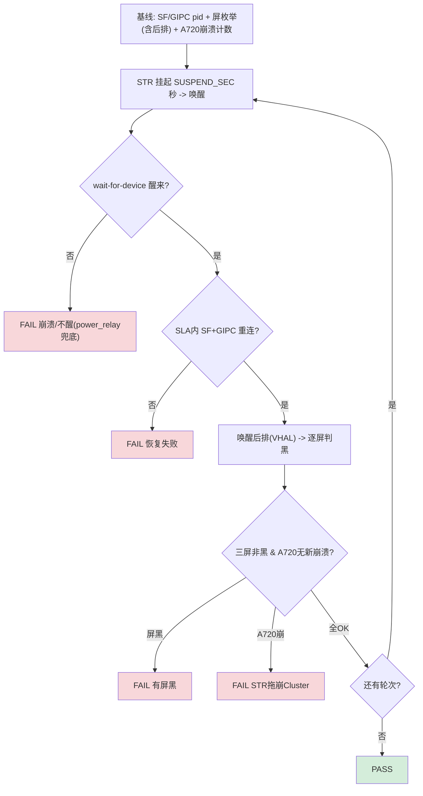

today's plan: adding STR related test, understand STR
# TC_CSOC_RECOVER_001 — STR + 跨SoC 恢复
1. 测试test_006 休眠唤醒表现，理解方法
2. 补充到CSOC和STR一系列的测试用例中
3. 

> 规格：飞书 §3.4/§3.5，**P0**。代码：`cases/MultiMedia/GPU/CrossSoc/TC_CSOC_RECOVER_001.py`（branch `qi.zhu`）。
> ⭐ 本质就是 §3.5 的 **STR_003（Cross-SoC×STR）**——STR 类的**样板**用例。方法论见 [[GFWK STR 挂起唤醒稳定性测试]]。

**一句话**：反复 [[STR|挂起-唤醒]]，每轮验证唤醒后 [[SurfaceFlinger|SF]]/[[GIPC]]/投屏/三屏(含后排)全部重建、A720 无崩溃——**resume 是跨SoC图形链最脆的一环**。

---

## ① 背景（为什么这条最易出 bug）
STR resume 瞬间：DP HPD 时序、PLL relock、[[Fence|fence]] 重建、[[GIPC]] 跨SoC 重连全挤一起。任一没接好 → 冻屏/黑屏/投屏丢/后排不亮/资源泄漏。是图形上**最大单一故障场景**。

## ② 注入模式（env `STR_MODE`）
| 模式 | 命令 | 特点 | 风险 |
|---|---|---|---|
| **display**（默认,安全） | `input keyevent KEYCODE_SLEEP` → `KEYCODE_WAKEUP` | 快/稳/CI 友好 | 不走真内核 suspend |
| **mem**（真内核 STR） | `echo +N>/sys/class/rtc/rtc0/wakealarm; echo mem>/sys/power/state` | 最真实 | 需唤醒源，**有不醒风险**（备 power_relay） |

## ③ 四阶段 + 断言



| 断言（三态） | 判据 |
|---|---|
| 不崩/能醒 | `adb wait-for-device` 唤醒、不掉线（不醒=硬失败） |
| 重建 | SF + `gipc_sdd` + `cluster-service` <`RESUME_SLA` 重连 |
| 画面 | 逐屏 screencap 非黑（**后排先 VHAL 唤醒**） |
| 跨SoC | a720 串口 dmesg 无新 `composer_stub segfault`/`fence timeout`/`GIPC panic`（用 `A720CNT=` 标记抗串口噪声） |

## ④ 如何运行（自测）

**手动**（IVI 侧 adb，逐条）：
```bash
adb -s <dev> shell pidof surfaceflinger gipc_sdd vendor.gua.hardware.cluster-service   # 基线
adb -s <dev> shell input keyevent KEYCODE_SLEEP      # 挂起
adb -s <dev> shell input keyevent KEYCODE_WAKEUP     # 唤醒
adb -s <dev> shell pidof surfaceflinger gipc_sdd vendor.gua.hardware.cluster-service   # 应都在
adb -s <dev> shell dumpsys android.hardware.automotive.vehicle.IVehicle/default --inject-event 560992868 -a 0 -b 0x344c   # 点后排
adb -s <dev> shell "screencap -d <displayId> -p /sdcard/s.png"   # 逐屏判黑
```
```bash
# a720 串口另查是否被拖崩：
dmesg | grep -iE 'composer_stub.*(segfault|SIGSEGV)|fence.*timeout|GIPC.*(panic|reset)'
```

**本地 pytest**（需 a720 串口）：
```bash
source ~/.virtualenvs/py312/bin/activate
cd ~/Documents/autocase
CSOC_R001_ROUNDS=3 pytest cases/MultiMedia/GPU/CrossSoc/TC_CSOC_RECOVER_001.py --bench=/home/gua/data/apps/gtmp-client/data/config/ECU_V27_10.78.20.5_gua-SG0286.yaml -v
# 真内核 STR: STR_MODE=mem CSOC_R001_ROUNDS=3 pytest ...（需唤醒源+继电器兜底）
```

**GTMP**：绑含 a720 串口资源的台架（避开 `e0y`）→ 勾用例 → 提交；可 `--repeat=N` 加压。

## env 一览
| env | 默认 | 说明 |
|---|---|---|
| `CSOC_R001_ROUNDS` | 200 | 压测轮次（自测设 3） |
| `STR_MODE` | display | display / mem |
| `CSOC_R001_SUSPEND` | 5 | 挂起秒数 |
| `CSOC_R001_RESUME_SLA` | 30 | 唤醒后 SF/GIPC 重连 SLA |

## 关联
- 方法论 → [[GFWK STR 挂起唤醒稳定性测试]]｜概念 → [[STR]]｜[[Fence]]｜[[GIPC]]｜[[SHMEM]]｜[[composer_stub]]
- 同类 → [[TC_CSOC_FAULT_003]]（IVI panic→Cluster）｜[[TC_CSOC_FAULT_004]]（GIPC 断）
- 清单 → [[GFWK 稳定性测试用例全量清单]]｜上级 → [[000-GFWK图形框架总览]]

## 📚 延伸阅读
- 内核 suspend/resume 状态：https://docs.kernel.org/admin-guide/pm/sleep-states.html
- Android sync/fence（resume fence 未 signal 根因）：https://source.android.com/docs/core/graphics/sync
