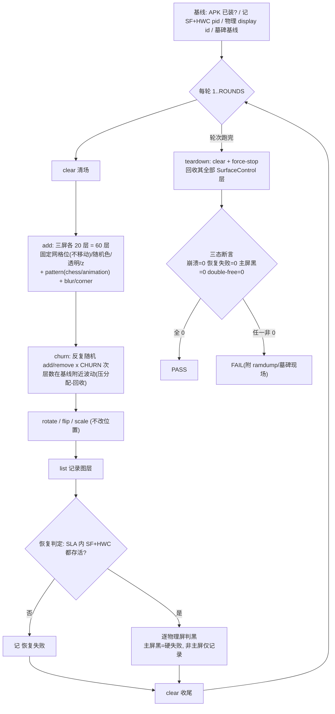

# TC_GFWK_STRESS_006 — 多屏图层随机增删压测

> 上级 [[GFWK 稳定性测试用例全量清单]] · 栈层 [[SurfaceFlinger]] / [[HWC]] · 工具 `MultiDisplayJavaDemo.apk`
> 代码 `autocase/cases/MultiMedia/GPU/Stress/TC_GFWK_STRESS_006.py`（branch `qi.zhu`）

## 用例简介
**MultiDisplayJavaDemo**基于 [[SurfaceControl]] 在 **IVI/Cluster/Rear 三屏**的**固定网格位**塞入随机色/透明/z 序、带 chess 纹理与圆角模糊的图层（**不移动、不游走**），随后**反复随机 `add`/`remove`** 制造高频增删；辅以 `rotate`/`flip`/`scale`（不改位置）与 `list`。核心压 **图层与 buffer 的分配-回收生命周期**：[[SurfaceControl]] 建/销、[[BufferQueue]]、[[Gralloc]] dma-buf 分配、[[HWC]] overlay 平面分配、alpha 混合 / z-order；断言三态：不崩、SF/HWC 存活、主屏不黑、无 double-free。

> **v3（本版）**：去掉 `move`/`mirror`/`wander`，固定位置 + add/remove churn（`MDT_CHURN`）。定位见下节「压什么」。带移动/跨屏/游走的**渲染算力版**为 v2（历史，任务 96851）。


**结论：v3 约 80% 压软件（分配与生命周期逻辑）+ 20% 压硬件资源（RAM/dma-buf、DPU overlay 平面数）；渲染算力（GPU 填充/DPU 扫描带宽）基本不碰——那是 v2 移动/变换版在压。**

固定位置、只反复 add/remove，一次增删连锁触发：

| 层次 | 增删图层触发什么 | 软/硬 |
|---|---|---|
| [[SurfaceControl]] 生命周期 | `add`→建节点+建 [[BufferQueue]]；`remove`/`clear`→销毁 + `Transaction` 提交 | **软件**（SF 客户端逻辑 + Binder 事务） |
| [[Gralloc]] / dma-buf 分配 | 新层分配图形 buffer（gralloc HAL→内核 ion/dma-heap 分物理内存）；删层释放 | **软件驱动 + 硬件资源(RAM)** |
| [[HWC]] overlay 平面分配 | 图层集变→SF `validateDisplay/presentDisplay`，HWC 定哪些走 overlay 硬件平面、哪些回退 GPU | **软件策略 + 硬件平面(DPU plane 有限)** |
| Fence / sync_file | 每次提交建/销毁同步栅栏 | **软件（内核 sync 框架）** |
| SF 合成一帧 | 图层集变化触发重合成（但位置固定→无逐帧动画负载） | 轻量 |

**v2（移动/变换/跨屏）vs v3（固定+增删）**：
- v2：图层每帧动/变换/跨屏搬 → 逼 GPU 持续填充、DPU 重扫描、跨 SoC 传输 → 压**渲染算力/带宽（偏硬件：GPU/DPU/总线）**。
- v3：画面基本不动，但图层对象+buffer 疯狂创建/销毁 → 压**分配器/记账表/生命周期正确性（偏软件）** + **内存子系统碎片化/泄漏/OOM**。

**v3 最易挖的 bug**：图层/buffer 泄漏（删了不回收）、double-free/UAF（回收时机与 fence 竞争）、HWC 平面分配抖动（overlay↔GPU 反复切换边界）、SF 图层表/BufferQueue slot 记账错乱。

## 目标
借测试 APK **MultiDisplayJavaDemo**（`com.example.multidisplaytest`，基于 **SurfaceControl**）在多块屏上**高频随机增删图层 + 全屏 wander 游走 + 跨屏 move/mirror**，重压：
- [[SurfaceFlinger]] 合成调度、z-order、**alpha blending**（半透明叠加）
- [[HWC]] overlay 层的**分配/回收**与 GPU 合成回退
- 跨屏搬运通路（IVI↔Rear，move/mirror）

补齐全量清单 §3.1 SF 层的 **"高频图层增删"** 缺口。

## 原理：这个 APK 在干什么
一句话：它是一支**直接操作 SurfaceFlinger 图层树的遥控器**——绕过 App/WMS，用 [[SurfaceControl]] 直连往任意屏塞/删/搬图层，命令经 `am --es cmd` 下发。

**为什么普通 App 做不到**：正常 App 只能在自己被 `WindowManager` 分配的 Window 里画，图层层级/位置/挂哪块屏都由 WMS 托管，你说了不算。压测 SF/HWC 需要人造极端负载（几十层半透明叠加、跨屏 mirror、全屏乱窜），业务 App 覆盖不到。本 APK 用 `android.uid.system` **平台签名**拿到 `SurfaceControl` 直连能力，于是能当半个 SF 客户端。

四个关键机制：

| 机制 | 说明 |
|---|---|
| **SurfaceControl 直连** | 每个 `add` → app 内 `SurfaceControl.Builder()` 造层 → `RenderHelper` 用 EGL(GPU)/CPU 往 buffer 填纯色/棋盘/动画 → `Transaction.setLayer/setPosition/setAlpha().apply()` 提交给 SF。**绕开 WMS**。 |
| **命令通道 `am --es cmd`** | 没做 socket/service，复用 Activity intent extra 当命令行：`am start … --es cmd 'add …'` → `onNewIntent → processCommand → runCommand`。常驻 Activity + 不断喂命令 = REPL。故 help 画到**屏/logcat**（App 内 `Log`/`TextView`），不回 shell stdout。 |
| **多屏寻址** | app 枚举 `DisplayManager` 列 display，面板序号(#0/#1/#2/#7)是**它自己的索引**，内部映射到物理 display token。所以**加层用 app 序号、判黑/截屏用物理 id**（两套编号，见 §二）。 |
| **图层生命周期** | 内部两套容器：`mLayers`(普通 add 层，`clear` 只清这个) + `mirrorSc`+计时器(镜像层，`clear` 不管)。**彻底重置 = `force-stop` 杀进程**，SF 检测客户端死亡回收其名下全部 SurfaceControl 层（见 §三）。 |

**压到栈的哪层**：`wander`+多层叠加主压 [[SurfaceFlinger]] 合成调度 + [[HWC]] overlay 分配/回退 GPU；`mirror` 到 Cluster(A720) 会顺带走 [[GIPC]]+[[SHMEM]]+[[composer_stub]]，压 [[跨SoC]] 通路。

## 一、APK 速用

### 1. 安装
```bash
adb -s <sn> install -r -g MultiDisplayJavaDemo.apk   # 平台签名/android.uid.system，userdebug 台架直装
```
`-r`=覆盖同包名(留数据)｜`-g`=自动授权｜`-d`=允许降级｜`-t`=允许 test-only。报错定位：`INSTALL_FAILED_UPDATE_INCOMPATIBLE`=签名冲突(先 `adb uninstall <pkg>`)、`..._VERSION_DOWNGRADE`=加 `-d`。user 版需预置 priv-app。

### 2. 喂命令机制 + wrapper
该 APK **无 shell wrapper**；命令经 **Activity 的 `cmd` extra** 下发（`onNewIntent → processCommand`）。定义顺手的 `mdt`：
```bash
mdt() { adb -s <sn> shell "am start -n com.example.multidisplaytest/.MainActivity --es cmd '$*'"; }

eg. 
mdt() { adb -s A41AEC42 shell "am start -n com.example.multidisplaytest/.MainActivity --es cmd '$*'"; }
```

### 3. 完整命令表（dex 原文，权威）
```
Commands:
  add    <display> <id> <type> <render> <w> <h> <x> <y> <z> <r> <g> <b> <a> <fmt> [pattern] [blur] [corner]
  remove <layerId>
  clear                                    # 清空 add 层
  move   <layerId> <target> [instant|slide]        # 跨屏搬运
  mirror <layerId> <targetDisplay> [seconds]       # 镜像到另一屏，N 秒后自动撤(0=永久)
  wander <seconds> <layerId1> [layerId2 ...]       # 各层在各自屏边界内随机游走(块越小范围越接近整屏)
  rotate <layerId> <0|90|180|270>
  flip   <layerId> <h|v|hv|none>
  scale  <layerId> <scaleX> <scaleY>
  help / list / layers / exit
```
**`add` 参数枚举**：`type=solid|device`｜`render=gpu|cpu`(solid 忽略)｜`r g b a`=颜色+透明度 0–255(a=alpha)｜`fmt=rgba|rgbx|rgb|rgb565|nv12|nv21|yv12`｜`pattern=solid|chess|animation`。

常用示例：
```bash
# add ── display0 加 400×300、半透明红、放(100,100)、z=5，id=1
mdt add 0 1 solid gpu 400 300 100 100 5  255 0 0 128 rgba
#      │ │ │     │   └w └h └x  └y └z └R └G└B └A(半透明)└fmt   (│:display #0 / id=1 / solid纯色 / gpu渲染)
mdt add 0 2 solid gpu 400 300 600 100 6  0 255 0 180 rgba chess 20 30   # 带可选: 棋盘纹理+模糊20+圆角30

mdt remove 1            # 删 id=1 那层
mdt clear              # 清空所有 add 层(mirror 层不清)

mdt move 2 2 slide     # 把 id=2 搬到 display2(后排)，滑动过去
mdt move 2 2 instant   # 瞬移(默认)

mdt mirror 2 2 10      # id=2 镜像到 display2，10s 后自动撤
mdt mirror 2 2 0       # 0=永久(勿用，clear 清不掉，只能 force-stop)

mdt wander 30 1 2      # 让 id=1、2 在各自屏内随机游走 30s

mdt rotate 2 90        # id=2 顺时针转 90°(仅 0/90/180/270)
mdt flip 2 h           # id=2 水平翻转(h水平/v垂直/hv both/none还原)
mdt scale 2 1.5 2.0    # id=2 放大到 1.5×宽、2.0×高

mdt help               # 出命令帮助
mdt list               # 列当前图层(layers 同义)
mdt layers             # 同 list
mdt exit               # 退出/收尾
```

> 要点：
> `id` 自定且唯一(后续 remove/move/rotate 靠它引用)；
> `<display>`/`<target>` 用 **app 面板序号**(见 §二)非物理 id；

## 二、屏映射（`add <display>` 用 app 面板序号）

| app 序号 | 屏 | 分辨率 | 物理 display id（screencap -d） |
|---|---|---|---|
| #0 | IVI 主屏 GUA0 | 2560×1600 | 4634679611807204096 |
| #1 | Cluster 仪表 | 1920×480 | — |
| #2 | Rear 后排 | 2560×1600 | — |
| #7 | Gua(副/HUD) | 1280×800 | — |

> app 序号 ≠ 物理 id：**加层用 app 序号，判黑/截屏用物理 id**。物理 id 用 `dumpsys SurfaceFlinger --display-id` 查。

## 三、清屏 vs 彻底重置（重要）
- `mdt clear` **只清 `mLayers` 里的 add 层**；`mirror` 层单独管理（`mirrorSc`+计时器），**不被 clear 清掉**，留到其 `[seconds]` 到期（`0` 则永久）。
- **彻底重置** = force-stop 杀进程，SurfaceFlinger 回收其全部 SurfaceControl 层：
```bash
adb -s <sn> shell am force-stop com.example.multidisplaytest
```
> 每轮收尾用 `clear` 够；有 mirror 残留或要干净收场时 `force-stop` 兜底。

## 四、手动压测脚本（20 层：尺寸/颜色/透明/z 序大范围随机 + 全屏游走）
```bash
SW=2560; SH=1600            # IVI 主屏(用 wm size 查你的屏)
mdt clear
for i in $(seq 1 20); do
  w=$((RANDOM%(SW/2)+40)); h=$((RANDOM%(SH/2)+40))   # 长宽独立: 40 ~ 半屏
  x=$((RANDOM%(SW-w)));    y=$((RANDOM%(SH-h)))       # 位置全屏随机
  r=$((RANDOM%256)); g=$((RANDOM%256)); b=$((RANDOM%256))
  a=$((RANDOM%216+40)); z=$((RANDOM%101))             # 透明 40-255, z 0-100
  mdt add 0 $i solid gpu $w $h $x $y $z $r $g $b $a rgba; sleep 0.12
done
mdt wander 120 $(seq 1 20)
```
> 权衡：块越大可移动空间越小。要**大游走**就把块做小（`RANDOM%120+40`）；要**尺寸多样**就放大到 `RANDOM%(SW/2)`。自动化用例里用「大小交替」两头兼顾（见 §关键 env）。

## 四+、全命令三屏压测脚本（3 屏 × ≥20 层，跑满所有命令）
覆盖 `add/list/rotate/flip/scale/remove/move/mirror/wander/clear` + `force-stop`；id 用 `屏号×100+序号` 全局唯一，跨屏 move/mirror 不撞。
```bash
#!/usr/bin/env bash
SN=A41AEC42
mdt() { adb -s "$SN" shell "am start -n com.example.multidisplaytest/.MainActivity --es cmd '$*'"; }
declare -A SW=( [0]=2560 [1]=1920 [2]=2560 );  declare -A SH=( [0]=1600 [1]=480 [2]=1600 )
DISPLAYS=(0 1 2); PERSCREEN=20; FMTS=(rgba rgbx rgb rgb565); PATS=(solid chess animation)

mdt clear; sleep 0.3
# 1) add: 每屏 20 层(随机尺寸/色/透明/z, 交替 fmt/pattern)
for d in "${DISPLAYS[@]}"; do sw=${SW[$d]}; sh=${SH[$d]}
  for i in $(seq 1 $PERSCREEN); do id=$((d*100+i))
    w=$((RANDOM%(sw/3)+60)); h=$((RANDOM%(sh/2)+40)); x=$((RANDOM%(sw-w))); y=$((RANDOM%(sh-h)))
    r=$((RANDOM%256)); g=$((RANDOM%256)); b=$((RANDOM%256)); a=$((RANDOM%216+40)); z=$((RANDOM%101))
    mdt add $d $id solid gpu $w $h $x $y $z $r $g $b $a ${FMTS[$((RANDOM%4))]} ${PATS[$((RANDOM%3))]}; sleep 0.05
  done
done
mdt list; sleep 0.5                    # 应 60 层
# 2) 变换: 每屏挑几层 rotate/flip/scale
for d in "${DISPLAYS[@]}"; do b=$((d*100))
  mdt rotate $((b+1)) 90; mdt rotate $((b+2)) 270
  mdt flip $((b+3)) h; mdt flip $((b+4)) v; mdt flip $((b+5)) hv
  mdt scale $((b+6)) 1.5 1.5; mdt scale $((b+7)) 2.0 0.5; sleep 0.1
done
# 3) remove: 每屏删 2 层
for d in "${DISPLAYS[@]}"; do b=$((d*100)); mdt remove $((b+18)); mdt remove $((b+19)); done
# 4) 跨屏 move(slide+instant)
mdt move 8 1 slide; mdt move 108 2 slide; mdt move 208 0 instant; sleep 0.5
# 5) 跨屏 mirror(8s 自动撤)
mdt mirror 9 1 8; mdt mirror 109 2 8; mdt mirror 209 0 8; sleep 0.5
# 6) wander: 三屏并行游走 30s
for d in "${DISPLAYS[@]}"; do b=$((d*100)); ids=""; for i in $(seq 1 $PERSCREEN); do ids="$ids $((b+i))"; done
  mdt wander 30 $ids & done
wait; sleep 1
# 7) 收尾
mdt list; mdt clear
adb -s "$SN" shell am force-stop com.example.multidisplaytest
```
> Cluster(#1) 高仅 480，尺寸按屏 `SH` 自适应防越界；app 不给 Cluster 加层时 `add` 报错即跳过，不影响 #0/#2。步骤6 `&`+`wait` 让三屏**同时** wander，压 SF 多屏并发合成。pytest 用例已把这套（含 rotate/flip/scale/remove/list）内建，`MDT_DISPLAYS` 默认 `0,1,2`。

## 五、通法：摸清任意陌生 APK（可迁移）
> 上面是本 APK 的现成用法；这一节是**遇到别的 APK** 时从零摸清它的通用套路。

| 步骤 | 命令 | 备注 |
|---|---|---|
| 找入口 | `pm list packages \| grep -i <关键词>`；`cmd package resolve-activity --brief <pkg>`；`dumpsys package <pkg> \| grep -A3 MAIN` | 拿包名 / 主 Activity / intent-filter |
| 跑 help | `am start -n <pkg>/.MainActivity --es cmd 'help'` | 命令行式 APK 靠 intent extra 收命令；输出画屏/日志不回显 shell → `adb logcat -s MainActivity:* *:S` 看 |
| 验证生效 | `dumpsys SurfaceFlinger --display-id`；`screencap -d <物理id> -p /sdcard/s.png` + `pull` | 效果不回显时靠外部信号(SF/截屏)确认 |

### ★ 远程台架：本地就能拿 help（不碰设备）
台架在境外/远端时，**不用连设备**——help 文本硬编码在 APK 的 dex 里，本地读 APK 文件即可。远程 `am start ... 'help'` 反而只画到你看不到的远程屏、还得 `adb logcat` 拉回，不如直接扒 dex：
```bash
unzip -o -q App.apk 'classes*.dex' -d _x
# ★ grep 全部 dex(_x/*.dex)——multidex 时 help 常在 classes2.dex；只 grep classes.dex 会空
grep -aoE '[ -~]{4,}' _x/*.dex | grep -iE 'usage|<display>|command|help' | sort -u
```
> git bash 无 `strings`，用 `grep -aoE '[ -~]{4,}'` 提取可打印串（Linux 可直接 `strings _x/*.dex`）。本 APK 的完整命令表（§一.3）、`add` 的 `type/render/fmt/pattern` 枚举值，全是这么从 dex 逆出的：`grep -aoE '[ -~]{4,}' _x/*.dex | grep -iE 'solid|chess|nv12|rgba'`。

| | 本地静态扒（推荐） | 远程 adb 跑 help |
|---|---|---|
| 连远程台架 | **不用** | 要 adb 通道(TCP/SSH隧道/GTMP client) |
| help 来源 | APK 里的 dex 字符串 | 设备跑 app 画到屏/日志 |
| 命令 | `unzip` + `grep -aoE _x/*.dex` | `am start --es cmd 'help'` |
| 看输出 | 直接在本地终端 | 必须 `adb logcat` 拉回，看不到远程屏 |
| 局限 | 只得静态语法，无运行期实际值 | 需网络稳、延迟高 |

### 其它静态挖法

| 想知道 | 命令 |
|---|---|
| 收哪些 intent / 入口 | `dumpsys package <pkg>` 看 intent-filter；`aapt dump badging App.apk`(PC 端) |
| 用哪些权限 | `aapt dump badging App.apk \| grep permission` |
| 界面控件结构 | `uiautomator dump` → 拉 xml 看控件 |

## 四阶段（每轮）

| 阶段     | 动作                                                                                                                                         |
| ------ | ------------------------------------------------------------------------------------------------------------------------------------------ |
| 1 基线   | 查 APK 已装（未装则 skip）、SF/HWC pid、物理 display id、墓碑                                                                                             |
| 2 注入   | `clear` → 三屏各加 `MDT_LAYERS` 个**固定网格位**图层（含 `pattern` 纹理 + 部分 `blur`/`corner`）→ 反复随机 `add`/`remove` churn `MDT_CHURN` 次 → `rotate`/`flip`/`scale`（不改位置）→ `list`（固定位置, 不 move/mirror/wander） |
| 3 恢复判定 | `MDT_SLA` 内 SurfaceFlinger + HWC 均存活                                                                                                       |
| 三态断言   | 不掉线/不进 ramdump；SF+HWC 存活；**主屏逐屏判黑**（非主屏仅记录）；无 double-free 墓碑                                                                               |

### 流程图

> 异常兜底：任一步 adb 通信瞬时错乱（`check_okay`/`Broken pipe` 等）→ `kill/start-server` 重连，设备仍活则判**框架抖动**跳过本轮不计；设备真掉线才记崩溃并中断。

## 关键 env

| env | 默认 | 说明 |
|---|---|---|
| `STRESS_006_ROUNDS` | 10 | 轮次 |
| `MDT_LAYERS` | 20 | 每屏图层数 |
| `MDT_CHURN` | 80 | **每轮铺层后随机 add/remove 次数**（v3 分配-回收压力核心） |
| `MDT_GRID_COLS` / `MDT_GRID_ROWS` | 6 / 4 | 固定网格列/行（层放在格位；超格数则同格叠加压 z/alpha） |
| `MDT_DISPLAYS` | `0,1,2` | 目标屏 app 序号（IVI,Cluster,Rear 三屏；改 `0,2`=只 IVI+Rear） |
| `MDT_PKG` | com.example.multidisplaytest | APK 包名 |
| `MDT_WMIN` / `MDT_HMIN` | 40 / 40 | 块最小宽/高(px) |
| `MDT_WMAX_FRAC` / `MDT_HMAX_FRAC` | 0.5 / 0.5 | **大块**上限 = 屏尺寸 × 比例 |
| `MDT_SMALL_FRAC` | 0.12 | **小块**上限 = 屏尺寸 × 比例 |
| `MDT_PATTERNS` | `solid,chess,animation` | 每层随机纹理（`add` 的 `[pattern]`） |
| `MDT_BLUR_MAX` / `MDT_CORNER_MAX` | 24 / 40 | blur/corner 像素半径上限（`add` 的 `[blur] [corner]`） |
| `MDT_EXTRA_FRAC` | 0.5 | 约多少比例的层附带 blur+corner |

> **大小交替**：奇偶轮换 **小块(≤屏×`SMALL_FRAC`，大游走范围)** 与 **大块(≤屏×`W_MAX_FRAC`，尺寸/叠加遮挡压力)**；位置全屏随机、颜色 RGB + alpha(40–255) + z 序(0–100) 全随机 → 一轮里同时有"大范围移动的小块"和"大面积重叠的大块"，兼顾游走范围与合成压力（解决"大尺寸↔大位移互斥"）。

## 运行 / 回归
```bash
# 前置: 台架先装 APK(§一.1)
STRESS_006_ROUNDS=1 MDT_CHURN=40 pytest cases/MultiMedia/GPU/Stress/TC_GFWK_STRESS_006.py --bench=<yaml> -v
```
- **2026-08-04 SG0286 任务 95838：1/1 PASS**（1 轮，15 层×IVI/Rear，wander 10s，cross=True）。HWC pid 25718 存活，检出 3 块物理屏；崩溃=0 恢复失败=0 主屏黑=0 double-free=0。首次台架跑通不误报。
- **2026-08-04 SG0286 任务 95886：1/1 PASS**（大尺寸变量版：20 层，块≤半屏 `W/H_MAX_FRAC=0.5` + 随机 z 序 + alpha 40–255，wander 15s）。大尺寸重叠遮挡下 SF/HWC 仍稳。
- **2026-08-04 SG0286 任务 95893：1/1 PASS**（大小交替版：小块(≤屏×0.12,大游走) + 大块(≤屏×0.5,大遮挡) 奇偶轮换，20 层，wander 15s）。混合尺寸下 SF/HWC 仍稳，崩溃=0 恢复失败=0 主屏黑=0 double-free=0。
- **2026-08-06 SG0286 任务 96839：1/1 PASS**（三屏全命令版：IVI/Cluster/Rear 三屏各 20 层=**60 层**，每轮跑满 `add/list/rotate/flip/scale/remove/move/mirror/wander/clear`，wander 15s）。检出 3 块物理屏、HWC pid 479 存活，崩溃=0 恢复失败=0 主屏黑=0 double-free=0。含 Cluster(#1,1920×480) 加层未报错。代码提交 `14352366`。
  > 建任务踩坑：克隆 workItem 漏 `origin=2` → 首个任务 96836 秒失败 `testcase parser of origin: [0] not exist`；补全字段后 96839 通过。`--params` 按逗号分隔，`MDT_DISPLAYS=0,1,2` 的逗号会破解析 → 三屏设为代码默认、params 省略该项。
- **2026-08-06 SG0286 任务 96851：2/2 PASS**（`add` 覆盖可选参数版：每层随机 `pattern`(solid/chess/animation)、约半数层再带 `blur+corner`，压纹理采样+圆角/模糊 shader；三屏×20层=60层，2 轮，wander 20s）。纹理/圆角/模糊叠加 + 三屏全命令下 SF/HWC 仍稳，崩溃=0 恢复失败=0 主屏黑=0 double-free=0。代码提交 `1b14d273`。新增 env `MDT_PATTERNS/MDT_BLUR_MAX/MDT_CORNER_MAX/MDT_EXTRA_FRAC`。

## 挖什么
- wander/增删时 SF 合成掉帧/花屏/**某层冻住**
- HWC overlay 层数拉满 → 回退 GPU 合成异常 / 层不释放泄漏
- 跨屏 move/mirror 拖崩仪表或后排（连坐）
- 反复增删后 double-free/UAF 墓碑、SF/HWC 崩溃

## 说明 / 限制
- APK 为 `android.uid.system` **平台签名**，userdebug/eng 台架可 `adb install`；user 版需预置 priv-app。
- Cluster(#1) 若 app 不开放加层，`add` 报错即忽略，不影响 IVI/Rear。
- 非主屏判黑仅记录（后排/仪表可能本就熄或未唤醒），主屏黑才硬失败。

## 📚 延伸阅读
- SurfaceFlinger 与 HWC：https://source.android.com/docs/core/graphics/arch-sf-hwc
- 多屏显示（Multi-display）：https://source.android.com/docs/core/display/multi_display
- SurfaceControl / 图层：https://developer.android.com/reference/android/view/SurfaceControl

## 关联
- 同族 [[TC_GFWK_STRESS_004]]（后排屏开合）· [[TC_GFWK_STRESS_005]]（环境光/自动亮度）
- 栈层 [[SurfaceFlinger]] · [[HWC]] · 后排屏机制 [[wiki/004-AAOS/Rear Display]]
- 总览 [[000-GFWK图形框架总览]] · 映射 [[06-GFWK如何映射到测试用例]]
