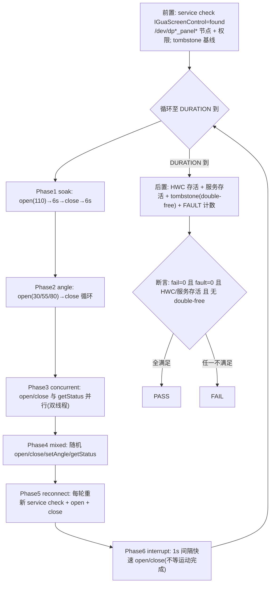

# TC_GFWK_STRESS_008 — 后排屏 AIDL 电机持续压测

> 上级 [[GFWK 稳定性测试用例全量清单]] · 接口 [[vendor AIDL]] `IGuaScreenControl` · 机制 [[后排屏]] · 原作者 yue.shen(原名 GFWK-BASE-TEST-006)
> 代码 `autocase/cases/MultiMedia/GPU/Stress/TC_GFWK_STRESS_008.py`（branch `qi.zhu`）

## 用例简介
纯 Python 经 `adb service call` 调后排屏电机的 [[vendor AIDL]] 接口 `vendor.gua.hardware.screenmotor.IGuaScreenControl`（服务端在 HWC3），**6 阶段循环压测** open/close/setAngle/getStatus + 回调监控，验证命令全成功、无 FAULT 回调、HWC 与服务存活、无 tombstone。后排屏控制**从旧 VHAL/CAN 改走 AIDL** 后的稳定性专项。

## 目标
压后排屏电机 AIDL 通路在**高频/并发/中断/重连**下的健壮性：命令队列不丢/不错、状态回读一致、异常中断不卡死、服务不崩不泄漏。

## 接口(transaction code)
| code | 方法 | 参数 |
|---|---|---|
| 1 | open | `i32 displayId i32 degree` |
| 2 | close | `i32 displayId` |
| 3 | setAngle | `i32 displayId i32 degree` |
| 4 | getStatus | `i32 displayId` → state/angle/fault/target |
| 5 / 6 | register/unregister Callback | — |

> 成功判据：Parcel **首个 8-hex 字==00000000**（详见 [[vendor AIDL]] 的判成功坑）。

## 六阶段流程

> 后台 `LogcatMonitor` 线程持续采 `GuaScreenControl` 日志，统计 onStatusChanged/onFault 回调分布（`fault_count` 必须为 0）。

## 断言(五项)
| 项 | 判据 |
|---|---|
| 命令 | `total_fail == 0`（所有 open/close/setAngle/getStatus 成功） |
| FAULT 回调 | `fault_count == 0` |
| HWC 存活 | composer HAL pid 在 |
| 服务存活 | `IGuaScreenControl` 收尾仍 found |
| 墓碑 | 无 double-free/UAF tombstone |

## 关键 env
| env | 默认 | 说明 |
|---|---|---|
| `SCREENMOTOR_STRESS_DURATION` | 3600 | 总时长秒(长稳 1h) |
| `SCREENMOTOR_PHASE_DURATION` | 60 | 每阶段秒(冒烟设 30 → 6 阶段各 30s) |
| `SCREENMOTOR_MOTION_WAIT` | 6 | 开合等运动完成秒 |
| `SCREENMOTOR_INTERRUPT_WAIT` | 1 | 中断阶段快速间隔 |
| `SCREENMOTOR_FAIL_FAST` | 1 | 掉线即停 |

> GTMP `--params SCREENMOTOR_STRESS_DURATION=180,SCREENMOTOR_PHASE_DURATION=30` 经 `cases/MultiMedia/conftest.py` / `cases/MultiMedia/GPU/conftest.py` 的 `--params→env` 桥生效。

## 运行 / 回归
```bash
SCREENMOTOR_STRESS_DURATION=180 pytest cases/MultiMedia/GPU/Stress/TC_GFWK_STRESS_008.py --serial <dev> -v
```
- **2026-08-07 GFWK-T29-001(bench 442, 设备 27A2E8C2) 任务 97349：PASS**（180s，6 阶段各 30s）。前置 `IGuaScreenControl=found`、节点OK、tombstone基线0；soak ok=6、angle ok=6、mixed ok=5……**汇总 ok=185 fail=0 fault=0**；回调 status=61 fault=0；HWC pid=484 存活、服务 found；`[PASS] 200s ok=185 0 fail 0 crash`。修正版 `_service_call`/`_aidl_get_status` 解析在真机验证正确。

## 挖什么
- 并发(命令+getStatus)下命令丢失/状态回读错乱
- 中断(不等运动完成快速反向)导致电机卡死/state 停在 MOVING
- 反复 reconnect 后服务句柄泄漏/拿不到服务
- 高频开合致 HWC3(服务端)崩溃、double-free、后排背光/DPU 异常

## 说明 / 限制
- 前置强依赖 `IGuaScreenControl` 服务注册 + `/dev/dp*_panel*` 节点；不满足直接 fail（属环境前置，非用例缺陷）。
- 本用例仍保留少量本地 helper(`_pid`/`_device_alive`/`_tombstones` 等)，与 `gfwk_stress_util` 重复，后续可按去重规则并入。

## 📚 延伸阅读
- AIDL for HALs：https://source.android.com/docs/core/architecture/aidl/aidl-hals
- Android 汽车多屏/乘客屏：https://source.android.com/docs/automotive/hmi/multi_display

## 关联
- 接口 [[vendor AIDL]] · 承载进程 [[HWC]] · 后排屏机制 [[后排屏]]
- 同族 [[TC_GFWK_STRESS_004]](旧 VHAL/broadcast 开合) · [[TC_GFWK_STRESS_006]](多屏图层)
- 总览 [[000-GFWK图形框架总览]] · 清单 [[GFWK 稳定性测试用例全量清单]]
