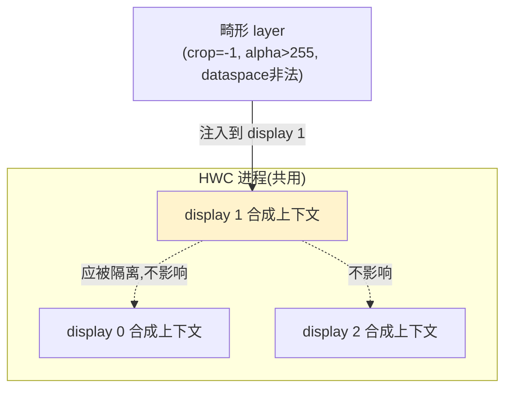
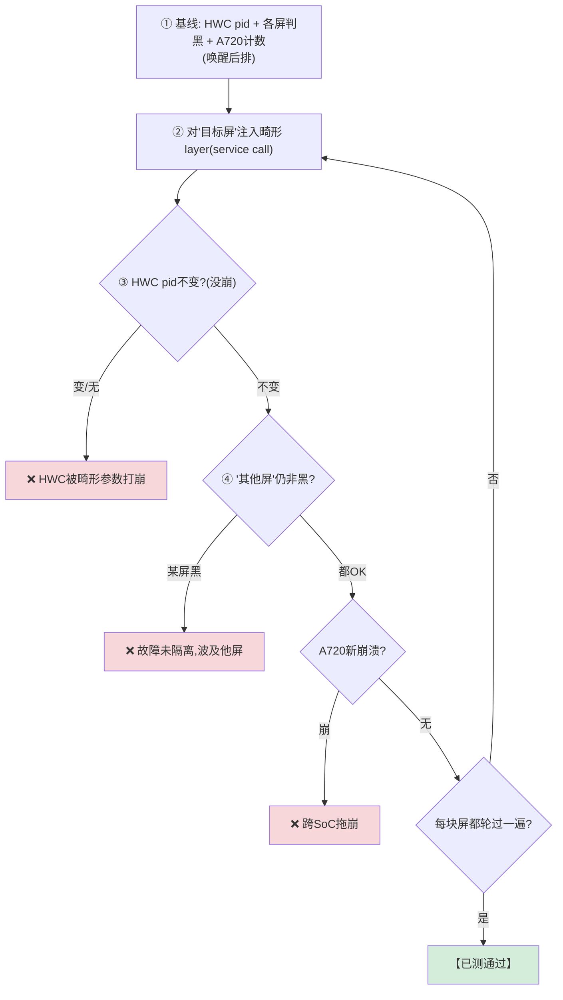
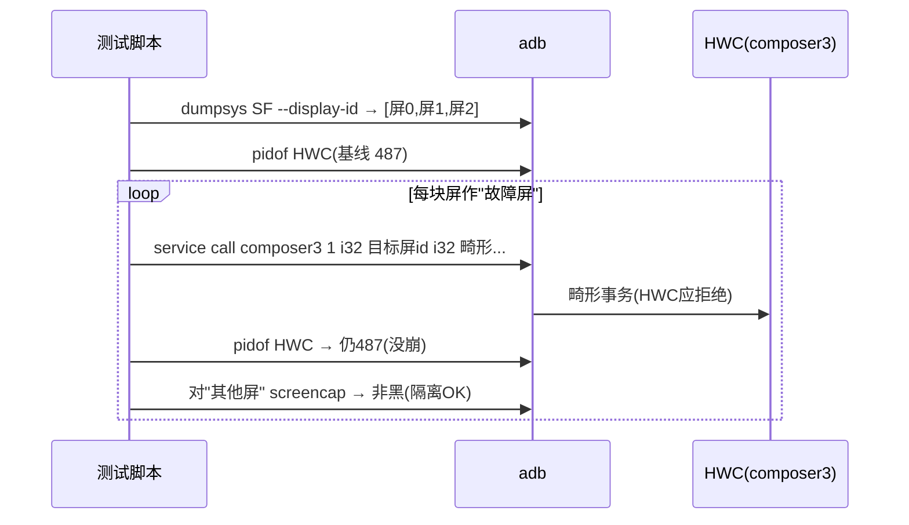

# TC_HWC_FAULT_003 — 多屏 Layer 故障隔离 【已测通过】

> **【已测通过】台架实测（2026-08-01, SG0286, fw 831）**：3 屏逐个作故障屏注入畸形 layer，HWC pid 不变、其余屏不受影响、A720 无崩溃。

## ① 一句话
**往"一块屏"提交非法图层参数，看"另一块屏"会不会跟着坏——验证一个 display 的错误不跨屏传播。**

## ② 原理：为什么多屏要"隔离"
座舱有多块屏（主屏、后排、乘客/仪表），它们**共用同一个 HWC 进程**在合成。风险是：如果某块屏收到一个非法图层（负数 crop、越界 alpha、非法 dataspace），HWC 处理时若没做好隔离，可能：
- 把整个 HWC 进程搞崩 → **所有屏一起黑**；
- 污染共享的 DPU 寄存器/图层表 → **别的屏花屏**。

正确设计：**每块 display 的合成上下文独立，一块屏的非法输入只影响它自己（甚至被拒绝），不波及其他屏。**



## ③ 注入手法：不用 native 工具，靠 service call 戳 Binder
关键技巧（复用 [[TC_HWC_FAULT_002]]）：直接对 HWC 的 composer3 Binder 发**畸形事务**，绕过 SF 的参数校验，**首个 i32 传目标 display id**：
```
service call android.hardware.graphics.composer3.IComposer/default 1 i32 <display_id> i32 0xffffffff i32 0xdeadbeef
```

## ④ 测试逻辑（流程图）


## ⑤ 交互时序（时序图）


## ⑥ 本地复现（逐条 adb）
```bash
adb -s A41AEC42 root
adb -s A41AEC42 shell "dumpsys SurfaceFlinger --display-id"     # 列出各屏id
adb -s A41AEC42 shell pidof android.hardware.composer.hwc3-service.gua  # HWC基线
# 对屏1注入畸形layer:
adb -s A41AEC42 shell "service call android.hardware.graphics.composer3.IComposer/default 1 i32 <屏1_id> i32 0xffffffff i32 0xdeadbeef"
adb -s A41AEC42 shell pidof android.hardware.composer.hwc3-service.gua  # 应不变
adb -s A41AEC42 shell "screencap -d <屏0_id> -p /data/local/tmp/x.png; stat -c%s /data/local/tmp/x.png"  # 屏0应非黑
```
自动化：`HWC_ISO_ROUNDS=1 pytest cases/MultiMedia/GPU/Hwc/TC_HWC_FAULT_003.py --bench=<yaml> -v`

## ⑦ 易出 bug 的环节（重点）
| 环节 | 为什么易出 bug | 判据 |
|---|---|---|
| **参数校验位置** | 🎯 若校验只在 SF 侧、HWC 侧假设"上游已校验" → service call 绕过 SF 直戳 HWC 就能喂进非法值 → HWC 崩 | HWC pid 不变 |
| **display 上下文共享** | 若各屏共享图层表/DPU 寄存器且无边界 → 一屏非法值污染他屏 | 其他屏非黑 |
| **跨SoC** | 仪表(A720)也是一块"屏"，畸形合成是否顺投屏链拖崩对端 | a720 无新崩溃 |
| **后排屏判黑前提** | 后排屏不唤醒就是黑，会把"本来就黑"误判成"被波及" | 判前先 VHAL 唤醒 |

> **对照思路**：本用例(隔离)与 [[TC_HWC_FAULT_002]](单屏坏参数)是"面 vs 点"——先证单屏能拒绝坏参数不崩，再证多屏之间互不影响。两条都绿 = HWC 参数健壮性 + 多屏隔离都 OK。

## 关联
- 前置 → [[TC_HWC_FAULT_002]](单屏坏参数)｜同簇 [[TC_HWC_FAULT_004]](kill HWC)
- 机制 → [[HWC]] [[composer_stub]]｜总览 [[GFWK 稳定性测试用例全量清单]]

## 📚 延伸阅读
- Hardware Composer HAL：https://source.android.com/docs/core/graphics/hwc
- AAOS 多屏：https://source.android.com/docs/automotive/display/multi-display
