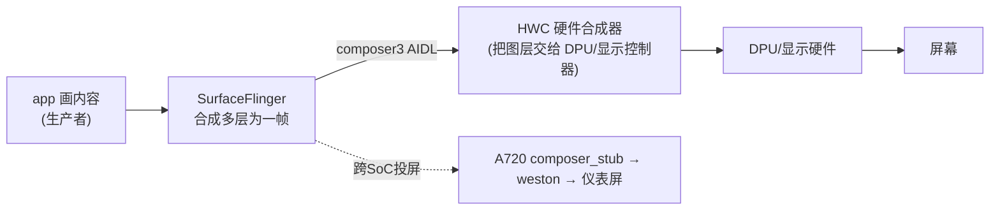
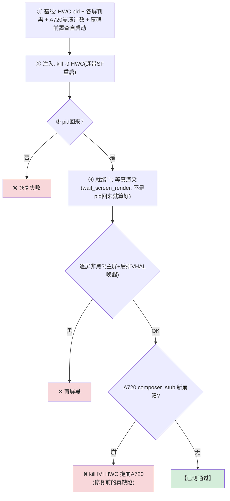
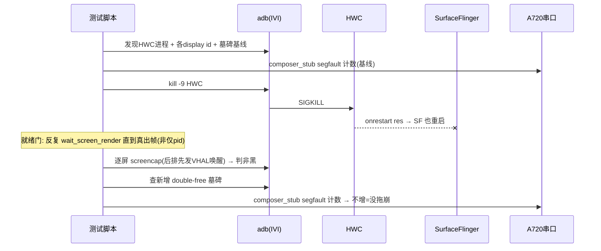

# TC_HWC_FAULT_004 — kill HWC 恢复 【已测通过】

> **【已测通过】台架实测（2026-08-01, SG0286, fw 831）**：5 轮 kill HWC 均过就绪门恢复；composer_stub 缺陷修复后跨SoC断言转绿。

## ① 一句话
**杀掉"把合成好的帧真正推给屏幕的硬件合成器"HWC，看主屏/后排/仪表能不能都恢复、且不连累别的 SoC。**

## ② 原理：HWC 在图形栈的位置
一帧从 app 到亮屏，经过三级：

- **HWC**（Hardware Composer）= SF 和显示硬件之间的 HAL，决定"哪些层用硬件 overlay、哪些回退给 GPU 合成"，最终驱动 DPU 点屏。
- **关键联动**：HWC 的 rc 配了 `onrestart res` → **kill HWC 会连带 SF 一起重启**。所以本用例不是只测 HWC，是测整条"HWC→SF→显示"链的恢复。
- **跨SoC钩子**：IVI HWC 重启会抖动跨 SoC 投屏链 → 这正是[[TC_CSOC_FAULT_002|composer_stub 缺陷]]被逮到的入口。

## ③ 测试逻辑（流程图）—— 注意"就绪门"


## ④ 交互时序（时序图）


## ⑤ 本地复现（逐条 adb + 串口）
```bash
adb -s A41AEC42 root
adb -s A41AEC42 shell "ps -A -o NAME | grep -iE 'graphics.composer|hwc[0-9]?-service' | grep -iv pq"  # 找HWC
adb -s A41AEC42 shell pidof <HWC名>                 # HWC pid
adb -s A41AEC42 shell kill -9 <HWC pid>             # 杀(连带SF重启)
adb -s A41AEC42 shell pidof surfaceflinger          # SF也换新pid
# 后排屏唤醒后判黑:
adb -s A41AEC42 shell 'dumpsys android.hardware.automotive.vehicle.IVehicle/default --inject-event 560992868 -a 0 -b 0x344c'
adb -s A41AEC42 shell 'screencap -d <display-id> -p /data/local/tmp/x.png; stat -c%s /data/local/tmp/x.png'
```
```bash
# a720 串口验是否拖崩:
dmesg | grep -iE 'composer_stub.*segfault'
```
自动化：`HWC_FAULT_ROUNDS=3 pytest cases/MultiMedia/GPU/Hwc/TC_HWC_FAULT_004.py --bench=<yaml> -v`

## ⑥ 易出 bug 的环节（重点）
| 环节 | 为什么易出 bug | 判据/铁律 |
|---|---|---|
| **就绪门** | 🎯 `pid 回来 ≠ 画面恢复`。SF/HWC 重启后要几秒才真出帧；pid 一回来就 screencap 会误报黑屏 | 必过 `wait_screen_render` 再判 |
| **多屏** | `单主屏不黑 ≠ 全屏好`。后排屏(display 1)不会自动亮，要先发 VHAL 才能判 | 逐屏 + 后排先唤醒 |
| **跨SoC拖崩** | 🔴 修复前真缺陷：kill IVI HWC → A720 composer_stub SIGSEGV（[[TC_CSOC_FAULT_002]] 那条）| a720 dmesg 无新 segfault |
| **设备崩溃防护** | `adb 报错可能是设备真崩了`。kill HWC 偶发把设备打进 ramdump，adb 返回乱码 | try/except→wait-for-device→记 crash |
| **double-free** | HWC/SF 重启与 buffer 回收竞态 → 双重释放墓碑 | 查新增 double-free 墓碑 |

> **这条用例是"三大铁律"的集大成者**——pid≠恢复、单屏≠全屏、adb错可能真崩。GTMP 上它曾 FAIL(adb desync)，本地过健康门+就绪门后稳过，说明**测试框架的健壮性本身也要设计**。

## 关联
- 逮到的缺陷 → [[BUG-kill-HWC-crashes-A720-composer_stub]]｜[[BUG-HWC-DPMS-SetPowerMode崩溃循环]]
- 机制 → [[HWC]] [[SurfaceFlinger]] [[composer_stub]]｜同链 [[TC_CSOC_FAULT_002]]
- 方法论 → [[GFWK kill-恢复类测试]]｜总览 [[GFWK 稳定性测试用例全量清单]]

## 📚 延伸阅读
- Hardware Composer HAL：https://source.android.com/docs/core/graphics/hwc
- AAOS 多屏显示：https://source.android.com/docs/automotive/display
