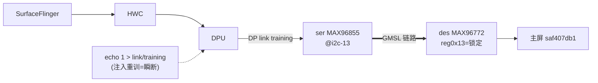
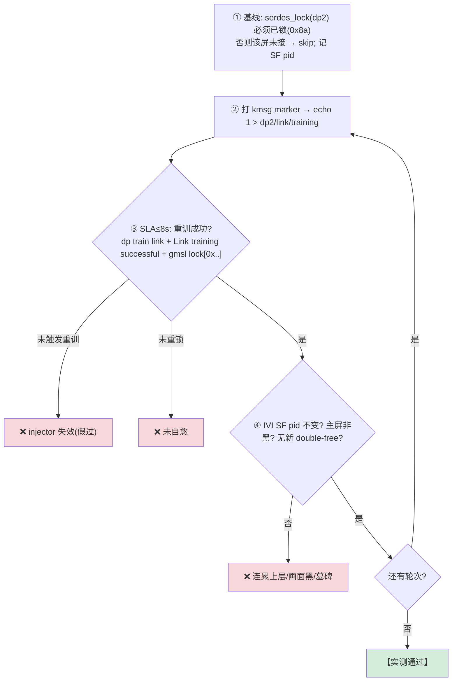

# TC_SERDES_FAULT_002 — [[SERDES链路|SERDES]](GMSL) 链路掉链-重训自愈

## ① 一句话
**强制显示串行链路(GMSL)重新训练 = 制造一次"瞬断重连", 看链路能否自动重锁、主屏恢复, 且不连累 IVI [[SurfaceFlinger]]。**

## ② 原理：远端屏靠一条"串行光缆"喂画面
主屏不在主板上, DPU 出的像素经 **序列器 MAX96855 → GMSL 链路 → 解串器 MAX96772** 才到面板。链路一旦失锁(unlock), 上层 [[HWC]]/[[SurfaceFlinger]] 可能"以为屏还在"(display 仍枚举), 实际已黑/花。所以要在**链路层**直接验证掉链后能自愈。



## ③ 测试逻辑（流程图）


## ④ 关键点：为什么判据不是"看到 linklock error"
初版想以"fmg 抓到 `linklock error`"证明真掉链, 但**实测发现 DP 重训不必然级联出 GMSL linklock error**——驱动内建 fault monitor(fmg)是**周期轮询**, 瞬断窗口若没撞上轮询就抓不到。故最终判据 = **DP 重训成功(`Link training successful`) + GMSL 重锁(`gmsl lock[0x8a]`)**; fmg 若抓到掉链仅作信息记录。这是"收严判据反被现实修正"的典型。

## ⑤ 复现指令
```bash
# 基线锁定
adb shell "su 0 sh -c 'echo M>/dev/kmsg; cat /sys/kernel/debug/dri/0/dp2/serdes_status>/dev/null; \
  dmesg|sed -n \"/M/,\\\$p\"|grep \"gmsl lock\"'"     # 期望 gmsl lock[0x8a]
# 注入重训 + 看恢复 + SF 隔离
sf0=$(adb shell pidof surfaceflinger)
adb shell "su 0 sh -c 'echo INJ>/dev/kmsg; echo 1 > /sys/kernel/debug/dri/0/dp2/link/training'"
adb shell "su 0 sh -c 'dmesg|sed -n \"/INJ/,\\\$p\"|grep -E \"dp train link|Link training successful|gmsl lock\"'"
adb shell pidof surfaceflinger    # 应 == $sf0
```
自动化：`SERDES_ROUNDS=3 pytest cases/MultiMedia/GFWK/Serdes/TC_SERDES_FAULT_002.py --serial <IVI> -v`

## ⑥ 易出 bug 的环节（重点）
| 环节 | 为什么易出 bug | 判据 |
|---|---|---|
| **重训自愈** | 链路重训后若不能自动重锁 → 屏永久黑/花 | `gmsl lock[0x8a]` 回来 ≤SLA |
| **injector 有效性** | 若 `link/training` 没触发重训, 断言无意义=假过 | 硬查 `dp train link` |
| **上层隔离** | 链路抖动不应打挂 IVI SF/整机 | SF pid 不变 |
| **资源泄漏** | 反复重训是否泄 fence/buffer → double-free | 无新墓碑 |

> **本用例结论：GMSL 链路重训自愈健康、上层隔离良好**(实测 <1s 重锁, SF pid 全程不变)。对照 [[TC_CSOC_FAULT_002]](投屏桥)同为"显示传输层"故障注入。

## 关联
- 机制 → [[SERDES链路]] · [[显示链路]] · [[硬件拓扑]] · [[wiki/004-AAOS/Rear Display]]
- 同类监控 → [[TC_SERDES_STRESS_003]]｜上层对照 → [[TC_HWC_FAULT_004]] [[TC_SF_FAULT_001]]
- 总览 [[GFWK 稳定性测试用例全量清单]]

## 📚 延伸阅读
- GMSL(Analog Devices/Maxim)：https://www.analog.com/en/product-category/gigabit-multimedia-serial-link.html
- DisplayPort Link Training（对照 DP 重训）：https://en.wikipedia.org/wiki/DisplayPort
