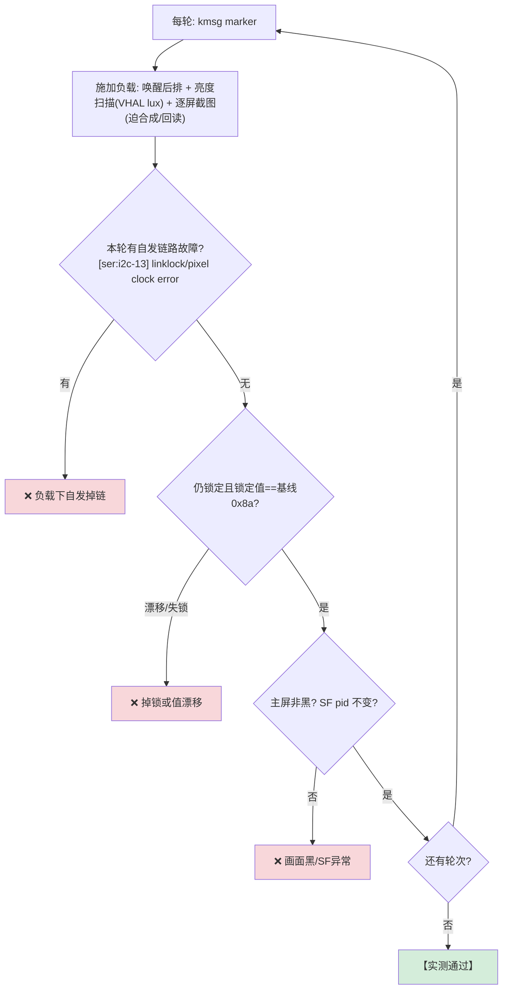

# TC_SERDES_STRESS_003 — [[SERDES链路|SERDES]](GMSL) 链路压力/长稳监控

## ① 一句话
**在显示负载下持续盯 GMSL 链路：锁定值不能抖、不能冒出自发链路故障、主屏不能黑。** 这是"链路层探针"而非上层枚举——比 [[TC_GFWK_STRESS_007]]"屏被检测到"更底层、更根因。

## ② 原理：为什么要"链路层"监控
上层查"display 枚举到了"只能证明**逻辑**上屏在;链路可能已在**误码/临界失锁**边缘(花屏/闪屏前兆)。直接读解串器锁定位 + fmg 故障事件, 能在上层还没黑之前抓到链路劣化。



## ③ 数据源（与 [[TC_SERDES_FAULT_002]] 共用）
- 锁定值：`cat dp2/serdes_status`(printk 到 dmesg)→ `gmsl lock[0x8a]`
- 故障事件：`dmesg | grep '[ser:i2c-13]'` 里 `linklock error`/`pixel clock error`(用 `/dev/kmsg` marker 隔离本轮读窗, 排除后排未接 bus15 的 `reg 0x13` 噪声)
- 隔离：IVI `pidof surfaceflinger` 不变

## ④ 关键点：噪声隔离
后排(dp1/bus15)未接会**持续**刷 `can't read reg 0x13`(ret=-121)。若不隔离, 全局 `[SERDES][E]` 计数会把后排噪声当成主屏故障→**误报**。做法:①故障正则 scope 到 `[ser:i2c-13]`(主屏总线)②每轮用唯一 kmsg marker 只数本轮窗内事件。与 [[composer_stub]] 崩溃计数用 `CSTUBCNT=` 隔噪同思路。

## ⑤ 复现指令
```bash
# 连续 N 轮盯锁定 + 本轮故障数
for r in 1 2 3; do
  adb shell "su 0 sh -c 'echo S$r>/dev/kmsg'"
  # ...施加负载(亮度扫描/截图)...
  adb shell "su 0 sh -c 'dmesg|sed -n \"/S$r/,\\\$p\"|grep -cE \"\\[ser:i2c-13\\].*(linklock error|pixel clock error)\"'"  # 期望 0
  adb shell "su 0 sh -c 'cat /sys/kernel/debug/dri/0/dp2/serdes_status>/dev/null; dmesg|grep -oE \"gmsl lock\\[0x..\\]\"|tail -1'"  # 期望 gmsl lock[0x8a]
done
```
自动化：`SERDES_ROUNDS=20 pytest cases/MultiMedia/GFWK/Serdes/TC_SERDES_STRESS_003.py --serial <IVI> -v`

## ⑥ 易出 bug 的环节（重点）
| 环节 | 为什么易出 bug | 判据 |
|---|---|---|
| **锁定值漂移** | 负载/温升下链路裕量不足 → lock 值变或短暂失锁 | 锁定值恒 ==基线 |
| **自发故障** | 高带宽帧下误码/pixel clock error | 本轮 faults==0 |
| **噪声误报** | 后排未接链路持续报错污染计数 | scope 总线 + marker 隔离 |
| **上层假象** | 屏枚举正常但链路已劣化 | 直接读链路层, 不靠 display 枚举 |

> **本用例结论：负载下 GMSL 链路锁定稳定、零自发故障**(实测锁定值恒 0x8a)。可作旁路探针嵌进其它压测。

## 关联
- 机制 → [[SERDES链路]] · [[显示链路]] · [[硬件拓扑]]
- 同类注入 → [[TC_SERDES_FAULT_002]]｜上层显示开关对照 → [[TC_GFWK_STRESS_007]]
- 噪声隔离同思路 → [[composer_stub]]｜总览 [[GFWK 稳定性测试用例全量清单]]

## 📚 延伸阅读
- GMSL 链路诊断(LOCK / error counter)：https://www.analog.com/en/product-category/gigabit-multimedia-serial-link.html
- Android 图形架构 SF/HWC：https://source.android.com/docs/core/graphics/arch-sf-hwc
