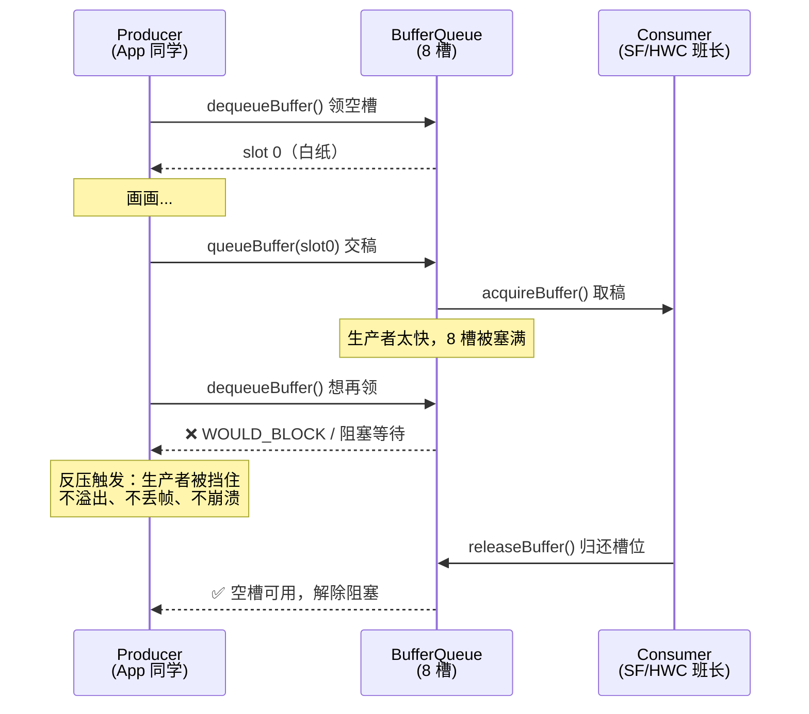
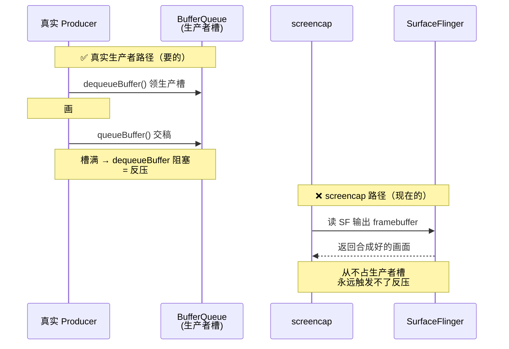

# TC_SF_BOUND_002 — Producer 極限

> 上级：[[000-GFWK图形框架总览]]｜被测：[[Buffer Queue]]｜维度：D2 边界条件
> 代码：`cases/MultiMedia/GPU/Bound/TC_SF_BOUND_002.py`（branch `qi.zhu`）
> 参照：[[TC_SF_FAULT_001]]

**一句话**：把[[生产者]]（App/native producer）速率从 30fps 推到 120fps 再到 1000fps，验证 BufferQueue 的**反压机制正确阻塞生产者，不溢出、不崩溃**。

---

## ① 背景：什么是[[反压 (back-pressure)]]

同学们（App）画画的速度比班长（SF）取纸的速度快——提交槽（[[Buffer Queue]]）已经塞满了，新画好的纸没地方放。

**反压 = dequeueBuffer 返回 `WOULD_BLOCK` 或阻塞等待**
- **正确行为**：同学应该**等着**（被阻塞），等班长取走一张纸后再放入新的。  
- **错误行为**：同学把槽塞爆、溢出，或者直接扔掉导致画面丢帧/黑屏。




---

## ② 测什么

| 速率 | 预期行为 |
|---|---|
| 30 fps | 正常，BufferQueue 从不满 |
| 120 fps | 接近 display 刷新率上限，轻微反压 |
| 1000 fps | 远超 display，BufferQueue 快速打满，反压持续触发 |

**断言骨架**：
- Producer 在高 fps 下被阻塞（不是无限加速）
- SF fd 数量稳定（无 buffer 泄漏）
- dmesg 无 BufferQueue overflow / fatal

---

## ③ 当前状态：🟡 骨架通过（Shell producer，非 native 真实 BufferQueue）

`/data/local/tmp/bq_producer` 已上台架（shell 版，用 screencap 循环模拟）。框架可完整执行，无 pytest.skip。

> **注意**：screencap 不走标准 BufferQueue dequeue/queue 路径，SF latency 结果反映的是 display vsync 周期，**不是真实反压指标**。真实反压验证需 native C++ producer。

运行：
```bash
source ~/.virtualenvs/py312/bin/activate
cd /home/gua/Documents/autocase
pytest cases/MultiMedia/GPU/Bound/TC_SF_BOUND_002.py --serial A41AEC42 -v
```

**试跑结果（2026-07-27，台架 A41AEC42）**：`PASSED` — 耗时 334.82s（5m34s）

| 速率 | SF latency（ns） | 换算 | 状态 |
|---|---|---|---|
| 30 fps | 16666660 | 16.67ms = 60Hz | ✅ 稳定 |
| 120 fps | 16666660 | 16.67ms = 60Hz | ✅ 稳定 |
| 1000 fps | 16666660 | 16.67ms = 60Hz | ✅ 稳定 |

SF vsync 周期全程 60Hz 稳定，无崩溃、无 dmesg 异常。占位断言通过，待接入 native producer 后可升级为真实反压指标。

### 为什么 shell 版测不了真实反压

反压发生在**生产端** `IGraphicBufferProducer` 上。但 `screencap` 是**消费者侧抓图**——它读 SF 合成好的输出画面，从不往 BufferQueue 里 `dequeueBuffer/queueBuffer`。生产者槽位从没被占用，"等空槽"就永远不发生。



**铁证**：试跑里 30/120/1000fps 的 latency **全是 16666660ns（60Hz）** ——因为 screencap 速率被 **vsync 钳死**，那是显示刷新周期，不是生产速率。脚本写的 1000fps 是假的，screencap 根本跑不到。

| 反压要素 | 需要 | shell 能给？ |
|---|---|---|
| 身份 | connect 到 BufferQueue 当**生产者** | ❌ 无 shell 命令能当生产者 |
| 动作 | 循环 dequeue→queue **超速** | ❌ screencap 是读输出 |
| 触发 | dequeued buffer 到上限 → dequeueBuffer 阻塞 | ❌ 槽从没被占 |

**正解**：native C++——创建 Surface/ANativeWindow → `for(;;){ dequeueBuffer; 填色; queueBuffer; }` 超速 → dequeued 到上限 → dequeueBuffer 阻塞 → 测阻塞时长 = 真实反压。需链接 `libgui/libui/libnativewindow`，NDK 编 arm64 binary 推 `/data/local/tmp/bq_producer`。

---

## ④ 如何运行

### 本地能测什么 vs 需要 native 工具

| 目标                          | 现在本地能测？ | 手段                                                   |
| --------------------------- | ------- | ---------------------------------------------------- |
| 框架跑通、无崩溃/dmesg 异常           | ✅ 能     | shell 版 `bq_producer`（screencap 模拟），pytest 直接跑       |
| SF vsync 周期稳定性              | ✅ 能     | `dumpsys SurfaceFlinger --latency`                   |
| SF fd 不泄漏                   | ✅ 能     | 数 `/proc/<sf_pid>/fd` 前后差                            |
| **真实反压**（dequeueBuffer 被阻塞） | ❌ 不能    | screencap 不走标准 BufferQueue，需 **native C++ producer** |
 > 想升级为**真实反压**验证：需把 native `bq_producer`（走 `IGraphicBufferProducer` 的 dequeue/queue）推上 `/data/local/tmp/`，替换现在的 screencap shell 版。
 
### A. 本地运行（Ubuntu host 直连台架）

```bash
# 1. 环境 + 用例根目录
source ~/.virtualenvs/py312/bin/activate
cd /home/gua/Documents/autocase
adb devices                       # 确认台架在线

# 2. 跑用例（当前 shell 骨架版，会 PASS 但属占位）
pytest cases/MultiMedia/GPU/Bound/TC_SF_BOUND_002.py --serial A41AEC42 -v
```

**手动旁证（不依赖 pytest，随时可查）**：
```bash
SF=$(adb shell pidof surfaceflinger)
adb shell "ls /proc/$SF/fd | wc -l"                       # fd 基线（泄漏检测，前后对比）
adb shell dumpsys SurfaceFlinger --latency                # 帧延迟 / vsync 周期
adb shell "dmesg | grep -iE 'BufferQueue|gralloc|fatal' | tail"  # 有无 overflow/fatal
```


### B. 在 GTMP 上运行（自动化平台）

同 [[TC_SF_FAULT_002]] ⑤，两种入口：

**① gtmp-skill 自然语言（推荐）**——对我说：
```
用 <版本> 在台架 A41AEC42 上跑 TC_SF_BOUND_002
```
我走 `+task create`（版本+台架+用例）建任务并回传任务号，再查进度/取消。

**② GTMP Web**：新建任务 → 选版本（避开含 `e0y` 的刷机版本，见 [[GTMP E0y 已废弃]]）→ 绑台架 → 勾 `MultiMedia/GPU/Bound/TC_SF_BOUND_002` → 提交 → 看报告。

| 维度 | 本地 pytest | GTMP |
|---|---|---|
| 场景 | 开发调试、单台架快速验证 | 回归、多轮/多台架、留档 |
| 当前有效性 | 骨架 PASS（占位，非真实反压） | 同上——**native producer 就位前两者都是占位** |
| 结果 | 终端 + `--latency` 输出 | 平台报告 + 飞书通知 |

> ⚠️ 现阶段无论本地还是 GTMP，跑的都是 **shell 占位骨架**——PASS 只代表"框架跑通、系统没崩"，不代表真实反压已验证。真实指标待 native producer。

---

## ⑤ 与 [[TC_SF_BOUND_003]] 的关系

|      | TC_SF_BOUND_002            | TC_SF_BOUND_003        |
| ---- | -------------------------- | ---------------------- |
| 被测角色 | [[生产者]]（速率过快）              | [[Consumer]]（速率过慢）     |
| 触发方式 | Producer fps 过高 → slots 打满 | Consumer 极慢 → slots 耗尽 |
| 期望行为 | Producer 被阻塞（反压）           | dequeueBuffer 返回错误码    |

---

## 关联
- 核心机制 → [[Buffer Queue]]｜[[生产者]]
- 落地工具 → [[编译native工具-BufferQueue 反压测试]]（真实反压 native producer 怎么编）
- 配对用例 → [[TC_SF_BOUND_003]]（消费者极限）
- 上级地图 → [[000-GFWK图形框架总览]]
- 重点用例集 → [[重点用例-高亮]]
