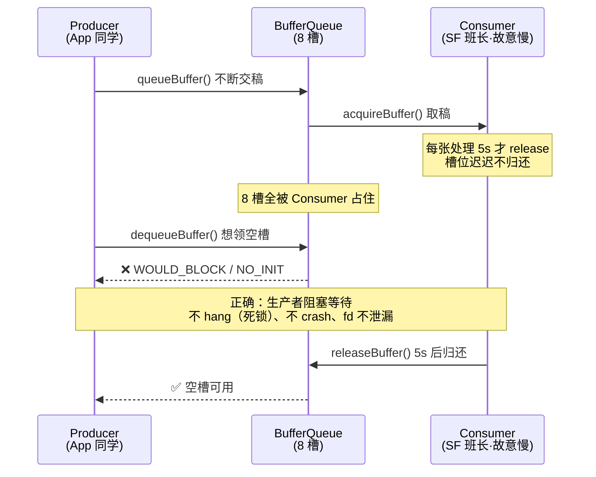

# TC_SF_BOUND_003 — Consumer 速率極限（Slots 耗盡 / 無死鎖）

> 上级：[[000-GFWK图形框架总览]]｜被测：[[Buffer Queue]]｜维度：D2 边界条件
> 代码：`cases/MultiMedia/GPU/Bound/TC_SF_BOUND_003.py`（branch `qi.zhu`）
> 参照：[[TC_SF_FAULT_001]]

**一句话**：让消费者极慢（5s 延迟才取一帧），BufferQueue slots 耗尽后，验证 dequeueBuffer 返回正确错误码、无死锁、SF fd 不泄漏。

---

## ① 背景：Consumer 极慢时发生什么

班长（[[Consumer]]/[[SurfaceFlinger]]）故意很慢——每张纸要处理 5 秒才肯归还槽位。
同学们（Producer）不断画完往提交槽（[[Buffer Queue]]）里放，很快 8 个槽全满了。

**正确行为**：槽满 → dequeueBuffer 返回 `WOULD_BLOCK`（没有空槽可用），同学等着，**不死锁、不崩溃**。  
**错误行为**：fd 泄漏、死锁（两方都等对方）、系统 OOM。



---

## ② 断言逻辑

| 断言 | 检查方式 | 为什么 |
|---|---|---|
| 正确错误码 | dequeueBuffer 返回 WOULD_BLOCK 而非 hang | hang = 死锁，属缺陷 |
| 无死锁 | 超时检测（producer/consumer 都能继续运行） | 死锁 = 两方永久等待 |
| fd 不泄漏 | `ls /proc/<sf_pid>/fd \| wc -l` 前后差 ≤ 20 | 每次 buffer cycle 不应产生新 fd |

**fd 检测是本用例唯一已实现的断言**（不需要 native 工具）——试跑时会打印 SF 当前 fd 数量。

---

## ③ 当前状态：🧩 骨架（缺 native consumer）

需要 `/data/local/tmp/bq_consumer` — 一个可以控制 acquire 速率（5s delay）的 native 消费者工具。工具未上台架，CI 会 `pytest.skip`。

**已实现部分**（不需工具）：
- 测试启动时读取 SF 当前 fd 数量并打印（`起始 SF fd=X`）

运行（有工具后）：
```bash
source ~/.virtualenvs/py312/bin/activate
cd /home/gua/Documents/autocase
pytest cases/MultiMedia/GPU/Bound/TC_SF_BOUND_003.py --serial A41AEC42 -v
```

**试跑结果（2026-07-27，台架 A41AEC42）**：`SKIPPED` — 缺 `bq_consumer`，框架集成正常（跳过前已执行 SF fd 读取）。两用例共 2 skipped / 4min41s。

---

## ④ 如何运行

### 本地能测什么 vs 需要 native 工具

本用例比 [[TC_SF_BOUND_002]] 更依赖 native 工具——**慢消费者**没法用 shell 模拟（screencap 不能"占住槽位 5s 不还"）。

| 目标 | 现在本地能测？ | 手段 |
|---|---|---|
| SF fd 基线读取、框架跑通 | ✅ 能 | pytest 启动即读 fd，随后 `skip` |
| fd 不泄漏对比 | 🟡 半能 | 手动数 `/proc/<sf_pid>/fd`，但没有慢消费者制造压力，只是静态基线 |
| **槽满 → dequeueBuffer 返回错误码** | ❌ 不能 | 需 native `bq_consumer`（可控 5s acquire 延迟） |
| **无死锁** | ❌ 不能 | 同上，需真实生产/消费两端 |

> 结论：**核心断言（错误码、无死锁）本地目前无法验证**，缺 `/data/local/tmp/bq_consumer`。现在跑只会 `SKIPPED`（框架正常、fd 已读）。

### A. 本地运行（Ubuntu host 直连台架）

```bash
source ~/.virtualenvs/py312/bin/activate
cd /home/gua/Documents/autocase
adb devices

# 现在跑：会 SKIPPED（缺 bq_consumer），但会先打印 SF fd 基线
pytest cases/MultiMedia/GPU/Bound/TC_SF_BOUND_003.py --serial A41AEC42 -v
```

**手动旁证（现在能做的）**：
```bash
SF=$(adb shell pidof surfaceflinger)
adb shell "ls /proc/$SF/fd | wc -l"    # fd 基线；接入慢消费者后前后对比查泄漏
```

**解除 skip 的前提**：把 native `bq_consumer`（可控 acquire 速率、5s delay）推上 `/data/local/tmp/`：
```bash
adb push bq_consumer /data/local/tmp/ && adb shell chmod 755 /data/local/tmp/bq_consumer
```

### B. 在 GTMP 上运行（自动化平台）

同 [[TC_SF_FAULT_002]] ⑤ 入口：

**① gtmp-skill 自然语言**——对我说：
```
用 <版本> 在台架 A41AEC42 上跑 TC_SF_BOUND_003
```
**② GTMP Web**：新建任务 → 选版本（避开 `e0y`，见 [[GTMP E0y 已废弃]]）→ 绑台架 → 勾 `MultiMedia/GPU/Bound/TC_SF_BOUND_003` → 提交。

> ⚠️ **GTMP 上同样会 SKIPPED**——除非台架镜像里已内置 `bq_consumer`。本地和 GTMP 的阻塞点相同：都缺 native 消费者工具。这是本用例目前**唯一的落地障碍**，不是环境问题。

| 维度 | 本地 pytest | GTMP |
|---|---|---|
| 现在结果 | SKIPPED（缺工具） | SKIPPED（缺工具） |
| 能拿到的 | SF fd 基线 | 同上 + 报告留档 |
| 解除条件 | 推 `bq_consumer` 上台架 | 版本镜像内置 `bq_consumer` |

---

## ⑤ 与 TC_SF_BOUND_002 的关系

| | TC_SF_BOUND_002 | TC_SF_BOUND_003 |
|---|---|---|
| 压力方向 | Producer 太快 | Consumer 太慢 |
| 结果 | slots 被 Producer 打满 | slots 被 Consumer 占满 |
| 反压触发方 | Producer 被阻塞 | Producer 被阻塞（同样结果） |
| 验证重点 | 反压机制正确 | 错误码正确 + 无死锁 + fd 稳定 |

---

## 关联
- 核心机制 → [[Buffer Queue]]｜[[Consumer]]
- 配对用例 → [[TC_SF_BOUND_002]]（生产者极限）
- 上级地图 → [[000-GFWK图形框架总览]]
- 重点用例集 → [[重点用例-高亮]]
