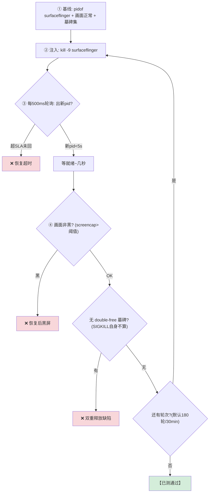
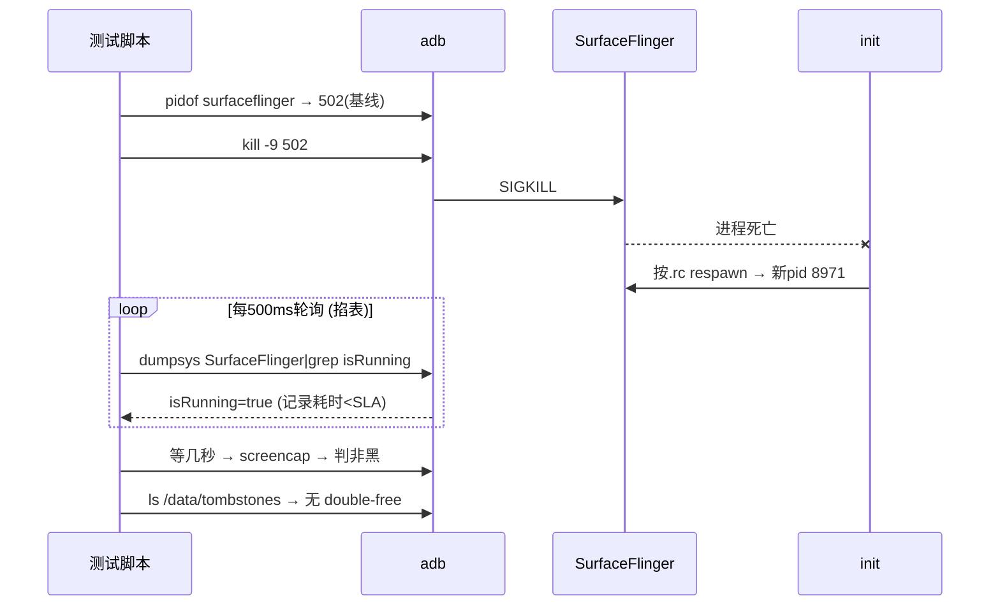

# TC_SF_FAULT_001 — kill SurfaceFlinger 恢复 SLA 

## ① 一句话
**杀掉整个安卓的"总合成器"SurfaceFlinger，掐表看它多久自己重启、画面多久回来。**

## ② 原理
[[SurfaceFlinger|SF]] 是 Android 图形栈的**总合成器**：把所有 app 画好的图层（Surface）合成成最终一帧，交给 [[HWC]] 上屏。它是**开机就起的关键系统服务**，由 init 托管。
- **为什么 kill 了会自己回来**：SF 在 init 的 `.rc` 里配了自启动（`class core` / 有 `onrestart`），进程一死，**init 立刻按配置 respawn** 一个新 SF（新 pid）。
- **SLA（恢复时限）**：健壮系统要求 SF 崩后 **<5s** 重新可用、画面回正。超了就是恢复能力缺陷。
- **副作用**：SF 是很多东西的依赖，杀 SF 会连带一批图形客户端重连（正常），但**不应**把 system_server 也拖崩。

## ③ 测试逻辑（流程图）


## ④ 交互时序（时序图）


## ⑤ 本地复现（逐条 adb）

```bash
adb -s A41AEC42 root
adb -s A41AEC42 shell pidof surfaceflinger        # 1. 基线 pid
adb -s A41AEC42 shell kill -9 <pid>               # 2. 杀
adb -s A41AEC42 shell pidof surfaceflinger        # 3. 立刻反复看→应秒出新pid
adb -s A41AEC42 shell "screencap -p /data/local/tmp/x.png; stat -c%s /data/local/tmp/x.png"  # 4. 画面非黑
```
自动化：`SF_FAULT_ROUNDS=3 pytest cases/MultiMedia/GPU/Fault/TC_SF_FAULT_001.py --bench=<yaml> -v`（默认 180 轮，冒烟设 3）

SF_FAULT_INTERVAL=1 SF_FAULT_ROUNDS=40 SF_FAULT_STOP_HOLD=1 \
  pytest cases/MultiMedia/GFWK/SurfaceFlinger/Fault/TC_SF_FAULT_001.py --serial A41AEC42
SETTLE_SEC 现在是写死常量(line 44)。要不要我把它也提成 SF_FAULT_SETTLE 环境变量,这样加压不用改码?

```
# 冒烟(3 轮, ~1min)
SF_FAULT_ROUNDS=3 python3 -m pytest cases/MultiMedia/GFWK/SurfaceFlinger/Fault/TC_SF_FAULT_001.py --bench <yaml>

# soak(还原 180 轮)
SF_FAULT_ROUNDS=180 python3 -m pytest cases/MultiMedia/GFWK/SurfaceFlinger/Fault/TC_SF_FAULT_001.py --bench <yaml>

# 激进档(高频加压)
SF_FAULT_INTERVAL=1 SF_FAULT_ROUNDS=40 python3 -m pytest cases/MultiMedia/GFWK/SurfaceFlinger/Fault/TC_SF_FAULT_001.py --bench <yaml>

# 自动选最新台架配置(不用写路径)
python3 -m pytest cases/.../TC_SF_FAULT_001.py --auto-bench
```

一个 surfaceflinger process triggers 3 screens 
实测这台 1 个 SF 进程(pid 3938)驱动 3 个物理屏:

、

所以那条需求对应的命令是杀 App,不是杀 SF:


kill -9 $(pidof com.android.car.carlauncher)   # 举例:杀车机桌面


正确命令(单引号,让设备端算 pidof):
adb -s A41AEC42 shell 'kill -9 $(pidof com.hobot.saturnv.hmi.app)'

更省事(pkill 按进程名,不用 pidof):
adb -s A41AEC42 shell pkill -9 com.hobot.saturnv.hmi.app  # 举例:杀车机桌面 (HMI 车机应用,同一进程同时驱动 IVI 和 Cluster 的 Home)。
### 三屏
``` bash

# kill ivi UI 只影响ivi表现
adb -s A41AEC42 shell 'kill -9 $(pidof com.hobot.saturnv.hmi.app)'


# ivi + rear 熄屏后 ivi进开机画面，重启后rear和+ivi同时进入系统，全程不影响cluster
adb -s A41AEC42 shell pkill -9 surfaceflinger


```

## ⑥ 易出 bug 的环节（重点）
| 环节 | 为什么易出 bug | 判据/铁律 |
|---|---|---|
| **恢复 SLA** | 若 SF 依赖的资源(fence/buffer)回收慢、或 init respawn 被别的服务阻塞 → 超 5s | isRunning<5s |
| **就绪 vs pid** | `pid 回来 ≠ 画面好`：SF 起来到真出帧有几秒，太早 screencap 误判黑 | 等就绪再判 |
| **墓碑辨伪** | kill -9 SF 自己必产生 SIGKILL 记录，**那不算缺陷**；只有 double-free/UAF 墓碑才是 bug | 只查 double-free 特征 |
| **DPU underflow** | 快速反复重启，DPU 取不到帧 → underflow fatal | dmesg 无 DPU underflow fatal |
| **连累关键服务** | 杀 SF 是否把 system_server 也带崩 | system_server pid 不变 |

> **为什么它是模板**：kill-恢复类用例（[[TC_CSOC_FAULT_002]] 投屏桥、[[TC_CSOC_FAULT_005]] weston、[[TC_HWC_FAULT_004]] HWC）都套这个"基线→kill→轮询恢复→判画面→查墓碑"四段式。理解这条 = 理解一半的稳定性用例。

## 关联
- 方法论 → [[GFWK kill-恢复类测试]]｜衍生 → [[TC_HWC_FAULT_004]] [[TC_CSOC_FAULT_002]] [[TC_CSOC_FAULT_005]]
- 机制 → [[SurfaceFlinger]] [[HWC]]｜总览 [[GFWK 稳定性测试用例全量清单]]

## 📚 延伸阅读
- SurfaceFlinger 架构：https://source.android.com/docs/core/graphics/surfaceflinger-windowmanager
- Android init（respawn 机制）：https://source.android.com/docs/core/architecture/init

---

``` bash
adb shell dumpsys SurfaceFlinger --display-id
# (py312) user@gua-SH0278:~$ adb shell dumpsys SurfaceFlinger --display-id
# -------------------------------------------------------------------------------
# DUMP OF SERVICE SurfaceFlinger:
# Display 4634679611807204096 (HWC display 0): port=0 pnpId=TMP displayName="GUA0" 中控 IVI
# Display 4634679327297303554 (HWC display 1): port=2 pnpId=TMP displayName="GUA2" 
# Display 4634679874316010244 (HWC display 2): port=4 pnpId=TMP displayName="GUA4" 
# Display 4634679587309427457 (HWC display 100): port=1 pnpId=TMP displayName="GUA1"
# --------- 0.004s was the duration of dumpsys SurfaceFlinger, ending at: 2026-08-31 19:21:58.735


adb -s a000025a shell pkill -9 surfaceflinger

am broadcast -a com.gua.action.OPEN_REAR_SCREEN -p com.android.car
am broadcast -a com.gua.action.CLOSE_REAR_SCREEN -p com.android.car


```