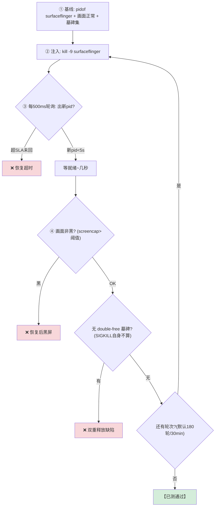
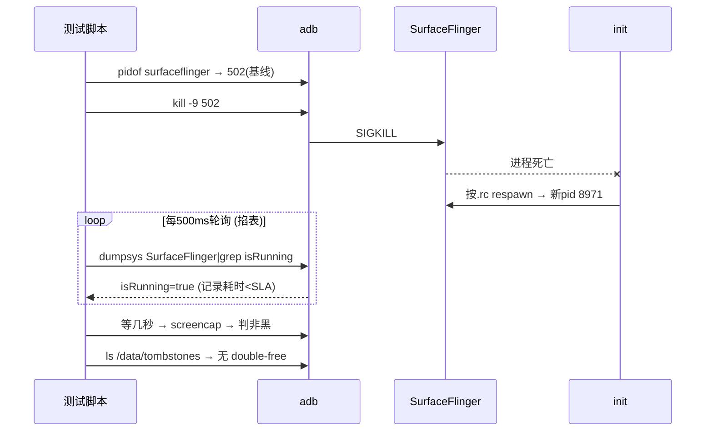

# TC_SF_FAULT_001 — kill SurfaceFlinger 恢复 SLA 【已测通过】

> **【已测通过】台架实测（2026-08-01, SG0286, fw 831）**：反复 kill SF 均秒级自恢复、画面回正。是所有 kill-恢复类用例的**模板**。

## ① 一句话
**杀掉整个安卓的"总合成器"SurfaceFlinger，掐表看它多久自己重启、画面多久回来。**

## ② 原理：SF 是谁、为什么杀了能自恢复
[[SurfaceFlinger|SF]] 是 Android 图形栈的**总合成器**：把所有 app 画好的图层（Surface）合成成最终一帧，交给 [[HWC]] 上屏。它是**开机就起的关键系统服务**，由 init 托管。
- **为什么 kill 了会自己回来**：SF 在 init 的 `.rc` 里配了自启动（`class core` / 有 `onrestart`），进程一死，**init 立刻按配置 respawn** 一个新 SF（新 pid）。
- **SLA（恢复时限）**：健壮系统要求 SF 崩后 **<5s** 重新可用、画面回正。超了就是恢复能力缺陷。
- **副作用**：SF 是很多东西的依赖，杀 SF 会连带一批图形客户端重连（正常），但**不应**把 system_server 也拖崩。

## ③ 测试逻辑（流程图）


## ④ 交互时序（时序图）


## ⑤ 本地复现（逐条 adb）
```bash
adb -s A41AEC42 root
adb -s A41AEC42 shell pidof surfaceflinger        # 1. 基线 pid
adb -s A41AEC42 shell kill -9 <pid>               # 2. 杀
adb -s A41AEC42 shell pidof surfaceflinger        # 3. 立刻反复看→应秒出新pid
adb -s A41AEC42 shell "screencap -p /data/local/tmp/x.png; stat -c%s /data/local/tmp/x.png"  # 4. 画面非黑
```
自动化：`SF_FAULT_ROUNDS=3 pytest cases/MultiMedia/GPU/Fault/TC_SF_FAULT_001.py --bench=<yaml> -v`（默认 180 轮，冒烟设 3）

## ⑥ 易出 bug 的环节（重点）
| 环节 | 为什么易出 bug | 判据/铁律 |
|---|---|---|
| **恢复 SLA** | 若 SF 依赖的资源(fence/buffer)回收慢、或 init respawn 被别的服务阻塞 → 超 5s | isRunning<5s |
| **就绪 vs pid** | `pid 回来 ≠ 画面好`：SF 起来到真出帧有几秒，太早 screencap 误判黑 | 等就绪再判 |
| **墓碑辨伪** | kill -9 SF 自己必产生 SIGKILL 记录，**那不算缺陷**；只有 double-free/UAF 墓碑才是 bug | 只查 double-free 特征 |
| **DPU underflow** | 快速反复重启，DPU 取不到帧 → underflow fatal | dmesg 无 DPU underflow fatal |
| **连累关键服务** | 杀 SF 是否把 system_server 也带崩 | system_server pid 不变 |

> **为什么它是模板**：kill-恢复类用例（[[TC_CSOC_FAULT_002]] 投屏桥、[[TC_CSOC_FAULT_005]] weston、[[TC_HWC_FAULT_004]] HWC）都套这个"基线→kill→轮询恢复→判画面→查墓碑"四段式。理解这条 = 理解一半的稳定性用例。

## 关联
- 方法论 → [[GFWK kill-恢复类测试]]｜衍生 → [[TC_HWC_FAULT_004]] [[TC_CSOC_FAULT_002]] [[TC_CSOC_FAULT_005]]
- 机制 → [[SurfaceFlinger]] [[HWC]]｜总览 [[GFWK 稳定性测试用例全量清单]]

## 📚 延伸阅读
- SurfaceFlinger 架构：https://source.android.com/docs/core/graphics/surfaceflinger-windowmanager
- Android init（respawn 机制）：https://source.android.com/docs/core/architecture/init
