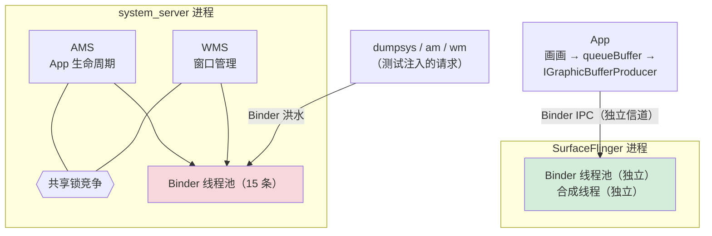
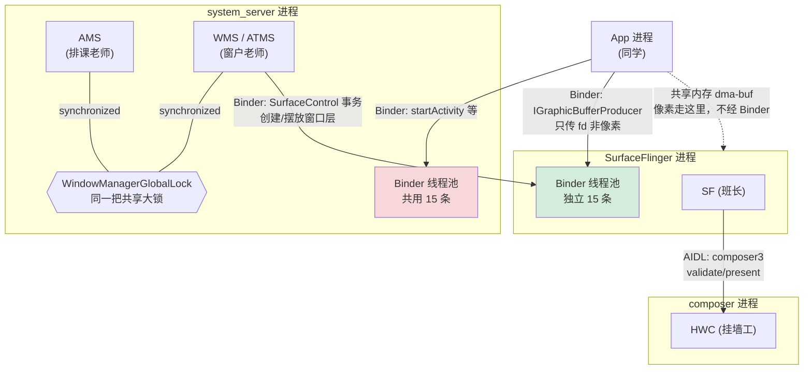

# TC_SF_FAULT_002 — AMS/WMS Binder 突刺（SF 不被连累）【已测通过】

> **【已测通过】 台架实测通过（2026-08-01 稳定集回归, SG0286, fw 831）**：`SF_F002_DURATION=60` Binder 突刺，SF 不被连累。
> 上级：[[000-GFWK图形框架总览]]｜被测：[[SurfaceFlinger]]
> 代码：`cases/MultiMedia/GPU/Fault/TC_SF_FAULT_002.py`（branch `qi.zhu`）
> 参照：[[TC_SF_FAULT_001]]

**一句话**：用大量并发 [[Binder IPC|Binder]] 请求轰炸 [[system_server]]（AMS/WMS），看 SF 能不能在上层系统高压下保持独立存活、画面不黑。

---

## ① 背景：AMS / WMS / Binder IPC 是什么

**[[Binder IPC]]**：Android 的进程间通信机制。每个进程有独立内存，进程间不能直接调函数，必须通过 Binder "传纸条"。每个服务进程有一个 **Binder 线程池**（默认 15 条线程），同时最多处理 15 个请求，超出的等待。

**[[AMS]]（ActivityManagerService）**：管理所有 App 的生命周期——打开 App、切后台、杀掉、权限管理。住在 [[system_server]] 进程里。

**[[WMS]]（WindowManagerService）**：管理所有窗口的位置、层级、焦点。也住在 [[system_server]] 进程里，和 AMS 共享锁。

### 进程结构图



### 为什么 AMS/WMS 过载不应波及 SF

|            | system_server（AMS/WMS）    | SurfaceFlinger  |
| ---------- | ------------------------- | --------------- |
| 进程         | 同一个 `system_server`       | 独立进程            |
| Binder 线程池 | 共用（15条，AMS/WMS 竞争）        | 独立（不共享）         |
| 锁          | AMS lock ↔ WMS lock 可能死锁  | 自己的 SF lock，不参与 |
| 崩溃影响       | system_server 崩 → App 全重启 | 不应影响 SF         |

> **测试的核心假设**：SF 与 system_server 之间只有 Binder 通信，Binder 有超时保护（5s），超时后 SF 直接跳过本帧继续工作，不会永久阻塞。如果 SF 被 AMS/WMS 死锁拖死，说明进程隔离或 Binder 超时机制有缺陷。

### SF 与 Binder 的关系（控制面 vs 数据面）

[[SurfaceFlinger|SF]] 本身就是一个 **Binder 服务**：开机时向 ServiceManager 注册名为 `SurfaceFlinger` 的服务。所有人和 SF 打交道都走 Binder：

| 通道 | 接口 | 走 Binder 传什么 |
|---|---|---|
| App → SF | `ISurfaceComposer` | 建 Surface、查显示信息、提事务 |
| App → SF | `IGraphicBufferProducer`（BufferQueue 生产端） | **只传 buffer 的 fd 句柄 + 状态**，不传像素 |
| [[WMS]] → SF | `SurfaceControl` 事务 | 创建/摆放/层级窗口图层（WMS 是 SF 的头号客户） |
| SF → [[HWC]] | `composer3`（AIDL/HwBinder） | validate/present 合成指令 |

> **关键区分**：**控制面**（谁画完了、放哪层、什么格式）走 Binder；**数据面**（几 MB 的像素）走 [[dma-buf heap|共享内存 dma-buf]]，Binder 只捎带那张纸的 fd。所以"轰炸 Binder"打的是控制面线程池，不是像素带宽。




> 红色线程池（system_server）被打满时，绿色线程池（SF）毫发无伤——这就是本用例要验证的**进程隔离**。

### AMS 与 WMS 之间的锁到底是什么

"共享锁竞争"不是一个叫 `AMS-WMS mutex` 的东西，而是**两个时代**的故事：

| 时代 | 锁结构 | 风险 |
|---|---|---|
| Android 9 及以前 | AMS 用 `synchronized(ActivityManagerService.this)`（AM 锁）；WMS 用 `mWindowMap`（WM 锁），**两把独立锁** | 启 Activity：AMS 持 AM 锁 → 回调 WMS 要 WM 锁；WMS 窗口变化 → 回调 AMS 要 AM 锁。**两条路径加锁顺序相反 → 锁序反转死锁（lock-order inversion）** |
| Android 10+（12 强化） | 引入 `WindowManagerGlobalLock`，把从 AMS 拆出的 **ATMS**（ActivityTaskManagerService）和 WMS 统一到**同一把锁** | 死锁被根除；退化为**串行竞争**（性能问题，不再死锁） |

> 这解释了本用例 **ANR=0** 的根因：AOSP 已用"统一大锁"消除 AMS↔WMS 死锁，常规压力再也复现不出真死锁。现在的"共享锁竞争"只是高并发下抢同一把 `WindowManagerGlobalLock` 排队变慢，不会把 SF 拖死。

### 📚 延伸阅读（官方/权威）

- [Android Graphics architecture](https://source.android.com/docs/core/graphics/architecture) — SF / BufferQueue / Fence 全景
- [SurfaceFlinger and WindowManager](https://source.android.com/docs/core/graphics/surfaceflinger-windowmanager) — SF 与 WMS 的 Binder 协作
- [Binder IPC](https://source.android.com/docs/core/architecture/hidl/binder-ipc) — Binder 驱动与线程池机制
- [Hardware Composer HAL](https://source.android.com/docs/core/graphics/hwc) — SF → HWC(composer3) 接口
- [ANR / Watchdog 诊断](https://developer.android.com/topic/performance/vitals/anr) — ANR 触发与线程池打满

---

## ② 测什么

班级里负责排课的老师（AMS）和管窗户的老师（WMS）被同学们挤满了——每个同学都在同时问问题，老师根本忙不过来（[[ANR|ANR]]）。

**这种混乱应该只影响老师，不能连累班长（SF）**。SF 有自己独立的 Binder 线程池，不参与 AMS/WMS 的锁竞争。

---

## ③ 验证脚本

```bash
# 施压前记基线：SF pid + 分进程 CPU
adb shell pidof surfaceflinger
adb shell "top -n 1 | grep -E 'surfaceflinger|system_server'"   # 压前 CPU 基线

# 正确施压：把输出丢掉，避免刷屏（接近用例逻辑）
adb shell logcat -c
for i in $(seq 1 200); do
  # 并发轰炸 ActivityManagerService
  adb shell "dumpsys activity activities >/dev/null 2>&1 &"
  # 并发轰炸 WindowManagerService
  adb shell "dumpsys window >/dev/null 2>&1 &"
done

# 施压进行时抓分进程 CPU（关键：确认烧 CPU 的是 system_server 不是 SF）
adb shell "top -n 1 | grep -E 'surfaceflinger|system_server'"
sleep 5

# 施压后检查
adb shell pidof surfaceflinger          # 应与压前相同
adb shell "service check SurfaceFlinger" # 应含 found
adb shell "logcat -d | grep -E 'ANR in|WATCHDOG|Slow operation' | tail -20"
adb shell "screencap -d 4634679611807204096 -p /data/local/tmp/f002_gua0.png && stat -c%s /data/local/tmp/f002_gua0.png"
```

> **CPU 观测**：施压时整机 CPU 冲高（如 20%→60%）是**预期的施压负载**，不是缺陷。关键看**分进程占比**——`system_server` 高（被轰炸，正常）、`surfaceflinger` 保持低位（个位数 %）。SF 冷静 + pid 不变 + 画面不黑 = 隔离成功的铁证；若 SF 自己 CPU 也飙高，才需警惕被卷入锁竞争。

---

## ④ 断言逻辑

| 断言 | 检查方式 | 为什么 |
|---|---|---|
| SF 服务可用 | `service check SurfaceFlinger` 含 `found` | AMS/WMS 死锁不能波及 SF Binder 注册 |
| SF pid 不变 | 施压前后 `pidof surfaceflinger` 一致 | pid 变 = SF 被连累重启，属缺陷 |
| 画面不黑 | `screencap` 文件 > 30KB | SF 仍在合成帧，显示正常 |
| 无致命告警 | logcat 无持续 `ANR in`/`WATCHDOG` | 有则仅告警（见下） |

ANR / WATCHDOG 出现 → **仅告警不 fail**（system_server 层问题是预期副作用，SF 层才是被测目标）。

### 多屏逐块验证（座舱多 display）

座舱是多屏系统，`screencap -d <display-id>` 指定抓**哪块物理屏**——单屏不黑不代表全部不黑，必须逐屏验证。

```bash
# 抓 GUA0（主屏）
adb shell "screencap -d 4634679611807204096 -p /data/local/tmp/f002_gua0.png && stat -c%s /data/local/tmp/f002_gua0.png"

# 抓 GUA2（副屏）
adb shell "screencap -d 4634679327297303554 -p /data/local/tmp/f002_gua2.png && stat -c%s /data/local/tmp/f002_gua2.png"
```

| 参数 | 含义 |
|---|---|
| `-d <id>` | 物理 display id，指定抓哪块屏；不带 `-d` 只抓默认主屏 |
| `GUA0 = 4634679611807204096` | 主显示（中控 IVI 主屏） |
| `GUA2 = 4634679327297303554` | 第二显示（副屏/乘客屏） |
| `stat -c%s` | 取 PNG 字节数，> 30KB 视为有内容（非纯黑） |

> display id 可用 `adb shell dumpsys SurfaceFlinger --display-id` 或 `dumpsys display` 查到。判黑逻辑：纯黑帧 PNG 压缩后极小（几 KB），有内容则 30KB 以上。


---

## ⑤ 如何运行

### A. 本地运行（Ubuntu host 直连台架）

台架接在本机、`adb devices` 能看到序列号时：
> 多台架同时在线时 `--serial` 必填。加大压力：`SF_BINDER_BURST=500`。

```bash
# 1. 进虚拟环境 + 用例根目录
source ~/.virtualenvs/py312/bin/activate
cd /home/gua/Documents/autocase

# 2. 确认台架在线（拿 --serial 用的序列号）
adb devices

# 3. 跑用例（--serial 指定台架；环境变量调压力）
SF_BINDER_BURST=200 SF_F002_DURATION=120 \
  pytest cases/MultiMedia/GPU/Fault/TC_SF_FAULT_002.py \
  --serial A41AEC42 -v
```

### B. 在 GTMP 上运行（自动化测试平台）

GTMP 负责 选版本 → 绑台架 → 批量跑 → 出报告，适合回归/多轮验收。两种入口：

**① gtmp-skill 自然语言（推荐）**——直接对我说：

```
用 <版本> 在台架 A41AEC42 上跑 TC_SF_FAULT_002
```

我会走 gtmp-skill 的 `+task create`（指定版本+台架+用例）创建任务并回传任务号；再用「任务 &lt;id&gt; 进度怎么样」查状态、「取消任务 &lt;id&gt;」中止。

**② GTMP Web 控制台手动**：
1. 新建测试任务 → 选**版本**（含 `e0y` 的刷机版本＝配了废弃车型，见 [[GTMP E0y 已废弃]]，别选）
2. 绑定**台架**（如 A41AEC42）
3. 用例树勾选 `MultiMedia/GPU/Fault/TC_SF_FAULT_002`
4. 非默认压力时在任务参数里传 `SF_BINDER_BURST` / `SF_F002_DURATION`
5. 提交 → 看报告（pass/fail + logcat + screencap 附件）

| 维度 | 本地 pytest | GTMP |
|---|---|---|
| 场景 | 开发调试、单台架快速验证 | 回归、多台架、留档 |
| 参数传法 | 命令行前缀 | 任务参数表单 |
| 结果 | 终端 + 本地文件 | 平台报告 + 飞书通知 |
| 前置 | adb 直连 + py312 venv | `GTMP_HOST`/`GTMP_TOKEN` + 版本已入库 |

---

## ⑥ 环境变量

| 环境变量               | 默认  | 说明              |
| ------------------ | --- | --------------- |
| `SF_BINDER_BURST`  | 200 | 每轮并发 Binder 请求数 |
| `SF_F002_DURATION` | 120 | 施压总时长（秒）        |

---

## ⑦ 当前状态：【已测通过】 验收通过（BSP 级保护，ANR 无法触发）

**真机验证汇总（2026-07-27，台架 A41AEC42）**：

| 方法 | 压力 | ANR | SF pid | 结论 |
|---|---|---|---|---|
| pytest BURST=200 | 200× dumpsys | 0 | 不变 | 【已测通过】 |
| am+wm BURST=200 | 200× am start + wm size | 0 | 不变 | 【已测通过】 |
| am+wm+旋转 BURST=500 | 500× am + 20× rotation | 0 | 不变 | 【已测通过】 |

> **结论**：Android 12+ 已在 AOSP 层修复 AMS↔WMS 锁序死锁（重写锁顺序保护）。本台架 BSP 继承了此保护，真死锁无法在常规压力下重现。ANR=0 是**正面结论**：系统层锁保护有效，SF 与 system_server 的进程隔离完整。

**如需更进一步验证**：需要 root + 注入特定内核锁竞争，超出日常自动化测试范围。


---

## ⑧ 与 TC_SF_FAULT_001 的对比

|      | TC_SF_FAULT_001 | TC_SF_FAULT_002       |
| ---- | --------------- | --------------------- |
| 故障来源 | SF 自身被 kill     | 上层系统（AMS/WMS）过载       |
| 注入方式 | `kill -9`（进程级，[[SIGKILL （kill -9）\|SIGKILL]]）  | Binder burst（IPC 压力级） |
| 期望行为 | 自愈重启            | 完全不受波及（pid 不变）        |
| 当前状态 | 【已测通过】 验收通过（180轮）    | 【已测通过】 验收通过（ANR=0，BSP 锁保护有效） |

---

## 关联
- 被测 → [[SurfaceFlinger]]
- 上层施压对象 → [[AMS]] / [[WMS]]（[[system_server]] 内部）
- 进程级参照 → [[TC_SF_FAULT_001]]
- 重点用例集 → [[重点用例-高亮]]｜总览 → [[000-GFWK图形框架总览]]
