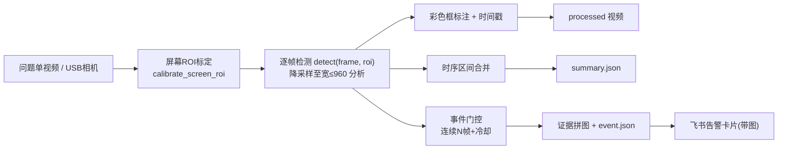
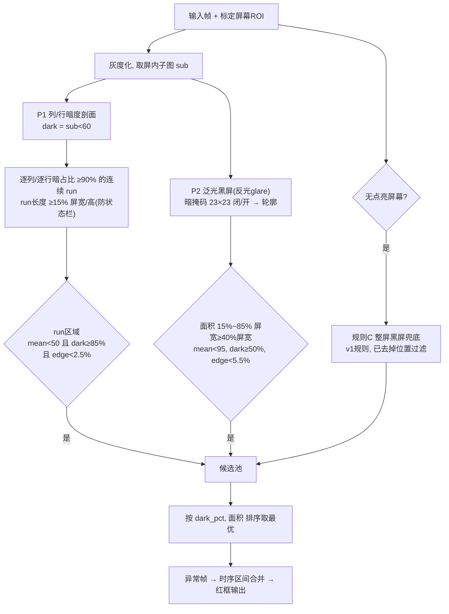
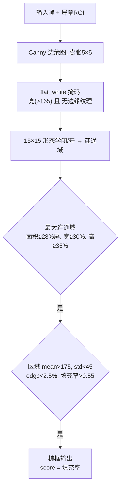
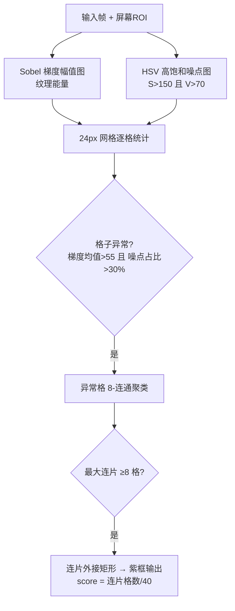
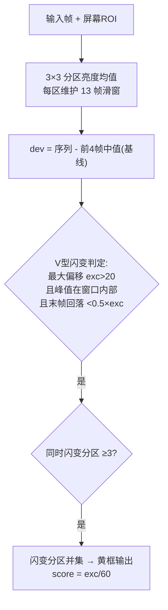
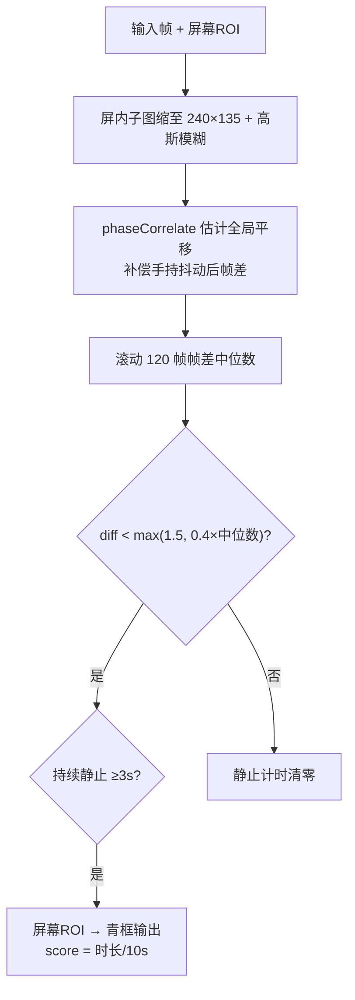

> 脚本目录：`D:\Dev_Stability\Camera-Algorithm\`（2026-07-14）
> 覆盖：黑屏 v3 / 白屏 / 花屏 / 闪屏 / 冻屏 五种检测算法
> 技术栈：OpenCV + NumPy，纯规则算法，无深度学习
> 公共核心：`anomaly_core.py`（ROI标定、降采样分析、分段处理、标注输出）
> 本文取代旧版《黑屏检测算法说明》中的 v2 流程

## 〇、公共架构

所有算法共享三层结构，检测框颜色区分异常类型：

| 算法  | 脚本                            | 框颜色  | 状态                 |
| --- | ----------------------------- | ---- | ------------------ |
| 黑屏  | analyze_black_screens.py (v3) | 🟥 红 | 已按标注调参，5/5 问题单命中   |
| 白屏  | analyze_white_screen.py (v2)  | 🟫 棕 | 真实样本 3.5/5 命中（相对亮度+平坦判据） |
| 花屏  | analyze_screen_distorted.py   | 🟪 紫 | 3/5 问题单命中，待标注迭代    |
| 闪屏  | analyze_screen_flicking.py    | 🟨 黄 | 4/7 命中（k1 三次闪变全检出） |
| 冻屏  | analyze_screen_freeze.py      | 🟦 青 | 手持样本 0 检出，需三脚架/标注  |

每个 processed 视频配套 `*_evidence.jpg`（检出异常帧合并拼图，0.4s 去重、上限 40 帧），供人工蓝圈复核 FP/FN 后迭代。

### 屏幕 ROI 标定（所有算法的第一步）

均匀抽 40 帧，累计逐像素**最大亮度**（屏幕总有点亮时刻，含结尾全屏 UI）；最大亮度图 >90 → 23×23 形态学闭/开 → 最大连通域 bbox（≥5% 画面）即物理屏幕。此步把车内暗环境彻底排除在检测之外。局限：夜间车灯扫过会使 ROI 偏大，台架固定机位应标定一次后写死 `--roi x,y,w,h`。

---

## 一、黑屏检测 v3（红框）

### 流程图

### 工作原理

**P1（深黑 pane）**：黑屏 pane 的整列/整行几乎全是暗像素（≥90%），而暗色 UI 内容（夜间路面、暗色主题）所在的列总包含亮像素——列/行剖面天然区分二者，且不受形态学"暗区连通"影响。run 长度下限 15% 排除屏幕黑边框和状态条。**edge<2.5%** 是黑屏与暗色相机画面的分水岭：黑屏无纹理（实测 0.1-1%），暗色路面有车道线和天空（实测 4%+）。

**P2（泛光黑屏）**：玻璃反光把黑屏均值抬到 80-91（SR 问题单实测），P1 的 mean<50 抓不到。放宽均值到 <95，改用暗占比≥50%（正常暗内容 ≤42%）+ 宽度≥40%屏宽（真 pane 占半屏，误报候选仅 33%）补偿。面积上限 85% 屏防止"整屏假候选"（暗背景+UI 连通）。

**关键教训**：v1 的 `center_x<0.32w` 位置过滤直接丢弃左半屏候选，导致 SR 左半屏黑屏漏检——位置先验慎用。

### 实测（5 个问题单）

| 问题单 | 结果 | 区间 |
|---|---|---|
| GUA1250924 转向灯切换 | ✅ bbox 局域化 | 1.6-15.0s 分9段 |
| GUA1251218 SR黑屏卡死 | ✅ 左半屏 [0,14,410,526] | 6.5-7.7 / 14.9-15.5s |
| GUA1260202 AVM倒车 | ✅ [484,42,796,690] | 31.05-41.33s |
| GUA1260612 AVM休眠唤醒 | ✅ 右pane [798,0,162,516] | 0-22s |
| GUA1260624 AVM锁车 | ✅ 底部 [0,907,720,373] | 0.1-17.3s |

---

## 二、白屏检测 v2（棕框）

### 流程图

### 工作原理

v1 镜像黑屏用绝对高亮阈值（>200 占 90%），真实样本全军覆没——**相机自动曝光会把白屏压暗到 150-190**。v2 改为相对判据：白屏 pane = **亮(>165) + 平坦(无 Canny 边缘) + 大面积(≥28%屏)** 的连通域。"无边缘"是核心：白底正常页面（设置页、地图）有文字/图标/道路纹理，flat_white 掩码会被割碎；真白屏内部无内容才能连成大片。std 上限放到 45 是因为 bbox 边缘含渐变（pane 本体 std 仅 15）。

### 实测（5 个真实问题单，data_source\white-screen）

| 问题单 | 结果 | 区间 |
|---|---|---|
| GUA1260422 SR应用区域白屏 | ✅ conf 0.865 | 0.28-2.93s（全程） |
| GUA1260423 IVI panic白屏 | ✅ conf 0.982 | 0-13.6s 分3段 |
| GUA1260429 HMI SR全屏白屏 | ❌ 0 检出 | "白屏"实为 SR 天空渲染区，语义模糊，需人工标注界定 |
| GUA1260603 APA泊车SR白屏 | ⚠️ 4 帧 | 1.6 / 21.6s 瞬时闪白，需确认是否漏检 |
| GUA1260615 中控地图白屏 | ✅ conf 0.784 | 0-0.4 / 3.8-5.0s |

---

## 三、花屏检测（紫框）

### 流程图

### 工作原理

AVM 花屏表现为**高频彩色噪声/块状撕裂**：同时具备高纹理能量（Sobel 梯度大）和高饱和彩色噪点（正常 UI 的高梯度区域如文字是低饱和的，正常高饱和区域如引导线是低梯度的平滑色块）。两个条件相与后按网格聚类，连片下限 8 格排除孤立的图标/花纹。

### 实测（4 个问题单）

| 问题单 | 结果 | 区间 |
|---|---|---|
| GUA1250422 行车打开AVM花屏 | ✅ | 14.2-15.7s |
| GUA1250613 压测AVM开关 | ❌ 0 检出 | 需人工确认该视频是否真有花屏 |
| GUA1250618 倒车AVM花屏 | ✅ | 5.1-9.5s |
| GUA1250911 泊出AVM花屏 | ✅ conf 0.875 | 0-5.1s |
| GUA1260708 休眠唤醒IVI花屏 | ❌ 0 检出 | AndroidLayerMerge 类花屏是图层错乱非彩色噪声，需另建"图层撕裂"判据 |

信号裕度偏弱（异常连片 8-10 格 vs 正常基线 p90=9），**建议在 processed 视频上蓝圈标注后再迭代阈值**（同黑屏流程）。

---

## 四、闪屏检测（黄框）

### 流程图

### 工作原理

闪屏的真实形态是**骤变-恢复的 V 型闪变**（亮度瞬间跌落/跳升后 2-6 帧内回到基线），不是教科书式持续振荡。判据三要素：偏移幅值够大（>20，正常内容运动 p90 仅 4-6）；峰值在滑窗内部（排除窗口边缘截断）；**末帧回落到基线附近**——这一条把单次界面切换（跳到新亮度后保持）干净排除。分区≥3 同时闪变才触发，排除局部视频内容闪烁。

### 实测（7 个问题单）

| 视频 | 检出 |
|---|---|
| 2025_04_09（k1，屏录） | ✅ 3.6 / 11.0 / 19.6s 三次闪变全命中，与亮度曲线尖峰一致 |
| 2025_04_12（k2, 86s 屏录） | ✅ 10 段闪变（0.7-46s），待复核 |
| GUA1260108 仪表小地图闪屏 | ✅ 6 段（2.6 / 6.9 / 16.2-16.7 / 23.4s） |
| GUA1260109 地图B站切换闪屏 | ✅ 5 段（11.2-11.6 / 55.9 / 73.1 / 78.5s） |
| GUA1260211 背光测试仪表闪屏 | ❌ V型检测器 0；**v4 引擎命中 2.76s** ✅ |
| GUA1260402 后排屏K歌闪屏 | ❌ 0（需标注定位闪屏形态） |
| GUA1260410 P挂D仪表闪屏 | ❌ V型检测器 0；**v4 引擎命中 19 帧（5.2-22.4s，conf 1.0）** ✅ |

### v4 引擎复用（analyze_screen_flicking_v4.py）

`D:\flicker-detection` 的 FlickerDetectorV4（增益归一化局部能量 + 结构不变性门控 + ABA 脉冲 + 滚动 MAD 自适应基线）已包装进本框架，召回显著强于 V 型分区检测器。建议双引擎并跑交叉验证：两者一致 → 高置信告警；仅一方命中 → 标记待人工复核。`flicker-detection/regression_labels.json` 是人工复核过的闪屏基准集，算法改动后必须回归。

---

## 五、冻屏检测（青框）

### 流程图

### 工作原理

冻屏=内容长时间无变化。难点在手持拍摄：相机抖动使帧差下限 2.4-5.8，直接淹没"静止"信号。缓解手段：缩小到 240×135+模糊（抑制高频抖动）、相位相关补偿全局平移、相对阈值（低于自身噪声中位数的 40%）。

### 实测与已知局限

3 个问题单视频**全部 0 检出**：探测显示补偿后帧差 min 仍有 4-7，抖动残差与内容变化不可分。结论：**手持视频不适合规则法冻屏检测**，需要①三脚架/固定机位样本，或②人工蓝圈标注冻结时间段后针对性建模（如局部特征点跟踪）。屏幕录制类样本（帧差≈0）该算法可直接工作。

---

## 六、迭代方法与事件闭环

标注驱动迭代 7 步法与事件门控（连续 N 帧→合并 10/40 帧证据拼图→10s 冷却→飞书带图卡片）见：

- Skill：`screen-anomaly-detection`（已打包安装）
- 仓库文档：`Camera-Algorithm\skills-anomaly-iteration.md`
- 帮助文档：`Camera-Algorithm\feishu-app\帮助文档.md`

产物位置：processed 视频在 `Camera-Algorithm\processed_videos\<类型>\`，黑屏问题单结果在 `Camera-Algorithm\data_source\detected_results_v3\`。
