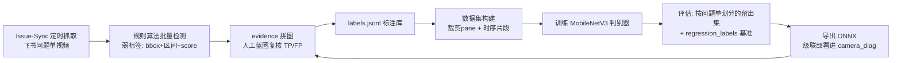

> 目标：在规则算法之上训练轻量判别模型，解决规则难以表达的形态
> （SR天空白屏 vs 页面留白、LayerMerge花屏、低幅闪变），形成"规则粗筛 + 模型精判"级联
> 前置：D:\Dev_Stability\Issue-Sync 本地问题单池 + evidence 拼图人工复核流程（均已就绪）

## 总体架构



## 第一步：标注库 labels.jsonl（先做这个，模型后行）

每条 = 一个人工复核过的区域样本：

```json
{"source": "GUA1260615...mp4", "issue_id": "GUA1260615D7019181527",
 "frame": 120, "time_s": 4.0, "bbox": [123, 33, 741, 483],
 "screen_roi": [0, 0, 960, 540],
 "anomaly_type": "white_screen", "verdict": "TP",
 "labeler": "user", "labeled_at": "2026-07-14",
 "rule_score": 0.78, "rule_version": "white_v3"}
```

数据来源三路汇入：① evidence 拼图复核结论（TP 帧直接入库，FP 帧改 verdict=FP 同样入库——**负样本和正样本一样值钱**）；② 零检出视频的人工蓝圈（漏检 FN，补 bbox 后入库）；③ `flicker-detection/regression_labels.json` 已复核基准直接转换。正常视频随机抽帧作背景负类。

## 第二步：数据集构建

- **输入单元**：pane 裁剪图（bbox 外扩 15% 后 resize 224×224）+ 整屏缩略图（辅助通道，可选）
- **划分原则**：⚠️ 按 issue_id 划分 train/val/test（同一问题单的帧极相似，按帧随机划分会数据泄漏、指标虚高）
- **类别**：6 类 = 正常 / 黑屏 / 白屏 / 花屏 / 闪屏(单帧形态) / 冻屏难以单帧表达→暂不进帧级模型
- **增广（模拟相机链路，重要性排序）**：亮度/对比度扰动（±30%，模拟自动曝光）、高斯噪声+ISO颗粒、轻度运动模糊、透视抖动（±3°，模拟手持）、莫尔条纹叠加（拍屏特有）、JPEG压缩
- **起步规模**：每类 300 区域（按今天节奏，一张 evidence 拼图≈10-40 样本，两周可达）；类别不平衡用 focal loss 或过采样

## 第三步：模型与训练

| 项 | 选择 | 理由 |
|---|---|---|
| 骨干 | MobileNetV3-Small (ImageNet预训练) | 2.5M 参数，CPU 实时，几百样本可微调 |
| 头 | 全局池化 + 6类 softmax | 单帧判别 |
| 训练 | 冻结骨干前半，lr=1e-3 cosine，30 epoch，batch 32 | 小数据防过拟合 |
| 框架 | PyTorch → 导出 ONNX | Windows 台架 onnxruntime CPU 推理 |
| 时序类（闪屏/冻屏）二期 | 规则提特征序列(亮度/帧差) + 1D-CNN 或 GRU | 比 3D-CNN 省数据得多 |

## 第四步：评估门槛（不达标不上线）

- 按问题单留出的 test 集：每类 recall ≥ 规则算法当前值，FP 率 ≤ 规则的一半
- `regression_labels.json` 闪屏基准：全部通过（区间 ±0.3s）
- 专项对抗集：设置页留白 vs 白屏、暗色路面 vs 黑屏、UI切换 vs 闪变——今天发现的所有规则混淆对，各留 20+ 样本专测

## 第五步：级联部署

```
帧 → 屏幕ROI标定 → 规则检测(高召回配置, 阈值放宽)
   → 规则命中 → 裁剪候选区域 → ONNX 模型精判 → 确认才进事件门控/飞书
   → 规则未命中 → 每秒抽1帧过模型兜底(捞规则盲区) 
```

规则做粗筛保证算力和可解释性，模型做精判压误报；模型置信度写入 event.json 的 score，人工复核结论继续回流 labels.jsonl——形成主动学习闭环，每月重训一次。

## 里程碑

1. **W1**：labels.jsonl 汇聚脚本 + 把已有复核结论（黑屏5单、白屏5单、闪屏7单、花屏5单的 TP/FP）导入 → 预计 ~800 样本起步
2. **W2**：继续 Issue-Sync 抓取+复核攒数据；搭训练管线（dataset/train/export 三个脚本）
3. **W3**：首版模型训练+评估，重点打设置页白屏/SR天空两个混淆对
4. **W4**：ONNX 级联接入 camera_diag `--ml` 开关，台架实测对比规则-only
