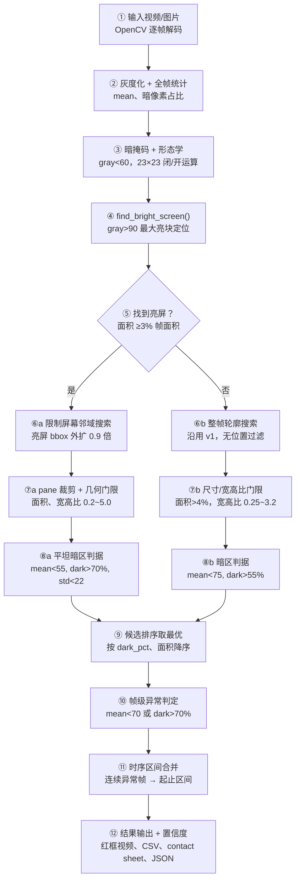

> 脚本：`D:\Dev_Stability\Camera-Algorithm\analyze_black_screens.py`（v2，2026-07）
> 适用：车机屏幕黑屏问题单视频/图片离线复核
> 技术栈：OpenCV + NumPy，纯规则算法，无深度学习
> 完整 HTML 版：`D:\Dev_Stability\Camera-Algorithm\docs\black_screen_detection_algorithm.html`

## 一、检测流程图

## 二、各环节算法解释

### ② 灰度化与全帧统计
`cv2.cvtColor(BGR2GRAY)` 按 ITU-R BT.601 加权（0.299R + 0.587G + 0.114B）转灰度，计算全帧 `mean` 和 `dark_pct`（gray<40 占比）。不直接参与判定，写入逐帧 CSV 供复核调参。

### ③ 固定阈值分割（Thresholding）
`gray<60` 暗掩码、`gray>90` 亮掩码，最基础的全局二值化。快且可解释，但阈值与曝光强耦合——换相机/环境光后可能失效。改进方向：Otsu 自适应阈值或 `cv2.adaptiveThreshold`。**前提：相机锁定曝光。**

### ③④ 数学形态学：闭运算 + 开运算
23×23 矩形结构元，先闭（填补暗块内小亮点、连接碎块）后开（删孤立噪点、平滑边界）。核尺寸 23 决定"多近算同一块、多小被丢弃"，是第二调参点。理论：Serra 数学形态学；教材：Gonzalez & Woods 第 9 章。

### ④ 亮屏定位（v2 新增）
`find_bright_screen()`：亮掩码形态学清理后取最大连通域外接矩形，面积 ≥3% 帧面积才有效。**v2 核心思想：黑屏 pane 必然出现在亮屏旁边**——先锚定亮屏，再在邻域找暗块，天然排除车内暗背景。

### ⑥⑦⑧ 连通域提取 + 先验几何门限
`cv2.findContours` = Suzuki-Abe 边界跟踪算法。两分支门限对照：

| | a 分支（有亮屏，pane 黑屏） | b 分支（无亮屏，整屏黑屏） |
|---|---|---|
| 搜索范围 | 亮屏 bbox 外扩 0.9 倍邻域；侧向 pane 裁剪到屏幕行范围，上下 pane 裁剪到列范围 | 整帧 |
| 面积门限 | ≥ max(1.5% 帧面积, 20% 屏幕面积) | ≥4% 帧面积，宽 ≥12%W、高 ≥15%H |
| 宽高比 | 0.2 ~ 5.0 | 0.25 ~ 3.2 |
| 暗度判据 | mean<55 且 dark>70% 且 **std<22** | mean<75 且 dark>55% |

### ⑧ 平坦度判据 std<22（v2 新增）
用区域灰度标准差区分"真黑屏"与"暗色正常画面"：黑屏是均匀灰面（低 std），暗色路面/夜景有纹理（高 std）。本质是最简一阶纹理特征；更强替代：局部方差图、Haralick 共生矩阵、Laplacian 能量。

> [!note] v1 → v2 三处修正
> 1. 删除 `center_x < 0.32w` 位置过滤（曾致左半屏黑屏 **GUA1251218** 整体漏检）
> 2. 暗区搜索锚定亮屏邻域，bbox 不再扩散到整帧暗背景（修正 **GUA1250924** 整帧红框）
> 3. 判据改为"更暗 + 更平"组合 + 放宽面积门限，提升 **GUA1260612** 弱黑屏召回

### ⑨⑩ 候选排序与帧级判定
候选按（dark_pct, 面积）降序取 best；帧级异常 = best 存在且 `mean<70 或 dark_pct>70`。多 pane 同时黑时只标排序第一块，需要全标可改 top-k。

### ⑪ 时序区间合并（去抖）
`intervals_from_flags()` 对逐帧布尔序列做游程编码（RLE），连续异常帧合并为 `[start, end]` 秒级区间。同无参考视频质量检测（freeze/dropped-frame）思路。当前无最短持续门限——单帧闪黑也报区间，误报多可加"≥N 帧才成立"。

### ⑫ 置信度评分
视频级：`confidence = min(1, 最高dark_pct/100)`；图片级：`0.65×暗占比分 + 0.35×亮度分`。启发式打分，可比大小但非校准概率；如需真概率需用标注样本做 Platt scaling。

## 三、参考文献与延伸阅读

1. Suzuki & Abe. *Topological Structural Analysis of Digitized Binary Images by Border Following*. CVGIP, 1985 —— `cv2.findContours` 底层算法
2. Otsu. *A Threshold Selection Method from Gray-Level Histograms*. IEEE TSMC, 1979 —— 自适应阈值
3. Serra. *Image Analysis and Mathematical Morphology*. 1982 —— 形态学理论
4. Gonzalez & Woods. *Digital Image Processing* (4th ed.), Ch.9/Ch.10
5. OpenCV 教程：[Morphological Transformations](https://docs.opencv.org/4.x/d9/d61/tutorial_py_morphological_ops.html) · [Contours](https://docs.opencv.org/4.x/d4/d73/tutorial_py_contours_begin.html) · [Thresholding](https://docs.opencv.org/4.x/d7/d4d/tutorial_py_thresholding.html)
6. Wolf. *A NR and RR Metric for Detecting Dropped Video Frames*. NTIA/VPQM, 2008 —— 无参考冻帧检测
7. ITU-T P.910 / J.247 —— 视频质量评估、freeze 统计口径
8. Ramachandra et al. *A Survey of Single-Scene Video Anomaly Detection*. IEEE TPAMI, 2020 —— 花屏/闪屏的自监督路线
9. Platt. *Probabilistic Outputs for SVM*. 1999 —— 置信度校准

## 四、已知局限与改进方向

| 局限                | 改进方向                                 |
| ----------------- | ------------------------------------ |
| 灰度阈值 60/90 与曝光强耦合 | Otsu / 自适应阈值，或按视频首秒直方图自标定            |
| 单帧闪黑即报区间          | 加最短持续帧数门限（如 ≥3 帧）                    |
| 只输出单个最优 bbox      | 输出 top-k 候选，多 pane 同时黑屏全部标注          |
| 置信度非校准概率          | 用问题单标注做 Platt scaling                |
| 无法区分"黑屏"与"正常熄屏"   | 接入 TDSG 三域方案：scrcpy 内部帧 + 系统日志判断合法熄屏 |

## 附：5 视频批次检测结果（2026-07-13）

| 问题单 | 结果 | 置信度 | 异常区间(s) |
|---|---|---|---|
| GUA1250924 转向灯切换黑屏 | ✅ 命中 (312/453 帧) | 0.89 | 主段 7.7~15.1 |
| GUA1251218 SR黑屏卡死 | ❌ v1 漏检 → v2 修正中 | — | 左半屏黑屏 |
| GUA1260202 AVM倒车黑屏 | ✅ 命中 (162/619 帧) | 0.988 | 31.1~41.3 |
| GUA1260612 AVM休眠唤醒黑屏 | ✅ 命中偏弱 (13/661 帧) | 0.604 | v2 提升召回中 |
| GUA1260624 AVM锁车黑屏 | ✅ 命中 (430/520 帧) | 0.94 | 4.4~17.3 |
